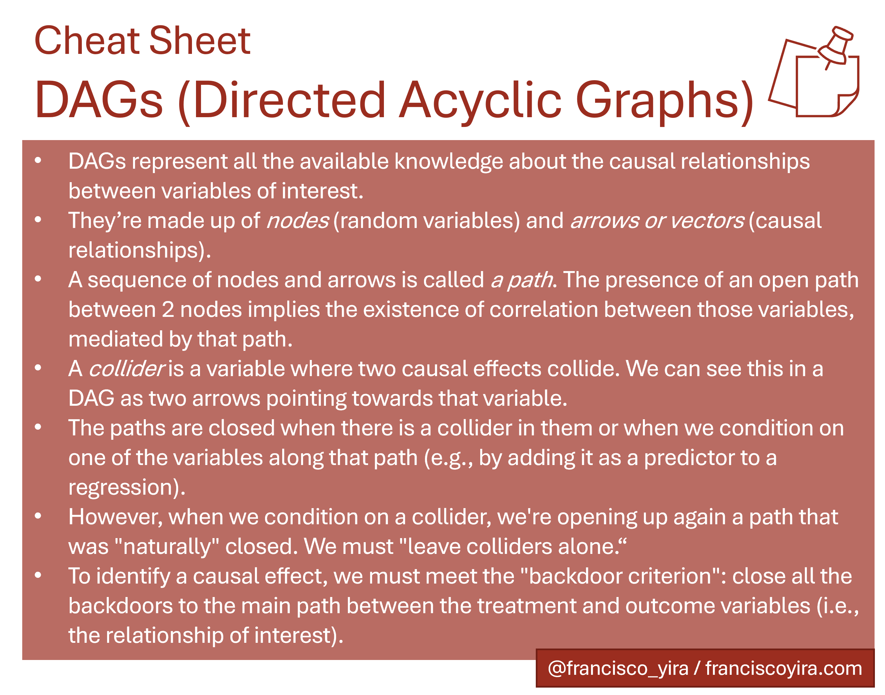

*This article is the first in a series dedicated to the content of the book  [Causal Inference: The Mixtape](https://mixtape.scunning.com/), in which I will try to summarize the main topics and methodologies exposed in the book.*

DAGs (Directed Acyclic Graphs) are a type of visualization that has multiple applications, one of which is the modeling of causal relationships. 

We can use DAGs to *represent the causal relationships that we believe exist between the variables of interest*. By drawing a diagram like this, we're making explicit all the previous theoretical and empirical knowledge we have about a specific problem.

Drawing a DAG is also helpful because it makes clearer how to isolate a causal effect within a set of more complex relationships.

The flip side of the coin is that the DAG we draw will be only as good as our prior theoretical knowledge. If any of our beliefs about the problem nature and the relationships between the variables are false (e.g., we're assuming some variable is exogenous when it depends on other variables), then the drawn DAG will only replicate this false belief in a different format.

> There is an underlying DAG behind every identification strategy, whether we like it or not.

Whether we like it or not, [there is an underlying DAG behind every identification strategy](https://nickchk.com/causalgraphs.html). Even if we don't represent it explicitly, there is always an implicit assumed DAG when we apply causal inference strategies such as Fixed Effects, Differences in differences, or Instrumental Variables.

.*](images/dags_examples.png){width="813px"}

If the implicit assumed DAG is an appropriate representation of the true causal relationships, then the chosen identification strategy will be valid. So, given that the underlying DAG is so important, we're better off by taking it out of the shadows and making it explicit. By doing so we will be making it easy (for ourselves and others) to judge the plausibility of our assumptions.

## DAG Notation

A DAG has the following components:

-   **Nodes**. In the context of causal modeling these represent random variables produced from a given data-generating process.
-   **One-way arrows or vectors**, that connect the nodes and represent causal relationships between the variables. 
-   **Paths**, sequences of adjacent nodes and vectors that connect non-adjacent nodes.

](images/simple_dag.png){width="400px"}

In the figure above, X, Y, U, and Z are nodes or random variables. The arrows tell us about the following causal effects:

-   X causes Y
-   Y causes Z
-   U causes Y
-   U causes Z

Also there are paths such as X→Y→Z and X→Y←U→Z[^1].

[^1]: The nature of these paths is different for reasons to be explained later on in this post. For now, it suffices to recognize them all as *paths*.

Causal effects in a DAG can be direct (a vector that connects two nodes without intermediaries, e.g., Y→Z in the figure above) or indirect and mediated through one or more variables along a path (e.g., X→Y→Z). A path represents a mediated causal effect when all the arrows along it go in the same direction. 

A key characteristic of DAGs is that in them **all the processes and effects always go forward in time**, there are no cycles (an effect "coming back" to a variable that originated it). If we want to represent an inverse causality relationship, we can draw multiple nodes representing the same variable in different moments (for example, we can draw a node for the income of a person in period T and another for the income in T+1).[^2]

[^2]: Simultaneity relationships (e.g., those in a supply and demand model) are more complex to express in DAG format, and the book's chapter doesn't cover them.

> The absence of a vector connecting two nodes represents the belief that there are no direct causal relationships between those variables.

The **absence of a vector between two nodes** it's also an assumption about causal relationships. If two nodes are not directly connected, we're saying that there are no direct causal relationships between those variables.

## Backdoors

After looking at the fundamentals of DAGs, it's time to learn about the **backdoor paths** and the **backdoor criterion**. The book's chapter uses the following example DAG to explain these concepts:

.*](images/simple_dag-1.png)

Here **D** is the variable of interest, **Y** is the outcome variable, and **X** represents a third variable that probably isn't the focus of our analysis. Whoever has to deal with this DAG probably wants to know **the causal effect of D on Y**.

This effect it's represented by the path D→Y. But there is also a second path between D and Y: D←X→Y.

This latter path is known as **backdoor path**. It's called *backdoor* path because it goes from the variable of interest to the outcome variable **bypassing our main path** (D→Y). The existence of this backdoor path makes more difficult the life of whoever wants to know the causal effect of D on Y because it creates a spurious correlation between D and Y, generated by the relationships X→D and X→Y.

In other words, there will be systematic and joint variation between D and Y generated by both the causal relationship D→Y (which is our relationship of interest) and the backdoor path D←X→Y (variability that is not of interest to us). The simple correlation between D and Y will be a combination of these two relationships, which will make it impossible to interpret such correlation as a causal effect of D on Y. 

Those who are familiar with regression analysis may as well interpret X in this DAG as a **relevant omitted variable**: a variable that determines both the independent variable (D) and the dependent one (Y), and whose exclusion will be a source of bias when estimating the coefficient of D on Y. In this case, the coefficient of D on Y will be "confounded" by the effects of X on D and Y. Because of that, variables like X are called **confounders**.

**Las puertas traseras se pueden cerrar** mediante condicionar o controlar por una variable ubicada a lo largo de ese camino. Condicionar o controlar por X puede implicar cosas como:

The good news is that **backdoor paths can be closed** by conditioning on (or control by) a variable along that path. Conditioning on X can mean things like: 

-   Add X as an independent variable to the regression.
-   Apply a matching technique using the values of X.
-   Stratify the data according to the values of X and then obtain correlations between D and Y inside each stratum.

In all these cases, we would be able to say that the backdoor path D←X→Y is closed.

> We can understand the attempt of identifying causal effects as a crusade for closing all the backdoor paths in a DAG

Si todas las puertas traseras están cerradas, se puede afirmar que el DAG de nuestro análisis cumple con el **backdoor criterion**, y esto implica que podremos aislar el efecto causal de la variable de interés (D) sobre la variable de resultados (Y).

If all the backdoor paths in our DAG are closed, we can say that our analysis meets the **backdoor criterion**. Meeting the backdoor criterion means that we can isolate the causal effect of the variable of interest on the outcome variable.

### The curse of the unobservables

Given that a DAG should contain *all* the relationships we assume affect our variables of interest, it's perfectly possible that some of these relationships involve variables not available in our data (a.k.a. *unobservables*).

Our crusade for closing the backdoor paths may find an obstacle in these unobservable variables because we can't condition on them. Therefore, a backdoor path containing an unobservable confounder can't be closed using a conditioning strategy[^3].

[^3]: [Everything's not lost](https://www.youtube.com/watch?v=0IywjWWlxF8) in this case: depending on the context (given by the DAG), there could be other observable variables that allow us to close the backdoor path. For example, if we have *individual ability* as an unobservable confounder, but we know (or we can reasonably assume) that it's constant in time for each individual, then a set of variables identifying each individual (i.e. dummy or binary variables) can close a backdoor path containing ability. Methodologies such as this made most of the book, and I will be explaining them in future posts.


### Example: effect of college education on income

To exemplify the concepts we've already seen, let's try to decode the information provided by the DAG below: 

 (page 100)*.](images/dag_parent_education.png){width="400px"}

This DAG shows us a set of hypotheses about the relationships between college education and income. The variables or nodes have the following meanings:

-   **D** is the treatment variable. In this case, the treatment is receiving or completing college education.
-   **Y** is the outcome variable: the person's income (who may have received college education or not).
-   **PE** is the education of the person's parents (PE = *Parents Education*).
-   **I** is the income of the person's family.
-   **B** are unobserved background factors that may affect both person's education and parents' education  (e.g. genetics, family environment, mental ability, and so on). B = *Background factors*.

We can summarise the relationship between these variables (illustrated by the DAG) like this:
college education affects the person's income, but this outcome is also directly affected by their family's income (for example, through money transfers or inheritances), and by unobserved factors (such as ability, that may cause someone to perform better in a job, regardless of their educational level).
These unobserved factors may also influence the person's decision to pursue a college education (for instance, in a family there may be more social pressure or expectations for a daughter/son to go to college).
Some of these unobserved factors may even influence the parents’ educational level.

This DAG also *proposes*[^4] that parents' educational level affects the education level obtained by the person, both directly (PE→D), and indirectly (through the family income, which in turn affects the person's college education: PE→I→D). This last idea can be intuitively explained as increased ease of access to college due to higher income.

[^4]: I emphasize the word *proposes* because all these relationships are just that, posits or assumptions, which ideally should represent the "state of the art" of the research in this topic, but they could well be objected to or even be simply wrong.
Expressing these assumptions in DAG format doesn't make them more valid, but it does make them explicit, making it easier to discuss them and making ourselves more aware that we're basing our analysis on such assumptions.

Moreover, this DAG helps us to introduce **new notation**:

-   The **dotted arrows** represent relationships involving *unobservable* variables (in this case, relationships associated with *B*).
-   When a variable is **surrounded by a square**, it means that we're **conditioning or controlling for** that variable (in this example, we're conditioning the family's income, why? We'll see it immediately).

The relationship of interest here is **the effect of college education on personal income (D→Y)**. 
However, there're several backdoors paths between those variables, so the simple correlation between D and Y most likely does not isolate this causal effect.

The backdoors in this DAG are:

1.  D←I→Y
2.  D←PE→I→Y
3.  D←B→PE→I→Y
4.  D←B→Y

We can easily close the first three by conditioning on family income (I), which is an observable variable in this example. 

Unfortunately, **the fourth backdoor can't be closed** (at least not with the information available until now) because B is an unobservable variable (or set of variables), and we don't know anything about what kind of correlation it has with D and Y.

Therefore, in this example, the backdoor criterion is not met, and we can't give a causal interpretation to the correlation between D and Y (even after conditioning on I)

## Colliders

There is another situation in which backdoors are closed: when there is a **collider** along the backdoor path.

What exactly is a collider? Basically, it is a variable that has two arrows pointing *to* it (like this: X→Collider←Y) in a DAG path. 
It's named like that because the causal effects of two other variables are *colliding* with each other.

The existence of a collider in a path automatically closes that path without us having to do anything else. Cool, right?

.*](images/collider_simple.png){width="317"}

For example, in the image above the collider C closes the backdoor E→C←O.
Therefore, the observed correlation between E and O represents the causal effect E→O (since there are no open backdoors between E and O).

The problem with colliders is that when we condition on them, **a backdoor that was closed opens up again**. That's why it's critical for any identification strategy to differentiate between colliders and confounders, and condition on the latter but not on the former.

This is a break from the habit that exists in some disciplines of adding as many covariates as possible to regressions. The DAG-based modelling proposes something different:

1.  Carefully draw a DAG representing all the known causal relationships involved in the phenomenon of interest, using all the institutional and theoretical knowledge available (e.g., literature review, conversations with stakeholders or business experts, etc.)
2.  List all the paths connecting the treatment variable (usually named *D*) with the outcome variable (usually named *Y*).
3.  Of these paths, one will represent the causal relationship of interest (e.g. D→Y), and the others will be backdoors. [^5]
4.  Identify which backdoors paths are closed due to colliders (and "leave them alone") and which we must close ourselves by conditioning on confounders along those paths.

[^5]: #Actually we may be interested in several causal paths, particularly in the case where the effect of D on Y happens through several transmission channels on which there are no confounders. 
Depending on the research question, the correlation between D and Y generated by these secondary causal paths may or may not be of interest. This subject is not covered in depth in the book's chapter and could be a topic for another blog post.

### Example of collider bias: beaty and talent in movie stars

The idea that colliders close backdoors and that, when conditioning on them, backdoors reopen is not very intuitive.
Because of that, I will cover an additional example regarding collider bias included in the book's chapter.

Some people have the hypothesis that beauty and talent for acting are inversely correlated.
This idea comes from cases of actors and actresses who, according to the public, are very attractive but have little talent[^6].
However, a possible explanation for this correlation is that beauty and talent are not correlated in the general population, but only in the sub-sample of actors and actresses, due to *collider bias*.

[^6]: The example shown in the book for this idea was Megan Fox, an actress from Transformers [who was chosen in a 2009 poll](https://marquee.blogs.cnn.com/2009/12/30/megan-fox-voted-worst-but-sexiest-actress-of-2009/) as the worst *and* most attractive actress.

The following DAG represents the previous hypothesis: 

. Page 110.*](images/moviestar-dag-1.png){width="400px"}

According to this DAG, Talent and Beauty are independent variables, which, separately, increase the likelihood of someone being a movie star. In this case, *being a movie star is a collider along the path* between Talent and Beauty.

By analyzing a dataset which only contains cases of movie stars (and leaving out all the population who doesn't belong to this group) we're actually **conditioning on the collider _Movie Star_**.
This generates a spurious correlation between Talent and Beauty in the analyzed data[^7].

[^7]: Another interesting feature of this example: it shows that covariate conditioning (including the problematic conditioning on colliders) can be embedded in the raw data itself, even before doing any data manipulation, due to selection bias in the way the data was collected.

We can see the idea above more clearly in the following visualization with simulated data: 

```{r plot-colliders, message=FALSE, warning=FALSE, out.width = '100%', fig.height=7, dpi = 300}
library(tidyverse)
library(patchwork)
set.seed(1989)

movie_stars <- 
  tibble(
    # We generate a sample of 2500 observations where beauty and talent are
    # normally distributed and independent
    beauty = rnorm(2500),
    talent = rnorm(2500),
    # The likelihood of being a movie star depends on a linear combination of
    # talent and beauty
    score = beauty + talent,
    # Only the people in the top 15% of the score distribution are movie stars
    c85 = quantile(score, .85),
    star = ifelse(score >= c85, "Yes", "No"))

plot_global <- 
  ggplot(movie_stars,
       aes(beauty, talent)) +
  geom_point(alpha = 0.3) +
  geom_smooth(method = "lm",
              color = "grey20") +
  annotate(geom = "label",
           x = -2,
           y = -0.6,
           label = "There is no correlation\nbetween Beauty and Talent in\nthe total sample",
           size = 2.8,
           color = "grey20") +
  theme_minimal()

plot_colliders <- 
  ggplot(movie_stars,
       aes(beauty, talent, color = star)) +
  geom_point(alpha = 0.3) +
  geom_smooth(method = "lm", se = FALSE, show.legend = FALSE) +
  annotate(geom = "label",
           x = 2,
           y = 2.5,
           label = "There is (spurious) correlation\nbetween Beauty and Talent in\nthe movie stars sub-sample",
           size = 2.8,
           color = "#008D91") +
  theme_minimal() +
  labs(color = "Is Movie Star?") +
  guides(color = guide_legend(override.aes = list(alpha=1)))
  
# Combining both plots with {patchwork}
(plot_global / plot_colliders) +
  plot_annotation(
    title = "Collider bias",
       subtitle = str_wrap("Being a Movie Star is a collider in the relationship between Talent and Beauty. By conditioning on being a Movie Star, we're creating a spurious correlation between both variables.")
  )
```

## Summary



*For more information, I recommend reading [the original DAGs chapter in Causal Inference: The Mixtape](https://mixtape.scunning.com/dag.html), from which I made this summary.*

*Your feedback is welcome! You can send me comments about this article by [e-mail](mailto:francisco.yira@outlook.com).*