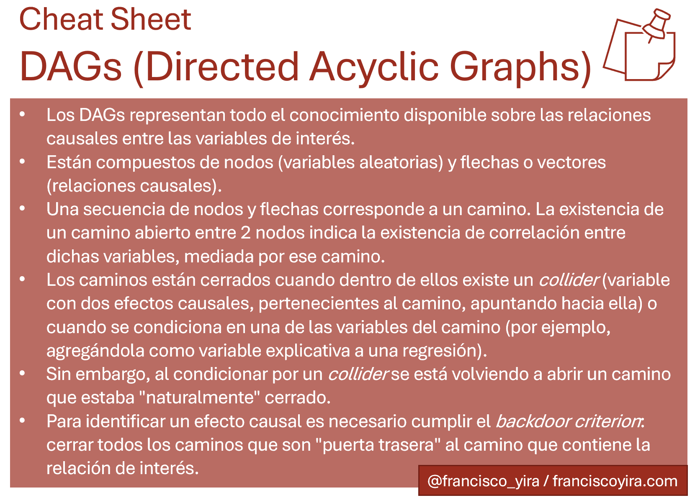

*Este artículo es el primero de una serie dedicada al contenido del libro [Causal Inference: The Mixtape](https://mixtape.scunning.com/), en la cual buscaré resumir los principales temas y metodologías expuestos allí.*

Los DAGs (*Directed Acyclic Graphs* o grafos acíclicos dirigidos) son un tipo de visualización que cuenta con múltiples aplicaciones, una de las cuales es el modelamiento de relaciones de causalidad.

Aplicados a causalidad, *los DAGs sirven para representar las relaciones causales que creemos que existen entre las variables de interés*. Al dibujar un diagrama de este tipo, estamos plasmando todo el conocimiento teórico y empírico previo que poseemos sobre un determinado problema.

Una ventaja de dedicar tiempo a dibujar un DAG es que mediante este diagrama se vuelve más claro el cómo aislar un efecto causal dentro de un conjunto de relaciones más complejas.

La otra cara de esto es que el DAG que dibujemos será tan bueno como lo sea el conocimiento teórico previo. Si algunas de nuestras creencias sobre la naturaleza del problema son falsas (ej. asumimos que una variable del DAG es exógena o independiente cuando en realidad depende de otras), el DAG no hará más que replicar esta falsa creencia en un formato distinto.

> Querámoslo o no, detrás de toda estrategia de identificación existe un DAG subyacente.

Querámoslo o no, [detrás de toda estrategia de identificación causal existe un DAG subyacente](https://nickchk.com/causalgraphs.html). Aún si el DAG no está expresado de forma explícita, existe siempre un DAG implícito al aplicarse estrategias como Efectos Fijos, Diferencias en Diferencias, o Variables Instrumentales.

.*](images/dags_examples.png){width="813px"}

Si ese DAG implícito se ajusta a la realidad (es una representación adecuada de las relaciones causales reales), entonces la estrategia de identificación aplicada será válida. Dado ello, conviene sacar a este DAG de las sombras y hacerlo explícito, para así juzgar más fácilmente la verosimilitud de nuestros supuestos (y también facilitar que estos supuestos sean juzgados por terceros).

## Notación de DAGs

Un DAG se compone de:

-   **Nodos**, que en el modelamiento de causalidad representan variables aleatorias, creadas a partir de un cierto proceso generador de datos.
-   **Flechas o vectores de una sola dirección**, que conectan los nodos representando relaciones causales entre las variables.
-   **Caminos** (o *paths*), que son secuencias de nodos y vectores que conectan nodos.

*](images/simple_dag.png){width="400px"}

En la figura de arriba, X, Y, U y Z son nodos o variables aleatorias. A partir de las fechas sabemos que existen los siguientes efectos causales:

-   X causa Y
-   Y causa Z
-   U causa Y
-   U causa Z

Y además hay caminos tales como X→Y→Z y X→Y←U→Z[^1].

[^1]: Estos caminos son de naturaleza distinta, por razones que se explicarán después en este mismo post. Por ahora basta con reconocerlos como *caminos.*

Los efectos causales dentro de un DAG pueden ser directos (un vector que conecta dos nodos sin intermediarios, por ej. Y→Z en la figura de arriba) o ser mediados por una o más variables a lo largo de un camino (por ej. X→Y→Z). Para que un camino tenga asociado un efecto causal es necesario que las flechas dentro de él apunten en una misma dirección.

Una característica clave de los DAGs es que **en ellos los procesos siempre van en una sola dirección** (la dirección del transcurso del tiempo) y **no hay ciclos** (de ahí la A de *acyclic* en el nombre). Para mostrar una relación de causalidad inversa es posible crear múltiples nodos que representan la misma variable en distintos momentos del tiempo (por ej: un nodo para *el ingreso de una persona en T* y otro para la misma variable en *T+1*).[^2]

[^2]: Las relaciones de simultaneidad (por ejemplo, las de un modelo de oferta y demanda) son más complejas de expresar en DAGs y el capítulo del libro deja fuera el tema.

> El que dos nodos no estén conectados por un vector representa la creencia de que no existe una relación causal que conecte esas variables de forma directa.

Otro concepto clave es que la **ausencia de flechas entre nodos** también implica un supuesto sobre relaciones causales: el que dos nodos no estén conectados por un vector representa la creencia de que no existe una relación causal que conecte esas variables de forma directa (es decir, que son variables independientes).

## Backdoors (puertas traseras)

Después de ver los fundamentos, es hora de aprender los conceptos de **backdoor path** (camino de puerta trasera) y **backdoor criterion** (criterio de puerta trasera). Para explicar esto el libro se apoya en el siguiente DAG de ejemplo:

.*](images/simple_dag-1.png)

Aquí **D** representa la variable de interés, **Y** es una variable de resultados, y **X** representa una tercera variable, que probablemente no es el foco del análisis. Quien se enfrente a este DAG probablemente busca conocer el efecto causal de **D sobre Y**.

Dicho efecto está representado en el camino D→Y. Pero a la vez existe un segundo camino entre D e Y: D←X→Y.

Este segundo camino se conoce como **camino de puerta trasera** (o *backdoor path*). Su existencia hace más difícil la vida de quien desee conocer el efecto causal D→Y, ya que al haber un *backdoor path* aparecerá correlación espúrea entre D e Y producto de las relaciones X→D y X→Y.

Dicho de otra forma, los valores de D e Y variarán de forma sistemática o conjunta tanto debido a la relación causal D→Y (variabilidad que nos interesa estimar), como debido a la puerta trasera D←X→Y (variabilidad que no nos interesa). La correlación simple entre D e Y será una combinación de estas 2 relaciones, lo cual imposibilitará interpretar la correlación observada como un efecto causal de D sobre Y.

Para quienes vengan del mundo del análisis de regresión, la variable X en este DAG podría entenderse como una **variable relevante omitida**: una variable que determina conjuntamente la variable independiente (D) y la dependiente (Y), y que al no ser considerada en el análisis generará sesgo: la correlación estimada entre D e Y no corresponderá al efecto causal real, sino que estará "confundida" por la correlación atribuible al efecto de X sobre D e Y. Por esto último a la variable X también se le llama **confounder** o **variable de confusión**.

**Las puertas traseras se pueden cerrar** mediante condicionar o controlar por una variable ubicada a lo largo de ese camino. Condicionar o controlar por X puede implicar cosas como:

-   Agregar X como variable explicativa a la regresión
-   Aplicar alguna técnica de matching según los valores de la variable X
-   Estratificar los datos según los valores de X y luego obtener correlaciones entre D e Y dentro de cada estrato

En cualquiera de estos casos se podrá afirmar que el *backdoor path* D←X→Y está cerrado.

> El intento de identificar efectos causales puede entenderse como una cruzada por cerrar todas las puertas traseras en un DAG

Si todas las puertas traseras están cerradas, se puede afirmar que el DAG de nuestro análisis cumple con el **backdoor criterion**, y esto implica que podremos aislar el efecto causal de la variable de interés (D) sobre la variable de resultados (Y).

### La maldición de los no observables

Dado que un DAG debería contener todas las relaciones que suponemos que afectan a nuestras variables de interés, es perfectamente posible que algunas de estas relaciones involucren variables no disponibles en los datos.

Por tanto, un problema que podemos encontrar en nuestra cruzada por cerrar las puertas traseras es que una de las variables de confusión sea **no observable**, en cuyo caso es imposible cerrar esa puerta trasera mediante condicionar por dicha variable[^3].

[^3]: Esto no significa que todo esté perdido: dependiendo del caso puede que existan observables que sí permitan cerrar estas puertas traseras. Por ejemplo, si la variable no observable *habilidad* es constante en el tiempo para cada individuo, entonces un conjunto de variables que identifiquen a cada individuo determinan perfectamente la habilidad, y tales variable pueden incorporarse en una regresión con datos de panel bajo la metodología de *efectos fijos*. Metodologías de este tipo constituyen el grueso del libro y las estaré resumiendo y explicando en futuros posts.

### Ejemplo con educación universitaria e ingresos

Para ejemplificar los conceptos ya vistos tratemos de descifrar la información que nos entrega el DAG de abajo:

 (página 100)*.](images/dag_parent_education.png){width="400px"}

Este DAG muestra un conjunto de hipótesis sobre la relación entre educación e ingresos. Las variables representan lo siguiente:

-   **D** es la variable de tratamiento, que en este caso corresponde a educación universitaria.
-   **Y** es la variable de resultados, en este caso el ingreso de la persona que recibió (o no) la educación universitaria.
-   **PE** es la educación de los padres de la persona (PE = *Parents Education*).
-   **I** es el ingreso de la familia.
-   **B** son factores no observados que afectan tanto la educación de los padres como la educación de la persona (genética, entorno familiar, habilidad mental, etc). B = *Background factors*.

La relación entre estas variables ilustrada por el DAG puede resumirse así: la educación universitaria afecta los ingresos de la persona, pero estos ingresos también son afectados directamente por los ingresos de la familia (por ejemplo, mediante transferencias o herencias), y por factores no observados (por ejemplo, habilidad, que podría hacer que alguien se desempeñe mejor en un trabajo, independiente del nivel de educación). Estos factores no observados también inciden en la decisión de la persona de obtener educación universitaria (por ejemplo, en una familia podría existir más presión o expectativa para que un hijo persiga estudios universitarios), e incluso algunos de estos factores podrían estar detrás del nivel de educación que recibieron los padres de la persona.

El DAG también nos *plantea*[^4] que el nivel de educación de los padres afecta el nivel de educación obtenido por la persona, tanto de forma directa (PE→D), como mediante afectar el ingreso de la familia, el cual a su vez afecta el nivel de educación de la persona (PE→I→D). Esto último podría explicarse como una mayor facilidad de acceso a la universidad al contar con mayores ingresos.

[^4]: Enfatizo la palabra *plantea* porque todas estas relaciones son sólo eso, planteamientos o supuestos, que idealmente representan el "estado del arte" de la investigación en este tema, pero que perfectamente podrían ser objetados o estar equivocados. El expresar estos supuestos en formato de DAG no los hace más válidos, pero sí los hace explícitos, facilita debatir acerca de ellos, y nos hace ser conscientes de que nuestro análisis parte sobre la base de tales supuestos.

Este DAG nos sirve también para introducir **nueva notación**:

-   **Las flechas punteadas** representan relaciones que involucran variables **no observables** (en este caso, las relaciones asociadas a *B*).
-   El **encerrar una variable en un cuadrado** indica que se está **condicionando o controlando** por esa variable (en este caso, se está condicionando por el ingreso de la familia, ¿por qué? lo veremos de inmediato).

La relación de interés aquí es el **efecto de la educación universitaria sobre los ingresos de la persona (D→Y)**, pero existen varios caminos de puerta trasera, así que la correlación simple entre D e Y muy probablemente no aísla el efecto causal de interés.

Las puertas traseras aquí son las siguientes:

1.  D←I→Y
2.  D←PE→I→Y
3.  D←B→PE→I→Y
4.  D←B→Y

De estas, las primeras 3 pueden cerrarse fácilmente mediante condicionar por el ingreso de la familia (I), que en este caso corresponde a una variable observable.

Desafortunadamente, **la cuarta puerta trasera no se puede cerrar** (al menos no con la información disponible hasta aquí), ya que B es una variable (o conjunto de variables) no observada(s), y no sabemos nada más sobre el tipo de correlación que tiene con D e Y.

Por ende, en este ejemplo no se cumpliría el *backdoor criterion* y no se podrá hacer interpretación causal de la correlación entre D e Y (incluso después de condicionar por I).

## Colliders

Existe otra situación en la cual las puertas traseras son cerradas: cuando existe un **collider** a lo largo de un *backdoor path* o camino de puerta trasera.

¿Y qué es exactamente un *collider*? Básicamente es una variable que tiene dos flechas apuntando *hacia* ella (así: X→Collider←Y) dentro de un camino en un DAG (se lo denomina así porque *collide* en inglés significa chocar, y en un *collider* los efectos causales de otras 2 variables chocan entre sí).

La existencia de un *collider* en un camino automáticamente cierra ese camino, sin que sea necesario hacer nada más. ¿Cool, cierto?

.*](images/collider_simple.png){width="317"}

Por ejemplo, en la imagen de arriba el *collider* C cierra la puerta trasera E→C←O, por lo que la correlación observada entre E y O representa el efecto causal E→O.

El problema aquí es que al controlar o condicionar por un *collider* el camino que estaba cerrado se vuelve a abrir. Por esto es crítico para cualquier estrategia de identificación el diferenciar entre *colliders* y *variables de confusión*, y controlar por estas últimas pero NO por los primeros.

Esto representa un quiebre en el hábito que existe en varias disciplinas de agregar tantos controles o covariables como sea posible a una regresión múltiple. El modelamiento en base a DAGs nos propone algo distinto:

1.  Dibujar cuidadosamente un DAG que represente todas las relaciones causales involucradas en el fenómeno de interés, a partir de todo el conocimiento teórico e institucional disponible (por ej., una revisión de literatura, una serie de conversaciones con *stakeholders* o expertos del negocio, etc).
2.  Listar todos los caminos que conecten la variable de tratamiento (usualmente denominada *D*) con la variable de resultados (usualmente denominada *Y*).
3.  De estos caminos uno será el que represente la relación causal de interés (por ej. D→Y), y los otros serán puertas traseras. [^5]
4.  Identificar qué puertas traseras están cerradas gracias a *colliders* (a los cuales hay que "dejar en paz"), y qué puertas traseras debemos cerrar nosotres mediante condicionar o controlar por *confounders* a lo largo de esos caminos.

[^5]: En realidad también puede ocurrir que nos interesen varios caminos causales, particularmente en el caso donde el efecto de D sobre Y se de mediante varios canales de transmisión sobre los que no hay confounders. Dependiendo de la pregunta de investigación, la correlación causada por estos canales secundarios puede ser o no de interés. Este tema no se cubre tan en detalle en el capítulo del libro y podría ser tema para otro post.

### Ejemplo de sesgo de *colliders*: belleza y talento en estrellas de cine

La idea de que los *colliders* cierran las puertas traseras y de que, al condicionar por ellos, estas se vuelven a abrir es poco intuitiva, por ello no está de más revisar un ejemplo al respecto presentado en el capítulo del libro.

Algunas personas tienen la hipótesis de que el talento para la actuación y la belleza están negativamente correlacionados, a raíz de casos de actores y actrices que, según el público, son muy atractivos o atractivas pero tienen poco talento[^6]. Sin embargo, una posible explicación para esta correlación es que talento y belleza no estén correlacionados en la población general, pero sí en la submuestra de actores y actrices, debido a un caso de *sesgo de colliders*.

[^6]: El ejemplo que se cita en el libro es el de Megan Fox, actriz de Transformers que [fue escogida en una encuesta de 2009](https://marquee.blogs.cnn.com/2009/12/30/megan-fox-voted-worst-but-sexiest-actress-of-2009/) como la peor actriz y a la vez la más atractiva.

El DAG que representa esta hipótesis es el siguiente:

. Página 110.*](images/moviestar-dag-1.png){width="400px"}

Según este DAG, Talento y Belleza serían dos variables independientes, que, por separado, aumentan la probabilidad de que alguien sea una estrella de cine. Ser estrella de cine en este caso es un *collider* a lo largo del camino entre Talento y Belleza.

Sucede que al analizar un dataset que contiene solamente casos de estrellas de cine (dejando fuera a la población que no pertenece a ese grupo), en la práctica se está *condicionando* por la variable *Estrella de cine*, lo cual genera que aparezca una correlación espúrea entre talento y belleza dentro del dataset[^7].

[^7]: Otro elemento valioso de este ejemplo es que muestra que el condicionamiento de variables (incluido el problemático condicionamiento por *colliders*) puede estar incrustado en el mismísimo dataset con que estamos trabajando, incluso antes de que realizar cualquier manipulación de variables, debido a sesgos de selección en la forma en que se recolectaron los datos.

Para ilustrar más claramente esta idea se puede recurrir a la siguiente visualización de datos simulados:

```{r plot-colliders, message=FALSE, warning=FALSE, out.width = '100%', fig.height=7, dpi = 300}
library(tidyverse)
library(patchwork)
set.seed(1989)

estrellas_de_cine <- 
  tibble(
    # Generamos una muestra de 2500 observaciones donde la belleza y el talento
    # se distribuyen de forma normal e independiente
    belleza = rnorm(2500),
    talento = rnorm(2500),
    # La probabilidad de ser estrella de cine depende de una combinación lineal
    # de talento y belleza
    puntaje = belleza + talento,
    # Sólo las personas en el 15% superior de la combinación belleza+talento
    # logran ser estrellas de cine
    c85 = quantile(puntaje, .85),
    estrella = ifelse(puntaje >= c85, "Sí", "No"))

plot_global <- 
  ggplot(estrellas_de_cine,
       aes(belleza, talento)) +
  geom_point(alpha = 0.3) +
  geom_smooth(method = "lm",
              color = "grey20") +
  annotate(geom = "label",
           x = -2,
           y = -0.6,
           label = "No existe correlación\nentre Talento y Belleza\nen el total de la muestra",
           size = 2.8,
           color = "grey20") +
  theme_minimal()

plot_colliders <- 
  ggplot(estrellas_de_cine,
       aes(belleza, talento, color = estrella)) +
  geom_point(alpha = 0.3) +
  geom_smooth(method = "lm", se = FALSE, show.legend = FALSE) +
  annotate(geom = "label",
           x = 2,
           y = 2.5,
           label = "Existe correlación espúrea\nentre Talento y Belleza en \nsubmuestra de estrellas de cine",
           size = 2.8,
           color = "#008D91") +
  theme_minimal() +
  labs(color = "¿Es estrella de cine?") +
  guides(color = guide_legend(override.aes = list(alpha=1)))
  
# Combinando ambos gráficos mediante patchwork
(plot_global / plot_colliders) +
  plot_annotation(
    title = "Sesgo de colliders",
       subtitle = str_wrap("Ser Estrella de Cine es un collider en la relación entre Talento y Belleza.\nAl condicionar por ser Estrella de Cine aparece una correlación espúrea entre ambas variables")
  )
```

## Resumen



*Para más información recomiendo leer [el capítulo original de DAGs en Causal Inference: The Mixtape](https://mixtape.scunning.com/dag.html), sobre el que está hecho este resumen.*
