This post it's a bit *meta* (in the sense of talking about the blog in the blog itself), but I wrote it anyway because when looking for tutorials about how to implement my own newsletter, I found very few resources: I had to figure out by myself how to do it by trial and error, and adapting instructions that hadn't `hugo`/`blogdown` in mind.

I would like those who want to do the same to have things easier. That's why I will explain here, step by step, **three different ways to implement a newsletter in a `blogdown` website**. These three ways differ regarding **difficulty level** and in how much **automation and customization** they allow.

Since this is a step-by-step tutorial, the full article it's quite long. My recommendation is NOT to read the whole thing but to decide which of these methods it's a better fit for your needs and then jump to the section in which that method is explained.

These three methods are:

1.  [Method 1: manual newsletter with Buttondown]. By using this method, we will have to manually write a mail to our subscribers each time we publish a new blog post. On the upside, the setup is much easier than the other two methods.
2.  [Method 2: automated newsletter with MailChimp, without segmentation]. This method consists in creating an automation based on the RSS feed of the blog, in order to automatically send a mail to the subscribers each time that a new article is published. 
3.  [Method 3: automated and segmented newsletter with MailChimp]. Similar to method 2, but allowing subscribers to self-select themselves on different subscription lists, based on topic or language (e.g. choose to only receive posts about Data Science in Spanish). It's more complex than method 2, since it requieres to create a different automation for each segment/distribution list, identify specific RSS feeds for each segment, and make additional adjustments in MailChimp's audience manager.

Below you can see a summary table with the advantages and disadvantages of each of these three methods.

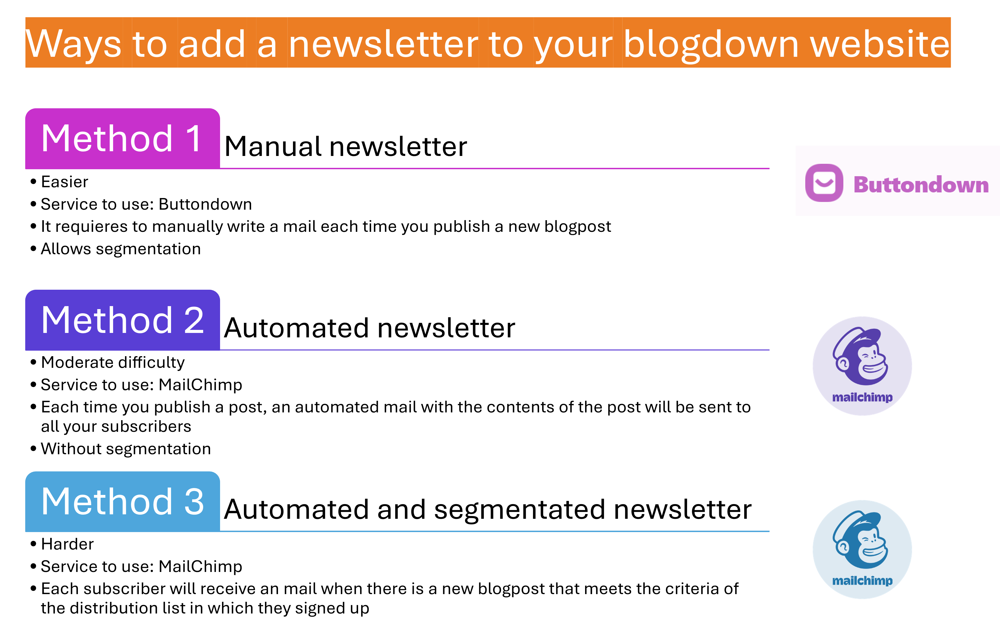
It's worth mentioning that all these three methods offer proper signup forms, so there is no difference between them in that regard.

Also, note that **method 1, the simpler one, has support for subscriber segmentation**, while method 2 does not. The trap here is that method 1 offers just a *manual* segmentation, in the sense that we will have to manually write the e-mails for each segment (they won't be automatically generated and sent as we publish content in the blog).

Finally (before moving on to the tutorials), I'd like to add a couple of considerations:

 -   There are a lot of `hugo` themes with different features/functionality, and in some of them, the steps shown here may require a bit of adaptation. But in most cases, everything should work very much the same (🤞🏼).
 
-  **My intention with this article is not to write an exhaustive revision of all the available methods for implementing a newsletter in blogdown** (that would be an ebook, not a blogpost). If you search the web you'll probably find many other newsletter services that could be integrated with blogdown, and some of them may even be easier to use and/or more feature-rich than those shown here. I just wanted to share with the community the methods that I found while setting up my own newsletter, in order to make things easier for those trying to do the same.

-  This article doesn't assume previous knowledge about Buttondown or MailChimp, but **it does assume that you have a good understanding of blogdown**, that is, that you know how to create and customize a website using this package. If that's not your case, you can find an excellent introduction to this topic in the book [*blogdown: Creating Websites with R Markdown*](https://bookdown.org/yihui/blogdown/).

-  This is an opinionated article. When I decided to create a newsletter, I had a very clear idea of how I wanted it, so the methods that I found (and that I'm sharing here) are biased towards that idea.

And without further ado, let's go to the tutorials themselves.

## Method 1: manual newsletter with Buttondown

If you have a blogdown website as a side-project and you only publish there once in a while (once per month or less), then *maybe* it's not necessary to have an automated newsletter, and you can afford the nuisance of manually writing mails to announce your blogposts to your subscribers.

If this idea sounds okay to you, then maybe [Buttondown](https://buttondown.email/), a simple and easy to use newsletter service, it's the right option for your website.

Below I'll explain how to use this service:

### Step by step

#### Step 1: Create an account and set up the newsletter

You can create a Buttondown account from [here](https://buttondown.email/login). Then, you'll be redirected to another page where you can set up your newsletter. There, you have to indicate the title, description, and, if you want, activate some optional features (such as having an archive or RSS feed for the mails that you will send)[^1].

[^1]: Almost all the options that you would need for a basic newsletter are free. Still, there are a few that are paid, such as removing the Buttondown logo from the mails. 


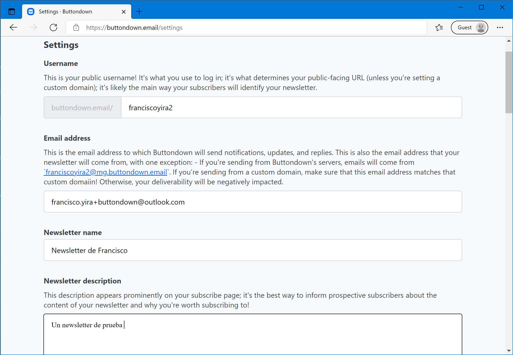{width="650"}

Finally, on this page, you can import subscribers by loading a CSV file with mail addresses. This is useful if you're migrating a newsletter from another platform, or if you already have a list of people who are interested in your newsletter.

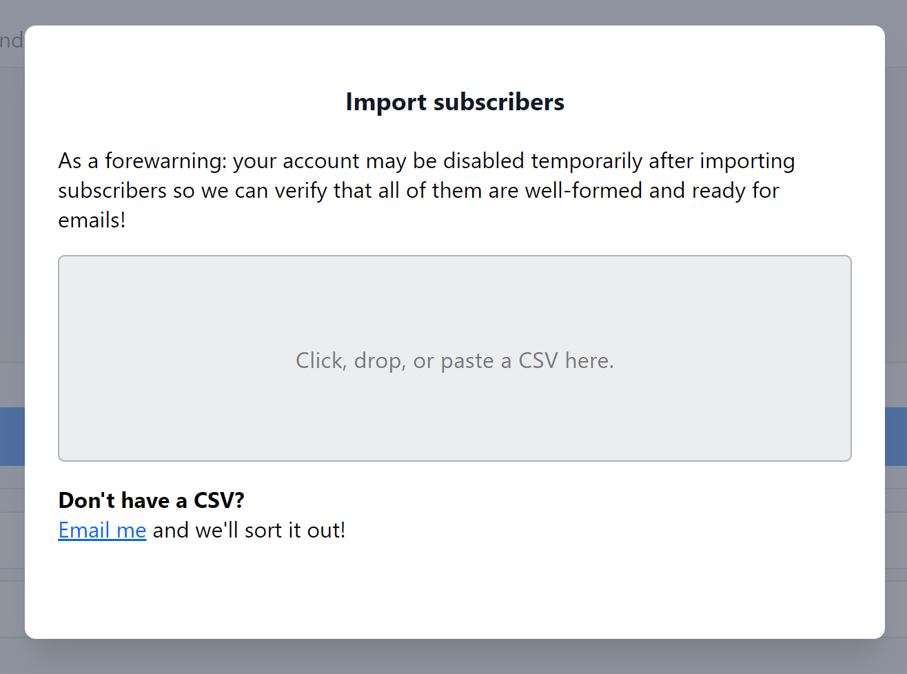{width="450"}

#### Step 2: implement the subscription form

Once you've created an account and configured the newsletter, you need to set up a way for people to subscribe. In Buttondown you can do this on the section ["Embedding & sharing"](https://buttondown.email/share), which can be found in the main menu (upper-left corner of the screen).


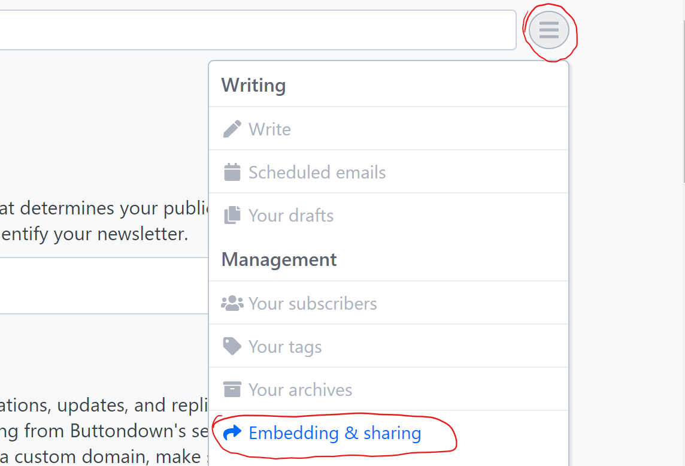{width="450"}

Once there, you can choose between two types of signup forms:

-   **Form hosted in Buttondown.email**, with a permanent URL which you can share or link from your blog ([here is an example](https://buttondown.email/franciscoyira)). This is the easiest option: you just have to take the URL and create a link from a visible place in your blog (e.g. the navigation bar).

- **HTML/iFrame embeddable form**. This option allows people to signup right into your blog without having to go to an external URL. If you choose this option, **I would recommend the HTML form instead of the iFrame one**. To implement the HTML form, you have to go to the tab *“Share as a form”*, then copy the HTML code shown there, and finally paste it in a `.md` file inside the content folder in the repo of your blog (usually this folder is literally named `/content`, and you can find it in the root directory of your blogdown repo).

[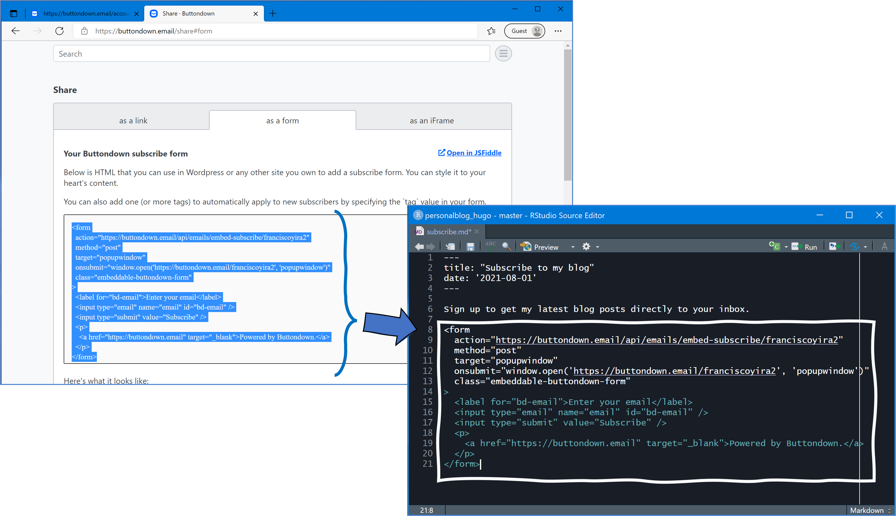{width="750"}](images/html_form_buttondown.png)

Afterwards, you should ensure that the `.md` page with the embedded form is accessible from the blog navigation. An easy way to do this is to add the page to the blog navigation bar (which can be configured on the `config.toml` file).

I would recommend naming the page with the embedded form as `subscribe.md`. In doing so, this page will get an URL like `baseURL/subscribe` (where `baseURL` is the URL that leads to the blog homepage). An URL like this it's easy to remember and to share with others.

An important detail about embedded forms is that sometimes **they won't load on your website due to a restriction in hugo's rendering engine**. If you find yourself with this problem, you can solve it by adding the following code snippet at the end of the `config.toml` file.

``` {eval="FALSE"}
[markup]
  [markup.goldmark]
    [markup.goldmark.renderer]
      unsafe = true
```

#### Step 3: We're done! Let's send emails (manually)

Once you've set up your newsletter and uploaded a list with subscribers (and/or got a couple of new subscribers through the signup form), **you can start sending emails right away**.

For doing so, go to Menu -\> option *“Write”* (or directly to  [buttondown.email/emails](buttondown.email/emails)). Then just write the mail announcing a new blogpost and press the “Send” button. You can even schedule the mail to be sent later.

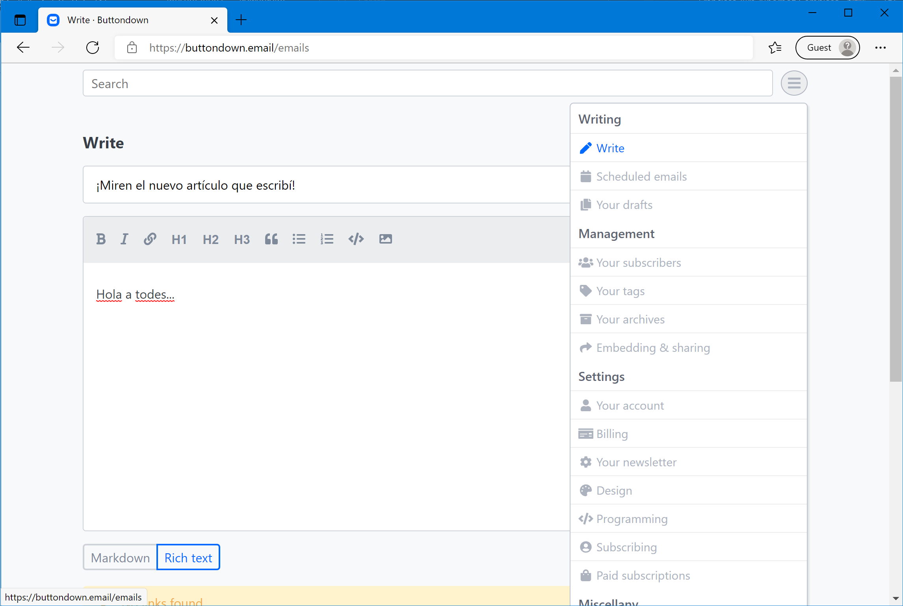{width="750"}

#### Bonus: enable tags (i.e. segmentated subscriber lists)

An interesting feature included in Buttondown is allowing to segment the audience using *tags*. That is, classify your subscribers with different tags in order to send some emails only to people who have a specific tag attached.

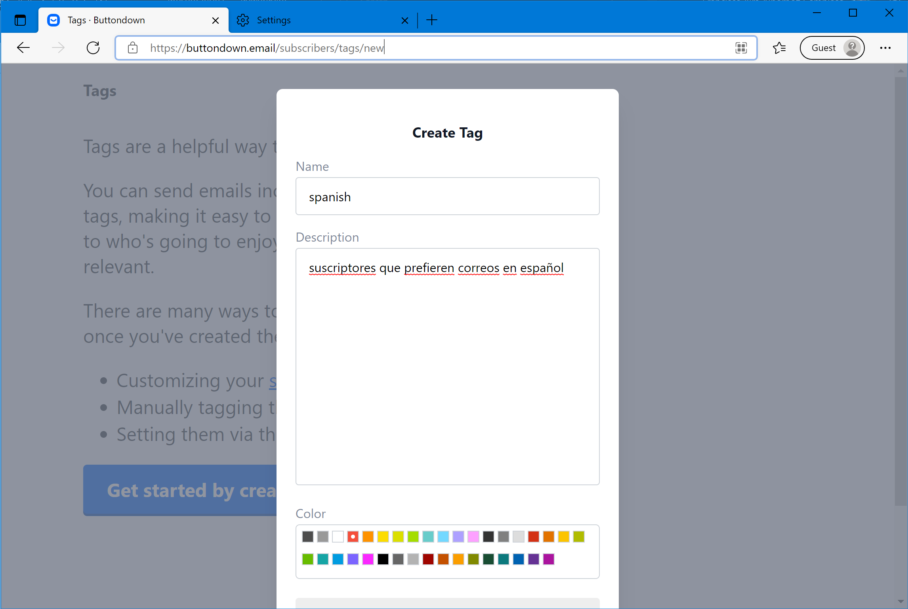{width="750"}

A use case for the tag feature is creating a **multilingual newsletter**. This can be done by classifying your subscribers based on their language of preference, and then sending emails to each tag according to that language choice.

Even better, you can set up different signup forms in such a way that the tags are automatically applied based on which form the subscriber used. To achieve this, you first have to create the appropriate tags and then return to step 2, where you'll see a new option to pick a tag to associate or link with the form you're creating.

This kind of workflow works very well in tandem with the [multilingual features of hugo and blogdown](https://www.rstudio.com/resources/rstudioglobal-2021/an-easy-and-friendly-way-to-build-your-multilingual-website/), because they allow you to have a different subscription page for each language in your website. That means that for each language you can embed a distinct signup form linked to the corresponding tag.

### Buttondown's limitations

An argument against using Buttondown is that **it makes very difficult to set up a newsletter that automatically delivers the content of new blog posts as they're published**. When you use this service, you almost have no choice but to manually write a new mail each time you want to announce a new blog post.

If you *really* wanted to have an automated newsletter in Buttondown, you would have to connect it with Zapier (an external service, which in many circumstances ends up asking you to pay). When I tried to do this, the resulting automated newsletter was neither well-formatted nor included images.

Maybe it's possible to find solutions to these problems by doing additional research, but if you are sure you want an automated newsletter, then I think **MailChimp is better suited to your needs**. That's why we're going to use it in method 2.

## Method 2: automated newsletter with Mailchimp, without segmentation

Now we'll see how to use MailChimp to set up a newsletter that automatically notifies your subscribers each time you publish a new blog post, without you having to write mails manually. 

Since MailChimp is more complex to use than Buttondown, I'll try to keep this section easy to follow by focusing on the most basic use case: **a unique distribution list delivering all your blog posts**. Later on (in method 3), I'll cover the case of several segmented distribution lists (comparable to Buttondown's tags) to send articles in different languages or about different topics according to your subscribers' preferences.

Another thing to keep in mind is that if you use MailChimp, **the newsletter content will be the same as the content of your blog's [RSS feed](https://es.wikipedia.org/wiki/RSS)**. If your blog has RSS feeds with full content, then subscribers will receive full blog posts in each mail. If not, mails will only display a brief excerpt with the beginning of each article, and subscribers will have no choice but to go to your blog to continue reading[^2].

[^2]: This blog post will not cover the instructions to enable full RSS feeds in blogdown because they heavily depend on the version of hugo and the template that you're using, so I would be risking writing something that's doesn't work in many blogdown settings. If you want to activate this option in your blog, I would recommend these links as a starting point:  [(1)](https://randomgeekery.org/post/2017/09/full-content-hugo-feeds/) , [(2)](https://coolbutuseless.bitbucket.io/2018/02/07/blogdown-rss-feed-of-full-articles/), [(3)](https://stackoverflow.com/questions/48997278/how-do-i-get-my-blogdown-blog-on-r-bloggers/#) and [(4)](https://www.rockyourcode.com/til-how-to-create-full-text-rss-feed-for-hugo/).

### Step by step

#### Step 1: Sign up on MailChimp (and provide a physical address)

Just like on Buttondown, the first step for using MailChimp is [creating an account](https://login.mailchimp.com/signup/). However, here we have an additional thing to worry about: since MailChimp is more focused on "professional" emailers, it asks us to **provide a physical address** in order to comply with anti-spam laws that require such information from those who send automated emails to a lot of people.

This address will then appear by default at the footer of sent emails and in some forms of the subscription flow (for example, when a subscriber changes their preferences). It's possible to [hide this address in some places](https://www.denisejoanne.com/remove-address-from-mailchimp-footer-confirmation/) but not everywhere, so there will always be some pages that publicly display it. 

**What can we do about this?** It's natural to feel uncomfortable with sharing our physical address, but if we don't write anything in this field, then MailChimp doesn't allow us to continue. 

[MailChimp's official recommendations](https://eepurl.com/dyikOT) to avoid sharing our home address are the following:

- Give the address of our university in case of being students or being affiliated with an academic institution.

- Give the address of our workplace (or a cowork space or a studio).

- Pay for a P.O. Box and use that address.

In general, **any address where you can receive and pick up physical mail will be a valid option** that will comply with anti-spam regulations.

[VOY ACÁ]

Además de la disyuntiva de la dirección física, al registrarnos en MailChimp también debemos escoger el plan a contratar (aquí el gratuito debería ser suficiente si la lista de suscripción es pequeña), y un "Nombre del negocio", que debería ser el nombre de nuestro sitio web o blog.

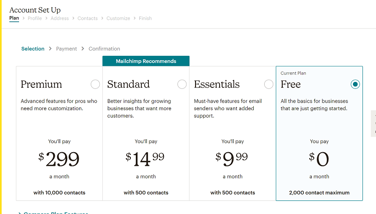

Finalmente (e igual que en Buttondown), se muestra una opción para importar direcciones de correo, útil si es que estamos migrando un newsletter existente. En caso contrario se puede omitir.

Y listo, con eso finaliza el registro y podemos avanzar al paso 2.

#### Paso 2: Obtener la URL del feed RSS del blog

Para poder enviar los posts de forma automática a tus suscriptores es necesario contar con un feed RSS que se actualice cada vez que se publica un nuevo artículo.

La mayoría de los templates de `hugo` usados para `blogdown` entregan soporte nativo para RSS, disponibilizando un feed con los blogposts en una URL de este tipo:

`baseURL/post/index.xml`

Donde `baseURL` corresponde a la URL que nos lleva a la página principal del blog, y `post` es el nombre de la carpeta que contiene los artículos en el repositorio del blog, y usualmente ubicada dentro de [`~/content`](https://bookdown.org/yihui/blogdown/content.html). Por ejemplo, en este blog la `baseURL` es `franciscoyira.com/es` y el feed con los posts es `franciscoyira.com/es/post/index.xml`.

En otros templates de blogdown esta carpeta puede tener otro nombre, pero el rasgo distintivo que permite identificarla es que **dentro de ella se guardan los artículos del blog** (archivos en formato `.Rmd`, `.Rmarkdown` o `.md`). A veces el nombre de esta carpeta está especificado en un archivo `config.toml` en el directorio raíz del repositorio[^3].

[^3]: Alternativamente también se puede usar este feed: `baseURL/index.xml`. Pero este incluirá también las páginas de primer nivel, tales como "Acerca de", "Contáctame", etc. , y también las páginas de otras secciones, si es que las hay (por ejemplo, si hay una sección "Portafolio", este feed incluirá también las páginas dentro de ella). Lo más probable que NO queramos que estas páginas se envíen como newsletter. Por eso mi sugerencia es **buscar un feed que contenga únicamente los posts o artículos**.


Una vez obtenida la URL del feed RSS puede ser buena idea **previsualizarla** para así validar su contenido. Para ello se pueden usar opciones como estas:

-   [RSS Viewer](https://codebeautify.org/rssviewer): una herramienta web en la cual se ingresa la URL del feed y se obtiene una vista HTML de este.

-   [The RSS Aggregator](https://chrome.google.com/webstore/detail/the-rss-aggregator/ffhafkagcdhnhamiaecajogjcfgienom): un lector RSS disponible como extensión para Chrome y Edge (Chromium). Al instalarlo podremos visualizar los feeds RSS directamente en el navegador.

-   [Feedly](https://feedly.com/): un lector RSS disponible como servicio web. Es muy completo y popular pero requiere crear una cuenta.

[LLEGAR ACÁ]

#### Paso 3: Crear el newsletter automatizado a partir del feed RSS

Ya con la URL del feed RSS en mano, procedemos a crear la automatización de MailChimp para enviar un correo cada vez que se publique un nuevo artículo.

Para ello hay que ir a [esta página](https://mailchimp.com/features/rss-to-email/) y hacer clic en el botón **"Turn On RSS-to-Email"**.

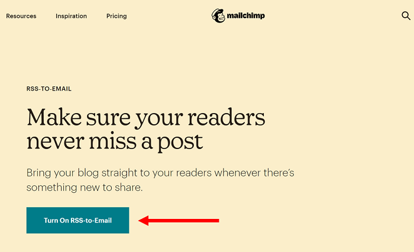

Luego aparecerá una vista como esta, donde se le debe asignar un nombre a la "campaña" (***"Campaign Name"***). Este nombre es interno y tiene como fin distinguir este envío recurrente de otros envíos (manuales o automatizados) que implementemos en el futuro.

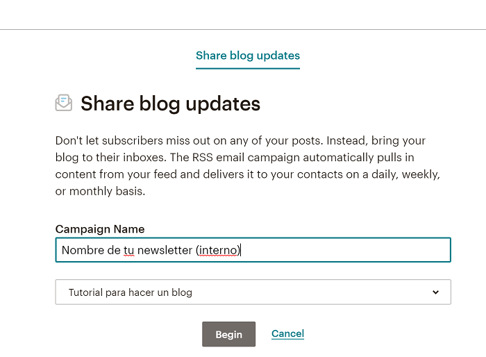

Presionamos "Begin", y en la siguiente página hay que **ingresar la famosa URL del feed RSS** obtenida en el paso anterior. Además, se puede configurar a qué hora se enviarán los correos automatizados[^4]. Si todo está OK, hay que presionar **"Next"** en la esquina inferior derecha.

[^4]: Notar que se enviarán correos nuevos en esos días/horas **sólo si existe contenido nuevo desde el envío anterior**, en caso contrario no se enviará nada. Por otro lado, si se desactivan algunos días y se publica un artículo ahí, Mailchimp tendrá que esperar hasta el siguiente día con envíos habilitados para poder enviar el newsletter. Por ello, mi recomendación aquí sería dejar intacta la opción por defecto, que es intentar enviar correos todos los días.

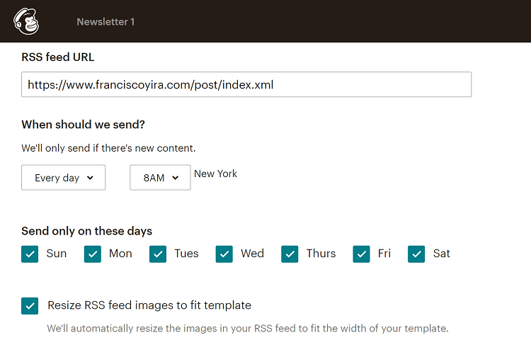

En la siguiente pantalla hay que **seleccionar la audiencia a la que le llegará el newsletter**. Aquí dejaremos el valor por defecto (*"Entire audience"*) ya que estamos creando un newsletter único (no segmentado) para todos los suscriptores[^5].

[^5]: Ya en la siguiente sección explicaré los cambios necesarios para introducir segmentación en el newsletter, pero por ahora estoy intentando explicar el proceso de la forma más simple posible.

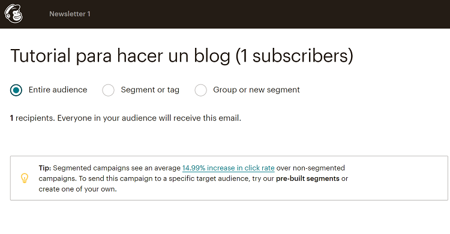

Luego de presionar **"Next"** aparecerá la sección de "Información de campaña", donde se pueden personalizar otros parámetros del newsletter.

[MILESTONE: 40%]

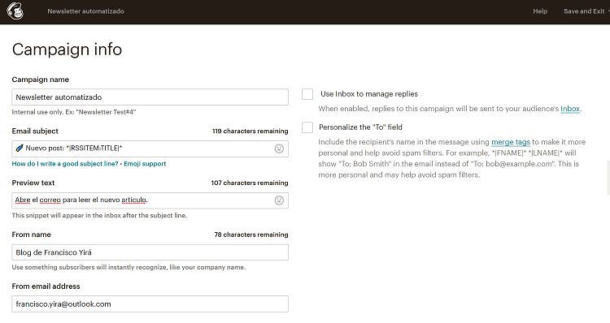

El primer campo (***"Campaign name"***) corresponde al mismo "nombre de campaña" que ingresamos en la primera parte del asistente, y que es solo de uso interno.

El segundo campo (***"Email subject"***) sí es relevante para los suscriptores: es el **título o asunto de los correos que recibirán**. Aquí es posible usar los llamados ["*merge tags*" de MailChimp](https://mailchimp.com/help/rss-merge-tags/): variables que son reemplazadas por atributos provenientes desde el feed RSS, o del gestor de audiencias de MailChimp (por ej, el nombre o apellido de cada suscriptor, o la fecha de publicación del artículo). En mi caso, uso el tag `*|RSSITEM:TITLE|*` que corresponde al **título de cada nuevo artículo**.

El tercer campo (***"Preview text"***) corresponde al fragmento que aparece debajo del asunto en las apps de correo electrónico.

*](images/previewtext01.png)

No logré encontrar un merge tag útil para personalizar el *preview text*, así que opté por un mensaje estático: "*Abre este correo para leer el artículo completo*", pensando en incrementar la tasa de apertura del newsletter.

Los últimos 2 campos de esta sección corresponden al **remitente**: el nombre (***"From name"***) y correo (***"From email address"***) que aparecerán en el "De:" o "From:" cuando los suscriptores reciban el newsletter. Aquí la idea es usar algo fácilmente reconocible para evitar que los suscriptores se confundan y piensen que es spam.

Más abajo en la misma página hay algunas opciones adicionales, pero que pueden dejarse con sus valores por defecto sin modificar.

A continuación presionamos **Next** y pasamos a la siguiente sección: **escoger la plantilla para el newsletter**. En esta sección mi recomendación es elegir *"1 Column"* o *"Simple Text"*, que tienen lo justo y necesario para que nuestros posts se muestren correctamente. Para este tutorial elegiré *"Simple Text"*.

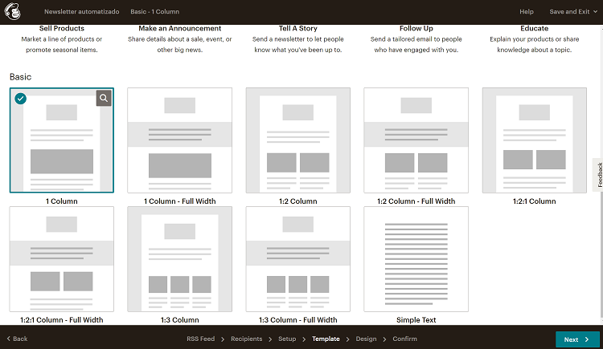

Habiendo seleccionado la plantilla, aparecerá la vista de **Diseño (*"Design"*)** donde hay que hacer algunos cambios para que el newsletter funcione de manera adecuada.

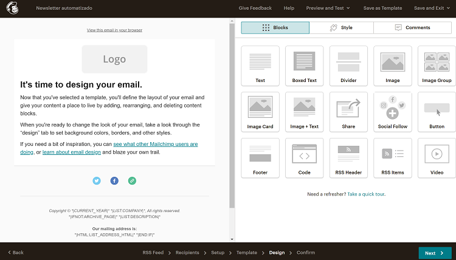

En particular, debemos insertar una serie de *merge tags RSS* para que contenido del newsletter se alimente de los nuevos posts del blog.

Para mí, la forma más sencilla de hacer esto fue **borrar todos los bloques que vienen con la plantilla**, e **insertar 3 nuevos bloques de texto** (*"Text"* desde la galería de contenido de la derecha). Luego seleccioné y edité estos bloques, e inserté ahí los merge tags correspondientes.

A continuación describo cada uno de estos bloques (junto al código HTML para replicarlos):

Primero, un **bloque de cabecera**, muy simple, en un tamaño de letra pequeño y con un link directo al post en el blog. ¿Por qué? Debido a que a veces los clientes de correo no muestran correctamente el contenido de los newsletters y en estos casos queremos que el lector pueda ir fácilmente al artículo original usando un navegador web[^6].

[^6]: Por ejemplo, [Microsoft Outlook Desktop utiliza ¡Word! como visor de HTML](https://medium.com/@brentonhenry/its-2019-and-outlook-is-still-rendered-with-word-675ca1a5d1a0#:~:text=Outlook%20renders%20your%20email%20using%20Word.%20Yes%2C%20the,in%20the%20%E2%80%9CEnterprise%E2%80%9D%20Standard%20product%20that%20is%20Outlook.), y a la vez es una aplicación muy utilizada en empresas, por lo que es casi seguro que alguno de nuestros suscriptores recibirá el newsletter ahí y tendrá una mala experiencia si no lo redirigimos a un navegador web a leer el artículo.

El HTML para este bloque es el siguiente:

`<span style="font-size:12px"><a href="*|RSSITEM:URL|*" target="_blank">Ver el post en tu navegador</a>&nbsp;(recomendado).</span>`

Y debería verse así en el panel de la izquierda:

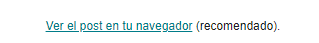

Nótese la presencia del merge tag `*|RSSITEM:URL|*` en el link. Este merge tag se reemplazará por la URL correspondiente al post en cada envío del newsletter.

Luego viene un **bloque de contenido**, cuyo código es el siguiente:

    <h2 class="mc-toc-title"><span style="font-family:helvetica neue,helvetica,arial,verdana,sans-serif"><a href="*|RSSITEM:URL|*" target="_blank">*|RSSITEM:TITLE|*</a></span></h2>
    <span style="font-family:helvetica neue,helvetica,arial,verdana,sans-serif">*|RSSITEM:CONTENT_FULL|*</span>

    <pre>
    <span style="font-family:helvetica neue,helvetica,arial,verdana,sans-serif">*|END:RSSITEMS|*</span>
    </pre>

Y debería verse así en el panel de la izquierda:

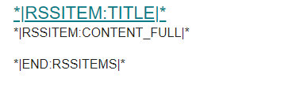

Y finalmente un **bloque *footer***, con elementos obligatorios como la licencia del contenido y el link de desuscripción. El código que usé para este bloque es el siguiente:

    <em>Este trabajo est&aacute; licenciado bajo &nbsp;<a href="http://creativecommons.org/licenses/by/4.0/" rel="license">Creative Commons Attribution 4.0 International License</a>.</em><br />
    <br />
    *|LIST:DESCRIPTION|*<br />
    <br />
    &iquest;Quieres cambiar como recibes estos e-mails?<br />
    Puedes <a href="*|UPDATE_PROFILE|*">actualizar tus preferencias</a> o <a href="*|UNSUB|*">desuscribirte de esta lista</a>.<br />
    <br />
    *|REWARDS|*

Y debería verse así en el panel de la izquierda:

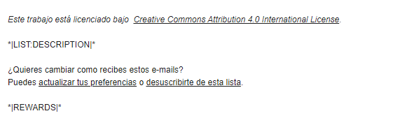

Por supuesto, en este último bloque deberías modificar la parte de la licencia en caso de que quieras usar una distinta a [CC 4.0](https://creativecommons.org/licenses/by/4.0/).

Notar que MailChimp ofrece un editor visual para los bloques de texto, por lo que *técnicamente* no es necesario manipular HTML: los merge tags se pueden insertar "tal cual" en este editor visual, y su formato (fuente, tamaño) se puede modificar desde ahí. Pero yo **prefiero compartirles los bloques de código porque así es más fácil seguir las instrucciones**: solo basta copiar y pegar. Una vez copiados los bloques se puede cambiar sin problemas al editor visual para seguir personalizándolos.

Y listo, habiendo ya diseñado y personalizado el newsletter podemos echarle un vistazo a como lucirá en las bandejas de entrada de nuestros suscriptores ✨. Para esto existe el menú *"**Preview and Test**"* en la esquina superior derecha, dentro de la misma sección *Design*. Este menú permite previsualizar un correo de prueba en la web de MailChimp o en la aplicación móvil, e incluso enviarnos un correo de prueba a nosotros mismos (o a amigos dispuestos a ser conejillos de indias).

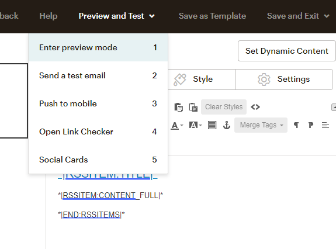

Una vez conformes con cómo se verá el newsletter presionamos ***"Next"*** y avanzamos al último paso de esta sección: **Confirmar que todo esté OK y dar luz verde a los envíos automáticos**.

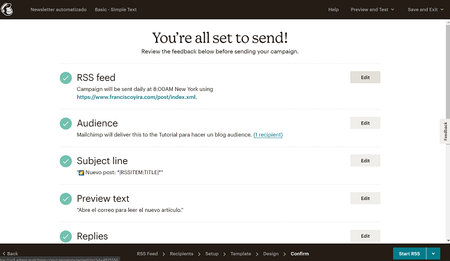

En esta página se puede dar un último vistazo a las opciones del envío, y volver atrás si es que aun queremos cambiar algo. Si todo nos parece bien, hay 2 opciones para que el newsletter empiece a operar:

-   ***Start RSS*** (botón abajo a la derecha): pone en marcha la automatización, pero a partir del próximo post que se publique en blog. Es decir, **no se enviará nada al momento de presionarlo**, pero sí cuando publiquemos nuevos artículos en el futuro.

-   ***Send now and Start RSS campaign*** (disponible al hacer clic en flecha al lado de *"Start RSS"*): también pone en marcha la automatización, pero realiza de inmediato un primer envío con el último post disponible en el blog.

Hay que elegir una de las 2 opciones y presionar el botón correspondiente, ¡y listo! Nuestro newsletter automatizado ya está funcionando.

Pero aún falta una parte muy importante: implementar el formulario de suscripción para que nuevos lectores puedan darse de alta.

#### Paso 4: Implementar el formulario de suscripción

Mientras que en Buttondown el formulario de suscripción viene configurado por defecto y sin muchas opciones de personalización, en MailChimp se nos da la posibilidad de **diseñarlo nosotros mismos**. El proceso de diseño es relativamente sencillo ya que contamos con un editor visual: para acceder a él solo hay que ir a ***Audience \> Signup forms*** y ahí hacer clic en **"Form Builder"**.

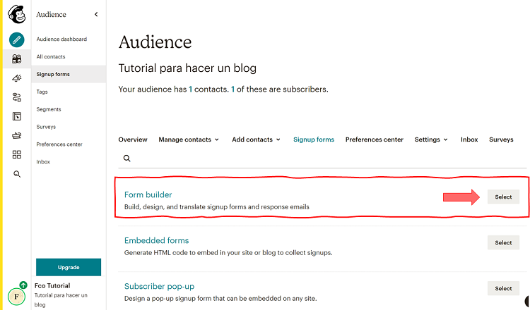

Lo primero que veremos dentro del editor visual será el **formulario de suscripción predeterminado de MailChimp**. Este incluye el campo de correo electrónico, que es el único estrictamente necesario, y también otros como fecha de nacimiento, nombre, y apellido. Depende de nosotros cuáles de estos campos adicionales conservar y cuáles eliminar.

Para eliminar un campo hay que seleccionarlo y luego presionar ***"Delete"*** en la parte inferior del panel de la derecha. Se nos mostrará una advertencia ya que eliminar el campo implica también eliminar los datos vinculados a este (en el gestor de audiencias de MailChimp). Si ya hay datos asociados a este campo puede convenir simplemente ocultarlo (opción también disponible en el panel de la derecha).

Además, se pueden agregar campos nuevos para recolectar información adicional. Esto lo usaremos en la siguiente sección para implementar los newsletters segmentados, pero para el newsletter simple nos basta y sobra con el campo de correo electrónico.

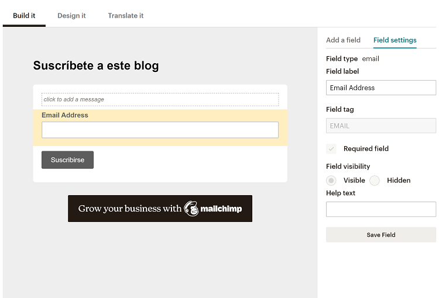

Una vez personalizado el formulario de suscripción tenemos 2 opciones para agregarlo a nuestro blog:

1.  La más simple: **usar el enlace directo al formulario de suscripción**. Este enlace apunta a un formulario alojado en MailChimp que luce idéntico al diseñado/previsualizado en el editor visual. Este se puede obtener en la sección ***"Signup form URL"*** dentro del editor visual de formularios. Con esta URL se puede crear un link desde cualquier lugar visible del blog (por ej., la barra de navegación).

    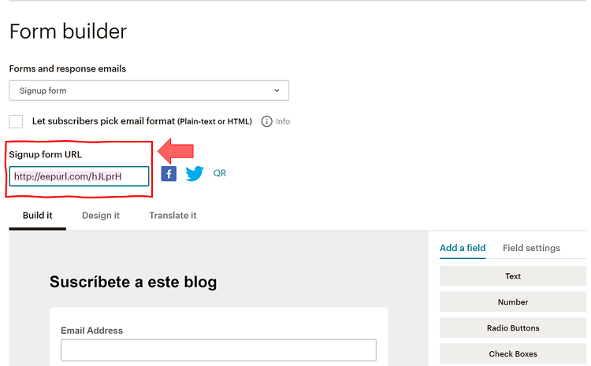

2.  **Incrustar el formulario en nuestro blog mediante código HTML**. Esto es más complejo, pero evita que lectores tengan que ir a una URL externa para suscribirse, y además da al formulario una apariencia más consistente con el resto de nuestro blog.

Para implementar el formulario HTML incrustado hay que volver a *Audience \> Signup forms*, pero ahora entrando en la sección **"Embedded forms"**.

En esta sección hay varias opciones de formularios incrustados, algunas con CSS y JavaScript, pero recomendaría usar la opción *Unstyled*: un formulario HTML básico que reduce la posibilidad de conflicto con el tema del blog.

Luego de seleccionar el formulario *Unstyled* recomiendo además desactivar la opción *Include form title*, porque el formulario se incrustará en una página Markdown que ya tiene su propio título.

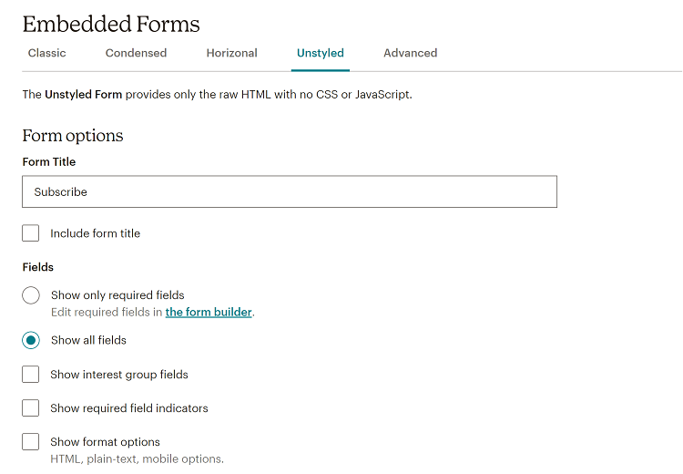

Es importante mencionar que los campos de este formulario y los del formulario que diseñamos en el editor visual son los mismos. **No estamos creando un formulario distinto**, sino que usando otra forma de acceder a él.

Luego de configurar las opciones, hay que ir al final de la página y presionar el botón **"Generate Embed Code"**.

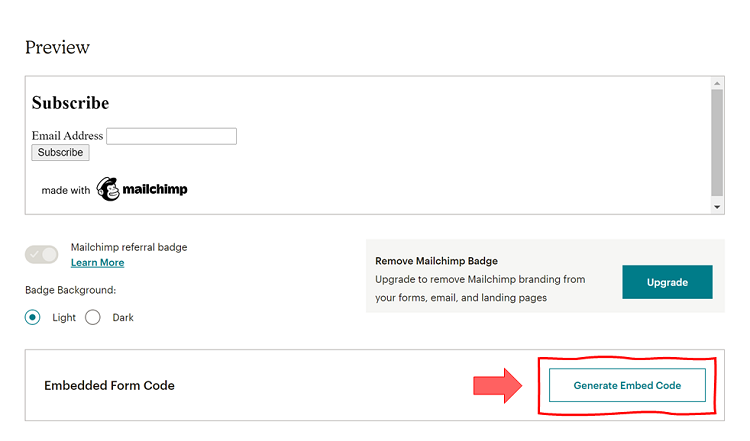

Se debe copiar el código que aparecerá ahí, y pegarlo en el archivo `.md` correspondiente (aquel donde queremos que se muestre el formulario de suscripción). El código debe ir debajo de la cabecera YAML (en mi caso agregué también un pequeño texto explicativo entre la cabecera y el formulario).

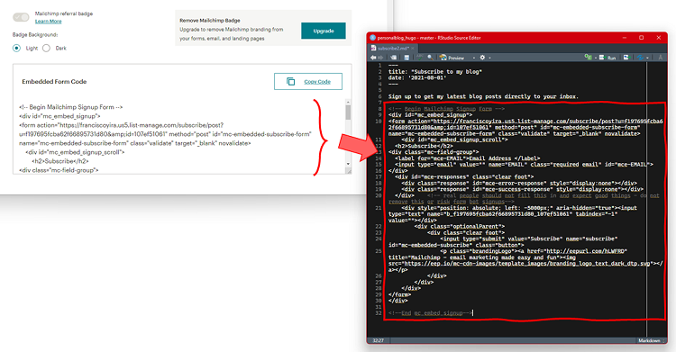

Al hacer *knit* del blog, la página con el formulario de suscripción debería lucir así:

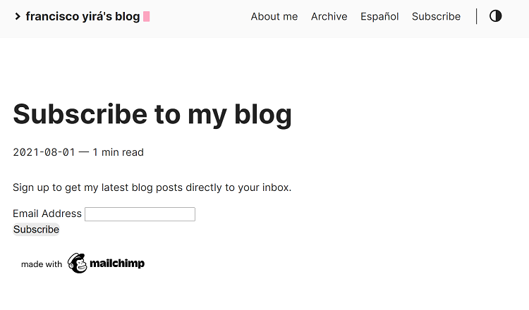

*¡Y listo!* Aquí ya tenemos un formulario de suscripción totalmente funcional, conectado al newsletter automatizado que creamos en la sección anterior.

Sin embargo, yo hice 2 ajustes adicionales, totalmente opcionales, que creo que mejoran la apariencia y funcionalidad del formulario.

Primero, **cambiar el estilo del botón "Subscribe"**. El por defecto no tiene mucha apariencia de botón, y además le falta un salto de línea que lo separe del campo *Email Address*. Para esto hay que buscar este código:

``` {.HTML}
<input type="submit" value="Subscribe" name="subscribe" id="mc-embedded-subscribe" class="button">
```

Y reemplazarlo por este código:

``` {.HTML}
</br> <div class="clear"><input type="submit" value="Subscribe" name="subscribe" id="mc-embedded-subscribe" style="height:27px; width:100px; font-size:16px"></div>
```

Segundo, **agregar al final de la página un link al formulario alojado en MailChimp** (el enlace directo que vimos en la sección anterior). ¿Por qué? Por la eventualidad de alguien que desee suscribirse pero use algún bloqueador de contenido (por ej., uBlock Origin) que le impida visualizar el formulario incrustado. Con este link esas personas tendrán una forma alternativa de darse de alta en el newsletter.

Para hacer este cambio basta con agregar un texto con el link correspondiente *después* de que termine el código del formulario incrustado (es decir, después de esta línea: `<!--End mc_embed_signup-->`).

Al hacer estos cambios la apariencia del formulario quedará así:


## Método 3: newsletter automatizado y segmentado con MailChimp

Estamos llegando a la parte final de este tutorial. Si sigues leyendo hasta aquí es porque no te basta con tener un único newsletter con todo el contenido de tu blog, sino que deseas tener **varias listas de distribución, segmentadas por idioma, por tema, o ambas**.

Para no extender tanto este artículo (que ya esta siendo bastante largo), aquí no haré una explicación "paso por paso" como en secciones anteriores, sino que **será una especie de anexo de la sección anterior** (método 2), mostrando qué cosas hay que hacer distinto para obtener un newsletter segmentado (eso implica que si saltaste directo desde la introducción hasta acá, tendrás que subir y leer primero la parte del método 2, lo siento 😅).

### Conseguir los feed RSS específicos para cada tema y/o idioma

El primer cambio necesario para tener listas de distribución segmentadas es **usar feeds RSS específicos** con el contenido que recibirá cada segmento.

Ilustraré esto con un ejemplo de este mismo blog: aquí implementé listas de distribución exclusivas para el contenido de Data Science, una en inglés y otra en español. Para esto fue necesario obtener 2 feeds RSS:

1.  Feed con el contenido de Data Science en inglés

2.  Feed con el contenido de Data Science en español

Al tener un sitio multilingüe con `blogdown` es muy sencillo obtener feeds RSS específicos para cada idioma: basta con **agregar el código del idioma** (por ej., *es*, *fr*, *en*) **justo después de la `baseURL`**. En el caso de este blog los feeds con contenido en español e inglés son los siguientes:

-   Español: `franciscoyira.com/es/post/index.xml`

-   Inglés: `franciscoyira.com/post/index.xml`

Donde `franciscoyira.com` corresponde a la `baseURL`. Notar el sufijo `es/` en el feed en español (en el feed en inglés no hay sufijo porque [está configurado como el idioma "base" del blog](https://github.com/franciscoyira/personalblog_hugo/blob/8ad38636ed080424babeef37d15d3eca344d0815/config.toml#L2)).

OK, ahí ya tenemos una regla para obtener los feeds correspondientes a cada idioma, pero ¿cómo obtener un feed que tenga sólo los posts sobre Data Science (o cualquier otro tema)?

Para esto debemos usar la **estructura de tags y categorías** de nuestro blog. En mi caso simplemente creé una categoría denominada `data-science` y empecé a marcar todos los posts de Data Science con esta categoría.

Aquí entra la magia de `hugo`, que automáticamente genera páginas para cada tag y categoría. En el caso de este ejemplo, se generaron las siguientes páginas con los posts de la categoría `data-science`:

`franciscoyira.com/es/categories/data-science/` para los posts en español, y...

`franciscoyira.com/categories/data-science/` para los posts en inglés.

Y como vimos en la sección anterior, `hugo` también crea automáticamente feeds RSS para las páginas de este tipo. **Para acceder a estos feeds simplemente hay agregar el sufijo `index.xml` al final**, por lo que los feeds de la categoría `data-science` serán estos:

`franciscoyira.com/es/categories/data-science/index.xml` para los posts en español, y...

`franciscoyira.com/categories/data-science/index.xml` para los posts en inglés.

Las instrucciones son muy similares si queremos usar tags en vez de categorías: por lo general bastará con reemplazar `categories` por `tags` en las URLs.

Como consideración, mencionar que **los tags/categorías en distintos idiomas no tienen por qué llamarse igual**, de hecho se configuran por separado y el que aquí tengan el mismo nombre es solo coincidencia. En mi blog quise que la categoría de Data Science tuviera el mismo nombre en español e inglés, pero perfectamente los posts en español podrían estar categorizados como `ciencia-de-datos` en cuyo caso la URL del feed sería así:

`franciscoyira.com/es/categories/ciencia-de-datos/index.xml`

Y esto no afectaría en nada la URL del feed de Data Science en inglés.

#### TL;DR

En resumen, **depende de nosotros mismos crear una estructura de tags o categorías acorde a las listas de distribución que queramos tener**. Una vez definida esta estructura, es sencillo obtener las URLs de los feeds RSS correspondientes: basta con encontrar la pagina del tag o categoría respectiva (para lo cual incluso se puede usar la navegación del blog) y agregar `index.xml` al final.

Y para especificar un idioma particular (en el caso de blogs multilingües) solo hace falta agregar el código de idioma después de la `baseURL`, siempre que se trate de un idioma distinto del "idioma base".

### Crear segmentos para cada lista de distribución

Otro ingrediente necesario para segmentar un newsletter es contar con las respectivos *campos de datos* o *columnas* en el gestor de audiencias de MailChimp, indicando a qué segmento pertenece cada suscriptor.

MailChimp ofrece varias formas de crear categorías de suscriptores, y una de ellas literalmente se llama *Segmentos*, pero **la que en realidad nos conviene usar se llama *Grupos*** (es confuso, lo sé), ya que está directamente vinculada con los formularios de suscripción.

Para crear grupos hay que ir a *Audience \> All Contacts*, ahí seleccionar el menú drop-down **"Manage contacts"** y hacer clic en "Groups".

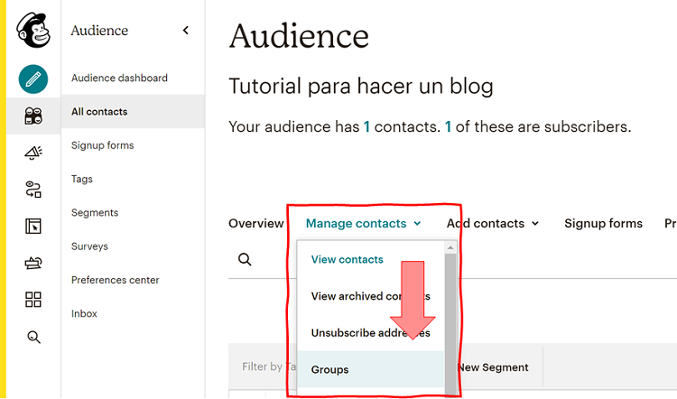

Dentro de la sección *"Groups"* hay que presionar el botón ***"Create Groups"***, a la derecha de la pantalla.

Ahí aparecerá la siguiente página de configuración, donde se debe ingresar el **nombre** (*Group category*) y **posibles valores** (*Group names*) del grupo a crear. También se debe elegir cómo aparecerán estas opciones dentro del formulario de suscripción (radio buttons, dropdown, checkboxes, etc).

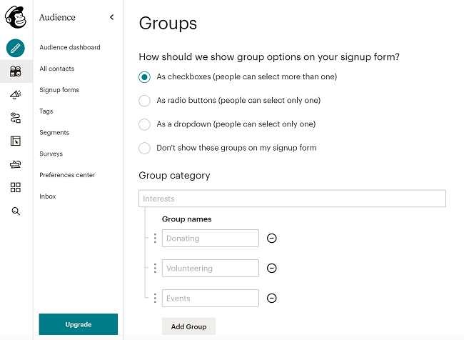

Aquí existe mucha libertad para crear distintos arreglos, dependiendo de cómo queremos que sea el flujo para enrolarse en cada lista de distribución[^7].

[^7]: Por ejemplo, yo definí el Idioma como una *Group category* que está oculta en los formularios: si te suscribes en el [formulario en español](https://www.franciscoyira.com/es/subscribe/) recibirás contenido en español, y si usas el [formulario en inglés](https://www.franciscoyira.com/subscribe/) recibirás contenido en inglés. Pero también podría haber configurado un formulario único, bilingüe, donde la opción de idioma se pudiera escoger desde un *dropdown* o con *radio buttons*.

Para ejemplificar los pasos que vienen después, replicaré los mismos grupos que implementé en mi propio blog, pero ahora usando *radio buttons* para todos ellos:

-   Grupos según temas/contenido:

    1.  Todo el contenido: para quienes deseen recibir todos los posts que publique

    2.  Sólo Data Science: para quienes deseen recibir exclusivamente los posts con la categoría `data-science`.

-   Grupos según idioma:

    1.  Español

    2.  Inglés

Para implementar esta segmentación hay que dirigirse a la sección *"Create groups"* ya mencionada y crear los 2 tipos de grupos, escogiendo *As radio buttons...* para ambos.

Hecho esto, la sección de grupos debería verse así:

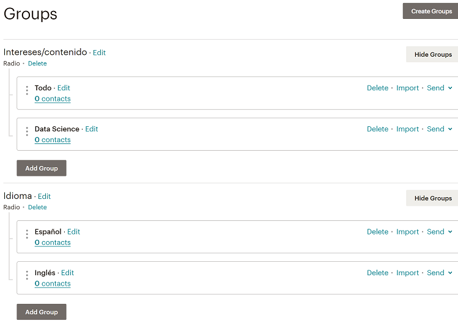

Ahora hay que disponibilizar un formulario que permita elegir entre estos grupos. Para esto, igual que antes, tenemos 2 opciones:

-   **Usar un link directo a un formulario alojado en MailChimp.** Los pasos para hacer esto son idénticos que los para el newsletter no segmentado.

-   **Incrustar un formulario en nuestro blog.** Aquí los pasos son muy similares a los del newsletter no segmentado, con una sola diferencia: dentro de *Audience \> Signup forms \> Embedded Forms \> Unstyled* hay que asegurarse de activar la casilla ***"Show interest group fields"***. Lo demás es todo igual: obtener el código HTML y pegarlo en un archivo `.md` de nuestra preferencia, dentro del repositorio del blog.

En ambos casos los grupos creados en el paso anterior se agregarán automáticamente al formulario.

Si seguimos la opción del formulario incrustado, el resultado debería lucir así:

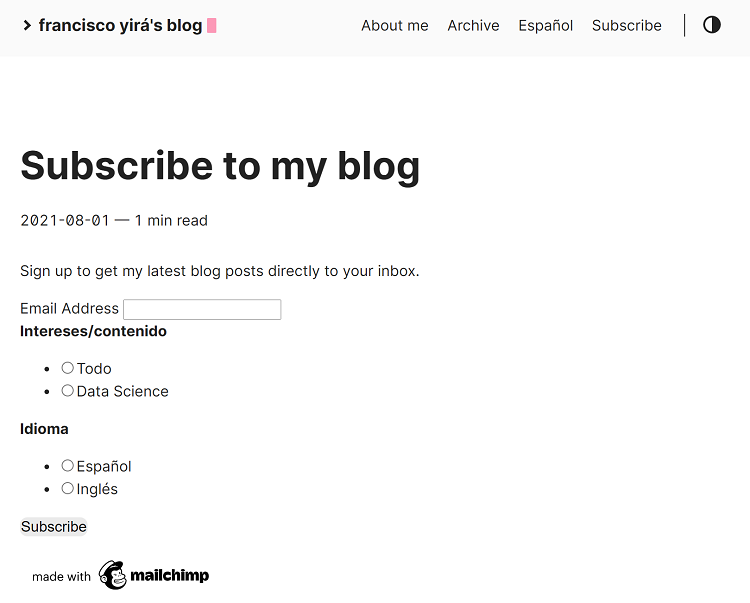

Aquí **ya contamos con un formulario funcional** que permitirá a los lectores escoger su propia lista de suscripción en base a idioma e intereses/contenido. *Técnicamente* no es necesario hacer nada más y podrían saltar de aquí a la sección final del tutorial pero si les gusta rizar el rizo como a mi pueden leer a continuación cómo hacer algunas mejoras al formulario incrustado.

#### Más personalización para el formulario incrustado

Si hemos optado por el formulario incrustado tenemos la opción de hacer algunos **ajustes estéticos adicionales**.

Para empezar, se pueden aplicar los mismos ajustes mostrados en la sección de newsletter no segmentado: mejorar el botón de suscripción, añadir un salto de línea después del campo de correo electrónico, y poner un link al formulario en MailChimp al final de la página (ante la eventualidad de que un bloqueador de contenido no permita visualizar el formulario incrustado).

Adicional a ello, creo que acá es buena idea **cambiar los textos descriptivos de los grupos**. Por ejemplo, dado que el formulario de este ejemplo sería bilingüe, aumentaría su usabilidad el describir las opciones tanto en inglés como en español.

Para lograr esto basta con ir al archivo `.md` donde está el formulario, invocar CTRL+F (o ⌘+F en Mac), buscar el texto que se muestra actualmente en el formulario y cambiarlo por otro nuevo que nos parezca más apropiado. En este caso, aplicaré los siguientes cambios:

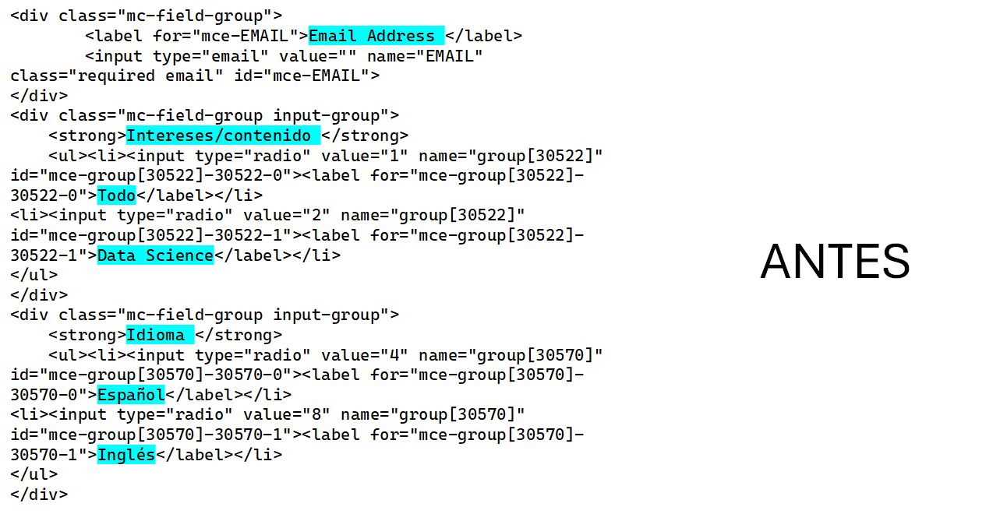{width="750"}

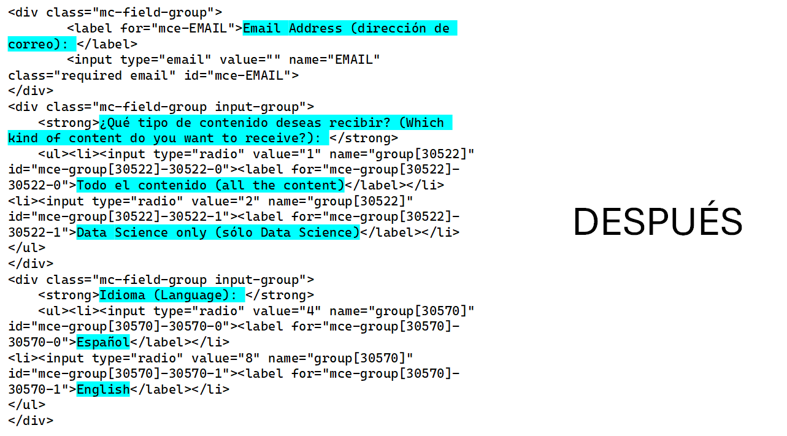{width="750"}

**Notar que esto no cambia el nombre interno de los campos de datos en el gestor de audiencias de MailChimp**. Allí los campos siguen llamándose "*Intereses/contenido"* e "*Idioma"*, y los valores asociados a cada alternativa son las opciones originales que configuramos en MailChimp.

Dicho de otra forma, existe simultáneamente un "valor interno" y un "valor para mostrar" para cada grupo y opción. Esto es útil ya que permite usar nombres cortos en los valores internos y nombres más largos y explicativos en los "valores para mostrar".

Una vez conformes con la apariencia del formulario, hemos completado el segundo de los requisitos para tener un newsletter segmentado. Ahora vamos a usar estos ingredientes para el paso final: **configurar el newsletter segmentado**.

### Mezclado los ingredientes para crear un newsletter segmentado

Una vez que tenemos las URLs de los feeds RSS, los segmentos de audiencia, y el formulario que permite a los suscriptores escoger su segmento, es hora de combinar todo esto para echar a andar nuestro newsletter segmentado ✨.

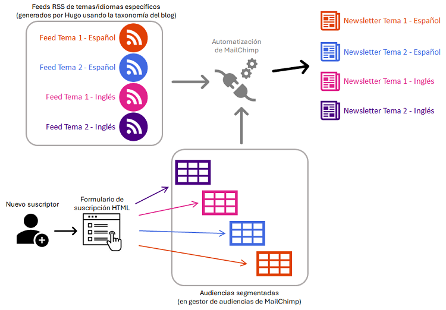

Lo que hay que hacer aquí es simplemente **repetir el proceso de crear un newsletter automatizado** (explicado ya en la sección anterior) para *cada uno* de los segmentos, pero haciendo 2 cambios:

1.  Al momento de ingresar la URL del feed RSS, hay que usar la URL correspondiente al feed del tema/idioma específico para el segmento.

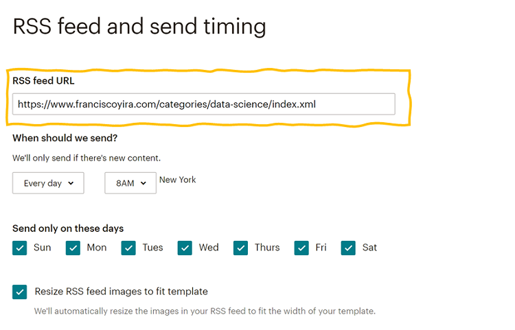

2.  En el paso de escoger la audiencia, en vez de seleccionar *Entire audience* hay que elegir *Group or new segment*. Al hacerlo aparecerá debajo un cuadro para **indicar los criterios que definen la audiencia segmentada**, y los grupos creados en pasos anteriores estarán dentro de los criterios disponibles. Por ejemplo, en este caso, se puede segmentar a los suscriptores según la opción de *Idioma* e *Intereses/contenido* que escogieron en el formulario de suscripción.

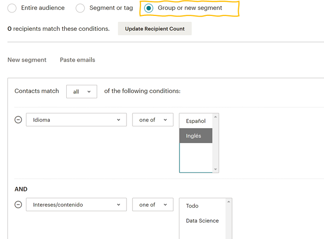

¡Y listo! El resto de los pasos son idénticos a los del newsletter sin segmentación. Solo recalcaría la necesidad de repetir el proceso con *cada uno* de los segmentos[^8], configurando una automatización distinta para todos ellos.

[^8]: En este ejemplo serían 4 segmentos, correspondientes a la combinatoria de los grupos de *Idioma* y de *Intereses/contenido*: Todo-Inglés, Todo-Español, Data Science-Inglés y Data Science-Español.

*Tu feedback es bienvenido. Si tienes comentarios sobre este artículo puedes enviármelos [por correo](mailto:francisco.yira@outlook.com).*

*Por cierto, luego de este artículo retomo [la serie sobre el libro Causal Inference: The Mixtape](https://www.franciscoyira.com/es/tags/causal-inference-the-mixtape/). El próximo post estará dedicado al [capítulo 4](https://mixtape.scunning.com/potential-outcomes.html), acerca el modelo causal de Potential Outcomes.*
