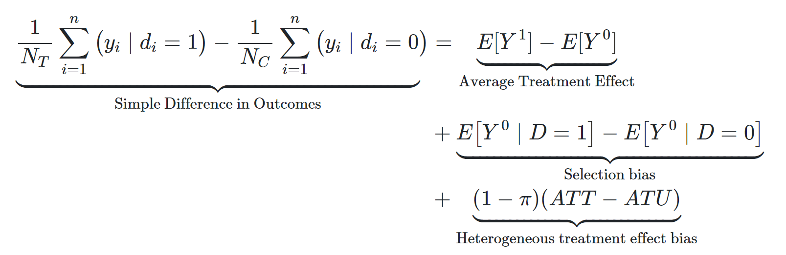

En este artículo, el segundo de la serie dedicada al libro [Causal Inference: The Mixtape](https://mixtape.scunning.com/), hablaré sobre **la notación de *Potential Outcomes*** y de cómo esta nos permite abordar preguntas de causalidad y entender ideas claves de este campo. Por ejemplo, gracias a ella podemos comprender porqué la diferencia simple de medias generalmente no permite identificar efectos causales, y el porqué los experimentos aleatorizados son útiles para hacer inferencia causal.

La idea central de esta notación es la **comparación entre 2 estados del mundo**:

-   **El estado actual:** lo que observamos en los datos, considerando el valor real que tomó una cierta variable de tratamiento. Por ej: las ventas trimestrales de la empresa, dado que se realizó cierta campaña de marketing (`dummy_campagna=1`).

-   **El estado contrafactual:** lo que hubiera ocurrido si es que esa variable de tratamiento hubiera tomado un valor distinto. Por ej: las ventas trimestrales de la misma empresa, si es que la campaña de marketing no se hubiera realizado (`dummy_campagna=0`).

El efecto causal se define como la diferencia entre estos dos valores, por ende para calcularlo bastaría con hacer una resta entre ellos... algo que en realidad nunca podemos hacer porque el valor contrafactual es hipotético y desconocido. Los *contrafactuales* no existen en realidad, ya que al materializarse uno de los escenarios posibles todos los outcomes potenciales desaparecen salvo el "real" o "actual".

En el ejemplo de la empresa, al realizarse la campaña de marketing ya no es posible observar cuáles hubieran sido las ventas de no haberse realizado la campaña. Podemos tener conjeturas o hipótesis, pero nunca sabremos con certeza cuál hubiera sido ese valor para esa empresa particular. La buena noticia es que teniendo datos de muchas empresas (y cumpliéndose ciertas condiciones que veremos más abajo) podemos reducir esa incertidumbre y tener una estimación razonablemente precisa del efecto *promedio* de una campaña de marketing genérica sobre *un conjunto* de las empresas analizadas.

## Notación de outcomes potenciales

Ahora llevaremos los conceptos anteriores a la notación de Potential Outcomes.

Primero se define una variable $D_i$ que representa si se administra el tratamiento o no a la unidad $i$. En el ejemplo de arriba, esta variable tomaría el valor 1 si es que la empresa $i$ realiza la campaña de marketing y 0 si no.

Luego se define una variable de resultados $Y$, la cual representa el outcome o resultado de interés, por ejemplo, las ventas de las empresas. Esta variable posee:

-   Un subíndice $i$ que especifica un individuo o unidad sobre la cual se mide el resultado. En el ejemplo, serviría para referirnos a una empresa particular $i$.

-   Un superíndice, que generalmente toma los valores 1 o 0, indicando a qué valor de $D$ está asociado el resultado (outcome) en cuestión. En este ejemplo, si el outcome corresponde a un mundo donde la empresa $i$ llevó a cabo la campaña de marketing o uno donde no la hizo.

Así la expresión $Y_i^1$ se interpreta como "las ventas de la empresa $i$ cuando sí se realiza la campaña de marketing".

Nótese que el superíndice por sí solo *no* indica si el outcome es "real" o "contrafactual". Para saber si un outcome es "real" o "contrafactual" necesitamos agregarle una pieza a la expresión:

$$
Y_i^1|D_i=0
$$

Ahora esta se interpreta como "las ventas de la empresa i cuando sí se realiza la campaña de marketing, *condicional a que esta no realizó la campaña de marketing en realidad*".

En otras palabras, el superíndice denota un escenario hipotético para $Y_i$, y lo que viene después de $|$ denota lo que ocurrió realmente con la unidad $i$. Si estos valores coinciden, estamos frente a un outcome "real", y si son distintos, se trata de un outcome "contrafactual" (y por ende desconocido).

Una forma de resumir lo anterior es la llamada ***switching equation***:

$$
Y_i = D_iY_i^1+(1-D_i)Y_i^0
$$

Que puede entenderse mejor con la ayuda de este meme:

[insertar meme de CI for Brave and True]

La idea aquí es que en el mundo real observamos sólo el outcome real ($Y_i$) que corresponde a la materialización de uno de los dos outcomes potenciales ($Y_i^1, Y_i^0$) en base al valor tomado por $D_i$. El outcome potencial no materializado queda relegado a ser el *contrafactual* (i.e. una entelequia de nuestra imaginación).

Con todos estos ingredientes podemos definir también el efecto causal de la campaña de marketing para la empresa $i$

$$
\delta_i=Y_i^1-Y_i^0
$$

Como ya se mencionó, este valor es imposible de observar, debido a que sólo conocemos uno de los 2 outcomes potenciales para la unidad $i$. Además, notar que la presencia del subíndice $i$ implica que el efecto causal de la campaña de marketing puede ser distinto para otras empresas (en general, $\delta_i\ne\delta_j$).

## Efectos promedio: ATE y ATT

Si bien nunca podemos conocer los efectos del tratamiento para cada unidad, bajo ciertas circunstancias podemos estimar los efectos causales promedio para un conjunto de unidades.

Existen varios nombres para estos efectos promedio, dependiendo de a qué conjunto de unidades sea considerado. Los más relevantes son:

-   [**A**]{.ul}**verage [T]{.ul}reatment [E]{.ul}ffect (ATE):** Corresponde al efecto promedio sobre todas las unidades.

$$
\begin{aligned}
ATE &= E[\delta_i]\\
&= E[Y_i^1 - Y_i^0]\\
&= E[Y_i^1]-E[Y_i^0]
\end{aligned}
$$

-   [**A**]{.ul}**verage [T]{.ul}reatment Effect on the [T]{.ul}reated (ATT):** Similar al ATE, pero sólo considera las unidades que efectivamente recibieron el tratamiento ($|D_i=1$).

$$
\begin{aligned}
ATT &= E[\delta_i|D_i=1]\\
&= E[Y_i^1 - Y_i^0|D_i=1]\\
&= E[Y_i^1|D_i=1]-E[Y_i^0|D_i=1]
\end{aligned}
$$

Aquí recordar que aunque las unidades hayan recibido el tratamiento, aun así poseen (conceptualmente) un outcome potencial sin tratamiento ($Y_i^0$). Además, como los efectos $\delta_i$ pueden ser diferentes entre unidades (y generalmente lo son), lo más probable es que ATE y ATT sean distintos.

Un problema que vemos acá es que el ATE y el ATT todavía son funciones de términos contrafactuales, lo cual los hace imposibles de calcular (al menos bajo estas expresiones). Pero antes habíamos dicho que en ciertas situaciones era posible estimarlos. ¿Cuáles son esas situaciones?

Para explicarlo debemos introducir una nueva expresión que sí puede calcularse: la **diferencia simple de medias**.

## Diferencia simple de outcomes

A pesar de la relevancia de los outcomes potenciales, el mundo real los únicos valores que observamos son:

-   Los outcomes reales: Y_i

-   Los valores de tratamiento de las unidades: D_i

En el ejemplo de las empresas y las campañas, esto equivaldría a observar:

-   Las ventas de cada empresa

-   El si realizaron una campaña de marketing o no durante el periodo analizado

Un estadístico fácil de obtener con estos datos es la diferencia en ventas promedio entre las empresas que realizaron una campaña de marketing y las que no la hicieron. A este estadístico le denominaremos SDO (*Simple Difference in Outcomes*), y se expesa así en notación de potential outcomes:

$$
E[Y^1|D=1] - E[Y^0|D=0]
$$

Y se puede calcular así (donde $N_T$ es la cantidad de empresas con $D=1$ y $N_C$ es la cantidad de empresas con $D=0$).

$$
\frac{1}{N_T} \sum_{i=1}^n(yi|d_i=1)-\frac{1}{N_C}\sum_{i=1}^{n}(y_i|d_i=0)
$$

Puede verse que esta expresión contiene sólo outcomes reales (no hay superíndices en las $y$), por lo que sí se puede calcular.

Ahora bien, intuitivamente sabemos que atribuirle interpretación causal a esta cifra está mal. Es probable que las empresas con presupuesto suficiente para hacer una campaña de marketing sean empresas más grandes, y por ende fueran a tener ventas mayores aunque no realizaran la campaña. O quizás lo contrario, puede que en la muestra considerada, las empresas que se vieron en la necesidad de hacer una campaña de marketing fueron justo las que venían con ventas a la baja.

Esta intuición se ve reflejada en la **descomposición de la diferencia simple de medias**: 

Lo que nos dice esta descomposición es que el SDO corresponde a la suma de 3 expresiones:

-   Nuestro codiciado **Average Treatment Effect**, el promedio de los efectos causales.

-   Dos sesgos: el **sesgo de selección** (diferencia de ventas promedio entre grupos de empresas si es que ninguna hubiera realizado una campaña de marketing) y el **sesgo de efectos heterogéneos** (diferencia de los $\delta_i$ promedio entre empresas que realizaron campaña y las que no).

Esta descomposición está demostrada en el libro, y es la explicación "técnica" de porqué la diferencia de medias usualmente no tiene interpretación causal: los sesgos de selección y de efectos heterogéneos hacen que el SDO sea distinto del ATE.

Aquí tenemos buenas y malas noticias. La buena es que tenemos ahora un estadístico fácil de calcular (el SDO) que técnicamente *contiene* el ATE. La mala es que para "extraer" el ATE desde el SDO necesitamos información que en el mundo real no tenemos (los sesgos están expresados en términos de potential outcomes).

La luz de esperanza que nos ofrece la inferencia causal aquí es desarrollar estrategias para que en los datos recolectados los sesgos sean pequeños o despreciables, y así sea posible usar el SDO como estimador del ATE.

En palabras del mismo autor Causal Inference: The Mixtape:

> "One could argue that the entire enterprise of causal inference is about developing a reasonable strategy for negating the role that selection bias is playing in estimated causal effects."

## El supuesto de independencia (o cuando correlación sí es causalidad)

OK, sabemos que queremos recuperar efectos promedio, como el ATE y el ATT, y que el SDO no generalmente es un buen estimador de ellos debido a los sesgos ya vistos. ¿Pero qué explica la aparición de estos sesgos?

**Los sesgos (de selección y efectos heterogéneos) aparece cuando la asignación del tratamiento (**$D_i$**) no es independiente de los outcomes potenciales.**

Por ejemplo, cuando decimos algo como "*las empresas con presupuesto suficiente para hacer una campaña de marketing son más grandes, y por ende tendrán mayores ventas aunque no realicen la campaña*" lo que estamos queriendo decir, en lenguaje de potential outcomes, es que $D$ depende de $Y^0$: empresas con mayor valor de Y\^0 tienen mayor probabilidad de mostrar un valor D = 1.

De lo anterior se desprende que cuando sí existe indepencia entre D y los outcomes potenciales (i.e. cuando se cumple el supuesto de independencia), el SDO efectivamente es una buena aproximación del ATE.

[insertar "demostración matemática"]

[INSERTAR FOTO DE GENTE CELEBRANDO]

La mala noticia es que esto rara vez ocurre en el mundo real.

[INSERTAR FOTO DE GENTE DESILUSIONADA]

En general dondequiera que la variable D sea escogida libremente por seres humanos, habrá dependencia entre D y los outcomes potenciales. Si bien las personas no somos homo economicus que toman sus decisiones con información perfecta (no conocemos con exactitud los outcomes potenciales), sí recabamos información sobre las opciones posibles y sus resultados esperados, y tomamos decisiones que creemos que nos beneficiarán a partir de esa información incompleta. Esto es suficiente para que tales decisiones (i.e. los valores de $D$) no sean independientes de los potential outcomes.

En palabras del autor del Mixtape: "*La elección racional está siempre empujando en contra del supuesto de independencia*".

La excepción a esto es la randomización, justamente porque allí no existe elección libre elección por parte de agentes. Al asignar los valores de D de forma aleatoria a los participantes de un experimento, imponemos que exista independencia entre estos valores y los outcomes potenciales. Como consecuencia, la diferencia simple de medias en datos experimentales es suficiente para poder estimar efectos causales.
