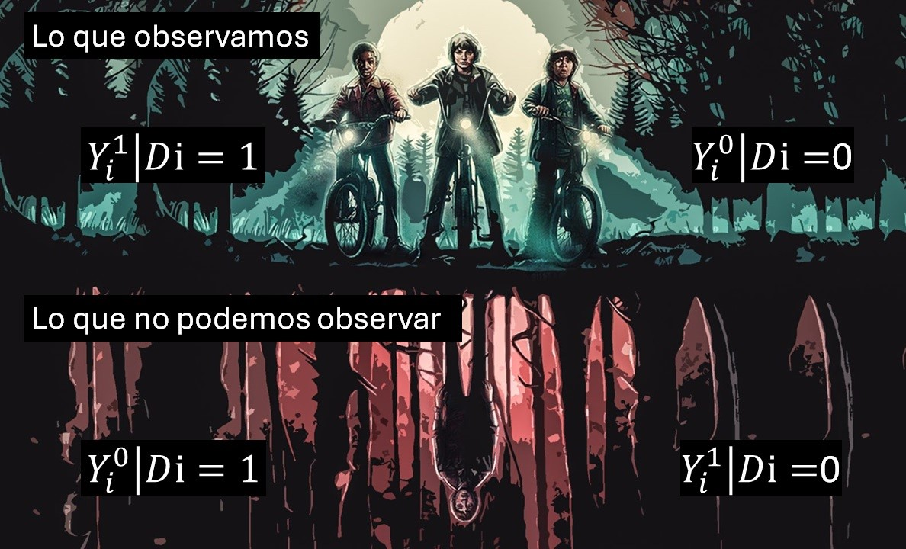
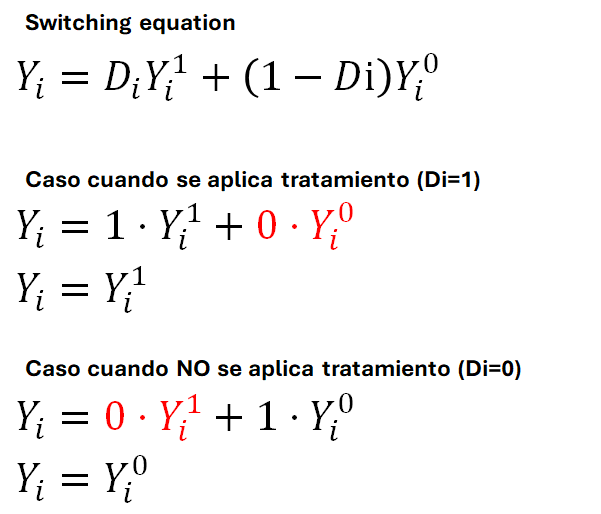
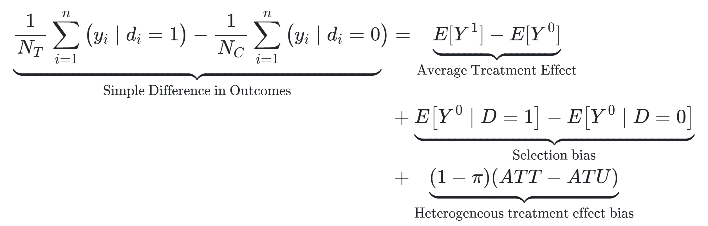

En este artículo, el segundo de [la serie](https://www.franciscoyira.com/es/tags/causal-inference-the-mixtape/) dedicada al libro [Causal Inference: The Mixtape](https://mixtape.scunning.com/), hablaré sobre [**la notación de *Potential Outcomes***](https://mixtape.scunning.com/potential-outcomes.html) y de cómo esta nos permite abordar preguntas de causalidad y entender conceptos claves de este campo[^1].

[^1]: La notación de Potential Outcomes fue concebida primero por [Splawa-Neymanen en 1923](https://www.jstor.org/stable/2245382), y luego popularizada por [Rubin en 1974](https://www.fsb.muohio.edu/lij14/420_paper_Rubin74.pdf).

La idea central de esta notación es la **comparación entre 2 estados del mundo**:

-   **El estado actual:** resultados observados en los datos, considerando el valor real que tomó una cierta variable de tratamiento. Por ej: las ventas trimestrales de una empresa, dado que se realizó cierta campaña de marketing.

-   **El estado contrafactual:** lo que hubiera ocurrido si es que esa variable de tratamiento hubiera tomado un valor distinto. Por ej: las ventas trimestrales de la misma empresa, si es que la campaña de marketing no se hubiera realizado.

El **efecto causal** de una intervención (en este caso, de la campaña de marketing) es la diferencia de la variable de resultados (ventas) entre estos dos estados. Por ende, para calcularlo bastaría con restar estos dos valores... algo que en realidad nunca podemos hacer porque **el valor contrafactual es hipotético y desconocido**. Los *contrafactuales* no existen en realidad, ya que al materializarse uno de los escenarios posibles todos los outcomes potenciales desaparecen salvo el "real" o "actual".

En el ejemplo de la empresa, al realizarse la campaña de marketing ya no es posible observar cuáles hubieran sido las ventas de no haberse realizado la campaña. Podemos tener conjeturas o hipótesis, pero nunca sabremos con certeza cuál hubiera sido ese valor para esa empresa particular.

La buena noticia es que, teniendo datos de muchas empresas (y cumpliéndose ciertas condiciones especiales), podemos igual conseguir una **estimación** razonable del **efecto *promedio** de una campaña de marketing genérica sobre ***un conjunto*** de empresas.

Ahora llevemos estos conceptos a la notación de *Potential Outcomes*.

## Notación de outcomes potenciales

Primero, se define una variable $D_i$ que representa **si se administra el tratamiento o no** a la unidad $i$[^2]. En el ejemplo de antes, esta variable tomará el valor 1 si la empresa $i$ realiza la campaña de marketing y 0 si no la realiza.

[^2]: Hay casos donde el tratamiento no es binario, pero los dejaremos fuera por ahora en pos de mantener la simplicidad de las explicaciones

Luego se define una variable de resultados $Y_i$, la cual representa **el *outcome* o resultado de interés** para la unidad $i$ (por ejemplo, las ventas).

Esta variable de resultados puede además tener un superíndice, que generalmente toma los valores 1 o 0 e indica a qué valor de $D$ está asociado el resultado (outcome) en cuestión. En nuestro ejemplo, nos indica si el outcome corresponde a un mundo donde la empresa $i$ llevó a cabo la campaña de marketing ($Y_i^1$) o uno donde no la hizo ($Y_i^0$).

Es importante señalar que el superíndice por sí solo ***no*** indica si el outcome es "real" o "contrafactual". Para saber si un outcome es "real" o "contrafactual" necesitamos agregarle una pieza a la expresión:

$$
Y_i^1|D_i=0
$$

Ahora esta se interpreta como "las ventas de la empresa $i$ en el mundo donde sí realiza la campaña de marketing, *condicional a que no realizó la campaña de marketing en realidad*".

En otras palabras, el superíndice denota un escenario hipotético para $Y_i$, y lo que viene después de $|$ denota lo que ocurrió realmente con la unidad $i$. Si estos valores coinciden, estamos frente a un outcome "real", y si son distintos, se trata de un outcome "contrafactual" (y por ende desconocido).

{width="750"}

Una forma de resumir lo anterior es la llamada ***switching equation***:

$$
Y_i = D_iY_i^1+(1-D_i)Y_i^0
$$

Que puede entenderse mejor con la ayuda de este meme:

*](images/meme_potential_outcomes.jpg){width="400"}

La idea aquí es que en el mundo real observamos sólo el outcome real ($Y_i$) que corresponde a la materialización de uno de los dos outcomes potenciales ($Y_i^1, Y_i^0$) en base al valor tomado por $D_i$: si $D_i=1$, entonces $1-D_i=0$ y la ecuación colapsa a $Y_i=Y_i^1$ (y viceversa cuando $D_i=0$).

{width="500"}

El outcome potencial no materializado queda relegado a ser el *contrafactual* (i.e. una entelequia de nuestra imaginación).

Con estos elementos ya podemos también definir el **efecto causal** de la campaña de marketing para la empresa $i$ (la diferencia entre *las ventas si la campaña se hubiera realizado* y *si no lo hubiera sido*).

$$
\delta_i=Y_i^1-Y_i^0
$$

Como solo conocemos uno de los 2 outcomes potenciales para la unidad $i$, el valor $\delta_i$ es imposible de observar. Además, notar que la presencia del subíndice $i$ implica que el efecto causal puede ser distinto para otras unidades (en general, $\delta_i\ne\delta_j$).

## Efectos promedio: ATE y ATT

Si bien nunca podemos conocer los efectos del tratamiento para cada unidad, bajo ciertas circunstancias podemos estimar efectos causales promedio para un conjunto de unidades.

Existen varios nombres para estos efectos promedio, dependiendo de qué conjunto de unidades se considere. Los más relevantes son:

-   [**A**]{.ul}**verage [T]{.ul}reatment [E]{.ul}ffect (ATE):** Corresponde al promedio de los efectos sobre todas las unidades.

$$
\begin{aligned}
ATE &= E[\delta_i]\\
&= E[Y_i^1 - Y_i^0]\\
&= E[Y_i^1]-E[Y_i^0]
\end{aligned}
$$

-   [**A**]{.ul}**verage [T]{.ul}reatment Effect on the [T]{.ul}reated (ATT):** Similar al ATE, pero sólo considera las unidades que efectivamente recibieron el tratamiento ($|D_i=1$)[^3].

[^3]: Además existe el ATU (*Average Treatment Effect on the Untreated*), que es análogo al ATT pero considerando sólo las unidades que *no* recibieron el tratamiento. Es menos relevante que el ATE y el ATT y por eso lo menciono solo en una nota al pie.

$$
\begin{aligned}
ATT &= E[\delta_i|D_i=1]\\
&= E[Y_i^1 - Y_i^0|D_i=1]\\
&= E[Y_i^1|D_i=1]-E[Y_i^0|D_i=1]
\end{aligned}
$$

Debemos recordar que, aunque las unidades reciban el tratamiento, aun así poseen conceptualmente un outcome potencial sin tratamiento ($Y_i^0$). Además, como los efectos $\delta_i$ pueden ser diferentes entre unidades (y generalmente lo son), lo más probable es que ATE y ATT sean distintos.

Algo problemático aquí es que el ATE y el ATT todavía son funciones de términos contrafactuales, y por ende son imposibles de calcular bajo estas expresiones. Pero antes habíamos dicho que en ciertas circunstancias era posible estimarlos. ¿Cuáles son esas circunstancias?

Para explicarlo debemos introducir una nueva expresión que sí puede calcularse: la **diferencia simple de outcomes**.

## Diferencia simple de outcomes

A pesar de la relevancia de los outcomes potenciales, el mundo real los únicos valores que observamos son:

-   Los outcomes reales: $Y_i$

-   Los valores de tratamiento de las unidades: $D_i$

Siguiendo con el ejemplo anterior, esto equivaldría a observar:

-   Las ventas de cada empresa

-   Si realizaron una campaña de marketing o no durante el periodo analizado

Un estadístico fácil de obtener con estos datos es la diferencia en ventas promedio entre las empresas que realizaron una campaña de marketing y las que no la hicieron. A este estadístico le denominaremos **SDO** (*Simple Difference in Outcomes*), y se expresa así en notación de outcomes potenciales:

$$
E[Y^1|D=1] - E[Y^0|D=0]
$$

Y se calcula con la siguiente fórmula (donde $N_T$ es la cantidad de empresas con $D=1$ y $N_C$ es la cantidad de empresas con $D=0$).

$$
\frac{1}{N_T} \sum_{i=1}^n(yi|d_i=1)-\frac{1}{N_C}\sum_{i=1}^{n}(y_i|d_i=0)
$$

Puede verse que esta expresión **contiene sólo outcomes reales** (observables) por lo que **sí se puede calcular**.

Ahora bien, intuitivamente sabemos que atribuirle interpretación causal a esta cifra está mal. Por ejemplo, es probable que las empresas con presupuesto suficiente para hacer una campaña de marketing sean empresas más grandes, y por ende fueran a tener ventas mayores aunque no realizaran la campaña.

Esta intuición se ve reflejada en la **descomposición de la diferencia simple de outcomes**: 

Lo que nos dice esta descomposición es que el SDO corresponde a la suma de 3 expresiones:

-   Nuestro codiciado **Average Treatment Effect**, el promedio de los efectos causales.

-   Dos sesgos desagradables: el **sesgo de selección** (diferencia de ventas promedio entre los grupos de empresas si es que ninguna hubiera realizado una campaña de marketing) y el **sesgo de efectos heterogéneos** (diferencia de los $\delta_i$ promedio entre empresas que realizaron una campaña y las que no).

Esta descomposición [está demostrada en el libro](https://mixtape.scunning.com/potential-outcomes.html#simple-difference-in-means-decomposition) y es la explicación "técnica" de porqué el SDO usualmente no tiene interpretación causal: los sesgos de selección y de efectos heterogéneos hacen que el SDO sea distinto del ATE.

La descomposición nos entrega buenas y malas noticias. La buena es que tenemos ahora un estadístico fácil de calcular (el SDO) que técnicamente *contiene* el ATE. La mala es que para "extraer" el ATE desde el SDO necesitamos información que en el mundo real no tenemos (los sesgos están expresados en términos de potential outcomes).

La luz de esperanza que nos ofrece la inferencia causal ante esto es desarrollar estrategias para que, en los datos recolectados, los sesgos sean despreciables, y así sea posible usar el SDO como estimador del ATE.

En palabras de [Scott Cunningham](https://www.scunning.com/), autor del libro:

> "One could argue that the entire enterprise of causal inference is about developing a reasonable strategy for negating the role that selection bias is playing in estimated causal effects."

## El supuesto de independencia (y la efectividad de la randomización)

OK, sabemos que queremos recuperar efectos promedio, como el ATE y el ATT, y que el SDO *generalmente* no es un buen estimador de ellos debido a los sesgos ya vistos. ¿Pero qué explica la aparición de estos sesgos?

**Los sesgos** (de selección y de efectos heterogéneos) **aparecen cuando la asignación del tratamiento (**$D_i$**) no es independiente de los outcomes potenciales.**

Por ejemplo, cuando decimos algo como "*las empresas con presupuesto suficiente para hacer una campaña de marketing son más grandes, y por ende tendrán mayores ventas aunque no realicen la campaña*" lo que estamos queriendo decir, en lenguaje de outcomes potenciales, es que $D$ depende de $Y^0$: empresas con mayor valor de $Y^0$ tienen mayor probabilidad de mostrar un valor $D$ igual a 1.

De lo anterior se desprende que **cuando sí existe indepndencia entre la asignación del tratamiento y los outcomes potenciales (**$(Y^1,Y^0)\mathrel{\unicode{x2AEB}}D$**) el SDO sí es un buen estimador del ATE!** (es insesgado)[^4].

[^4]: Pueden encontrar una demostración de esto en [esta sección](https://mixtape.scunning.com/potential-outcomes.html#independence-assumption) del libro.

La mala noticia es que esto rara vez ocurre en el mundo real.

En general, dondequiera que la variable $D$ sea escogida libremente por seres humanos, habrá dependencia entre $D$ y los outcomes potenciales 😵. Si bien las personas no somos [*homo economicus*](https://en.wikipedia.org/wiki/Homo_economicus) que toman sus decisiones con información perfecta (no conocemos con exactitud los outcomes potenciales), sí recabamos información sobre las opciones posibles y sus resultados esperados, y tomamos decisiones que creemos que nos beneficiarán a partir de esa información incompleta. Esto es suficiente para que tales decisiones (i.e. los valores de $D$) no sean independientes de los outcomes potenciales.

En palabras del autor del Mixtape: "*La elección racional está siempre empujando en contra del supuesto de independencia*".

La excepción a esto es la **randomización**, justamente porque allí no existe elección libre elección por parte de agentes. Al asignar los valores de $D$ de forma aleatoria a los participantes de un experimento, imponemos independencia entre estos valores y los outcomes potenciales. Como consecuencia, **la diferencia simple de medias en experimentos aleatorizados suele ser suficiente para estimar efectos causales sin sesgo**.[^5]

[^5]: Digo "suele ser suficiente" (y no "es suficiente) porque a pesar de existir randomización, los experimentos aún pueden sufrir de otros problemas que introducen sesgo en la estimación de efectos causales, tales como los [spillovers](https://en.wikipedia.org/wiki/Spillover_(experiment)). Esto queda como tema para otro post en el futuro.

*Tu feedback es bienvenido. Si tienes comentarios sobre este artículo puedes enviármelos [por correo](mailto:francisco.yira@outlook.com).*