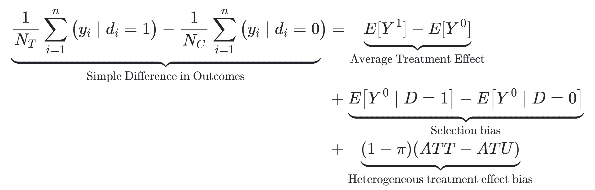

This article, the second one of [the series](https://www.franciscoyira.com/tags/causal-inference-the-mixtape/) about the book [Causal Inference: The Mixtape](https://mixtape.scunning.com/), is all about the Potential Outcomes notation and how it enables us to tackle causality questions and understand key concepts in this field[^1].

[^1]: The potential outcomes notation was first introduced by [Splawa-Neymanen in 1923](https://www.jstor.org/stable/2245382), and then was popularized [by Rubin since 1974]((https://www.fsb.muohio.edu/lij14/420_paper_Rubin74.pdf)).

The central idea of this notation is the **comparison between 2 states of the world**:

- **The actual state**: the outcomes observed in the data given the real value taken by some treatment variable. For example, the quarterly sales of a company given that they did some marketing campaign.

-   **The counterfactual state:** what would have happened if the treatment variable had taken another value. For example, the quarterly sales of the company if the marketing campaign had not been carried out.

The **causal effect** of an intervention (in this case, the marketing campaign) is the difference in the outcome variable between these two states. Thus, to calculate it, it would suffice to do a subtraction between them... but we can't actually do that because **the counterfactual value is hypothetical and unknown**. Counterfactuals don't really exist because as soon as one of the possible scenarios materializes, then all the other potential outcomes disappear.

In the company example, when the marketing campaign is carried out, it is no longer possible to know how much would have been the sales if the campaign had been ditched. We can have hypotheses or guesses, but we will never know for sure the counterfactual value for this individual company.

The good news is that by having data for many companies (and when some special conditions are met) we can still get a reasonable **estimate** for the **average effect** of a generic marketing campaign over that *group* of companies.

## Potential outcomes notation

Now we will translate those concepts into the potential outcomes notation.

First, we define the variable $D_i$, which represents if the unit $i$ receives the treatment or not[^2]. In the previous example, this variable would take the value 1 if the company $i$ executes the marketing campaign and 0 if not.

[^2]: There are cases where the treatment is not binary, but they will be left out of this article in order to keep the explanations simple.

Then we define the variable $Y_i$, which represents **the outcome of interest** for the unit $i$ (let's say, the quarterly sales of the company $i$).

This outcome variable can also have a superindex, which usually takes values 0 or 1 and indicates to which value of $D$ is the outcome associated. In our example, the superindex tells us if the outcome (sales) corresponds to a world where the company $i$ implemented the marketing campaign ($Y_i^1$) or to one where it didn't ($Y_i^0$).

It's important to note that the superindex by itself ***does not*** tell us if the outcome is actual or counterfactual. To know if an outcome is counterfactual or not, we need an additional piece of notation:

$$
Y_i^1|D_i=0
$$

Now this expression is interpreted as "the sales of the company $i$ when the marketing campaign is carried out, *conditional on the fact that it did not actually implement the campaign*". 

In other words, the superindex denotes a hypothetical scenario for $Y_i$, and what comes after $|$ indicates what really happened with the unit $i$. If these two values match, then the whole expression is a real outcome, and if they're different, it's a counterfactual outcome (and therefore, it's unknown).

The previous idea can be summarized through the so-called ***switching equation***:

$$
Y_i = D_iY_i^1+(1-D_i)Y_i^0
$$

Which can be better understood with this meme:

*](images/meme_potential_outcomes.jpg){width="400"}

The key idea here is that, in the real world, we only know the actual outcome ($Y_i$), which is the materialization of one of the potential outcomes ($Y_i^1, Y_i^0$) based on the value taken by $D_i$: if $D_i=1$, then $1-D_i=0$ and the equation collapses to $Y_i=Y_i^1$ (and vice versa when $D_i=0$).

{width="500"}
Thus, the non-materialized potential outcome is relegated to be a *counterfactual* (i.e. a fictional concept from our imagination)

Using all the notation we've already defined, we can also define the **causal effect** of the marketing campaign for the company $i$ (that is, the difference between the sales if the campaign had been carried out and the sales if it hadn't).

$$
\delta_i=Y_i^1-Y_i^0
$$
As we only know one of the two potential outcomes for the unit $i$, the value $\delta_i$ is unobservable. Note also that the subindex $i$ tells us that this causal effect can be different for other units (in general, $\delta_i\ne\delta_j$).

## Average effects: ATE y ATT

Despite not being able to know the treatment effects for each unit $i$, under some circumstances we can estimate average effects for a group of units.

There are different names for these average effects, depending on which group of units we are referring to. The most relevant ones are:

-   [**A**]{.ul}**verage [T]{.ul}reatment [E]{.ul}ffect (ATE):** It's the average effect over all the units in our analysis.

$$
\begin{aligned}
ATE &= E[\delta_i]\\
&= E[Y_i^1 - Y_i^0]\\
&= E[Y_i^1]-E[Y_i^0]
\end{aligned}
$$

-   [**A**]{.ul}**verage [T]{.ul}reatment Effect on the [T]{.ul}reated (ATT):** Similar to the ATE, but only considering the units that actually received the treatment ($|D_i=1$)[^3].

[^3]: There is also the ATU (Average Treatment Effect on the Untreated), which is analogous to the ATT but considering only the units which did *not* receive the treatment. It's less relevant than the ATE and the ATT, and that's why I only mention it in a footnote.  

$$
\begin{aligned}
ATT &= E[\delta_i|D_i=1]\\
&= E[Y_i^1 - Y_i^0|D_i=1]\\
&= E[Y_i^1|D_i=1]-E[Y_i^0|D_i=1]
\end{aligned}
$$
We must remember that even though the units didn't receive the treatment, they still have (conceptually) a potential outcome without treatment ($Y_i^0$). Besides, since the effects $\delta_i$ can be different between units (and usually they are), more often than not the ATE and ATT won't be equal.

Something problematic here is that the ATE and ATT are still functions of counterfactual terms, and therefore unobservable and impossible to calculate. But we previously had said that, under some circumstances, we could estimate them. Which are these circumstances?

To explain it, we must introduce a new expression that ***can be*** calculated: the **simple difference in outcomes**.

## Simple difference in outcomes (SDO)

Despite the relevance of potential outcomes, the only values we can truly observe in the real world are:

-   The actual outcomes: $Y_i$

-   The treatment values for the units: $D_i$

In the context of the previous example, this would mean to observe:

-   The sales for each company

-   Whether they did a marketing campaign or not (in the period of interest)

A statistic that can be easily obtained using this data is the difference in average sales between the companies that carried out a marketing campaign and those that did not. This statistic is called the Simple Difference in Outcomes, or SDO, and can be expressed as follows using the potential outcomes notation:

$$
E[Y^1|D=1] - E[Y^0|D=0]
$$

And it can be calculated by using the following formula (where $N_T$ is the number companies with $D_i=1$ and $N_C$ is the number of companies with $D_i=0$).

$$
\frac{1}{N_T} \sum_{i=1}^n(yi|d_i=1)-\frac{1}{N_C}\sum_{i=1}^{n}(y_i|d_i=0)
$$

We can see that this expression **only contains actual outcomes** (observables). Therefore, **it can be calculated**.

However, we intuitively know that attributing causal meaning to this metric is wrong. For instance, it's likely that companies with a big enough budget to implement a marketing campaign are larger companies, and therefore, companies that would have had bigger sales even if they didn't have implemented the campaign.

This intuition is reflected in the **simple difference in means decomposition**:

What this decomposition tells us is that the SDO is composed of the sum of three expressions: 

-   [Our precious](https://www.youtube.com/watch?v=Iz-8CSa9xj8), the **Average Treatment Effect**.

-   Two nasty biases: the **selection bias** (the difference in average sales between groups of companies if none of them would have implemented the marketing campaign) and the **heterogeneus treatment effect bias** (the difference in average $\delta_i$ between groups of companies).

This decomposition [is demonstrated in the book](https://mixtape.scunning.com/potential-outcomes.html#simple-difference-in-means-decomposition), and it is the "technical" explanation of why the SDO usually doesn't have a proper causal meaning: selection bias and heterogenous effect bias lead to the SDO being different from the ATE.

The decomposition gives us good and bad news. The good news is that now we have an easy to calculate statistic (the SDO) which *technically* contains the ATE. The bad news is that in order to "extract" the ATE from the SDO, we need information that we don't have (since the expressions for the biases contain counterfactual outcomes).

La luz de esperanza que nos ofrece la inferencia causal ante esto es desarrollar estrategias para que, en los datos recolectados, los sesgos sean pequeños o despreciables, y así sea posible usar el SDO como estimador del ATE.

En palabras de [Scott Cunningham](https://www.scunning.com/), autor del libro:

> "One could argue that the entire enterprise of causal inference is about developing a reasonable strategy for negating the role that selection bias is playing in estimated causal effects."

## El supuesto de independencia (y la efectividad de la randomización)

OK, sabemos que queremos recuperar efectos promedio, como el ATE y el ATT, y que el SDO no *generalmente* es un buen estimador de ellos debido a los sesgos ya vistos. ¿Pero qué explica la aparición de estos sesgos?

**Los sesgos** (de selección y de efectos heterogéneos) **aparecen cuando la asignación del tratamiento (**$D_i$**) no es independiente de los outcomes potenciales.**

Por ejemplo, cuando decimos algo como "*las empresas con presupuesto suficiente para hacer una campaña de marketing son más grandes, y por ende tendrán mayores ventas aunque no realicen la campaña*" lo que estamos queriendo decir, en lenguaje de outcomes potenciales, es que $D$ depende de $Y^0$: empresas con mayor valor de $Y^0$ tienen mayor probabilidad de mostrar un valor $D=1$.

De lo anterior se desprende que **cuando sí existe indepencia entre la asignación del tratamiento y los outcomes potenciales (**$(Y^1,Y^0)\mathrel{\unicode{x2AEB}}D$**) el SDO sí es un buen estimador del ATE!** (es insesgado)[^4].

[LLEGAR ACÁ]

[^4]: Pueden encontrar una demostración de esto en [esta sección](https://mixtape.scunning.com/potential-outcomes.html#independence-assumption) del libro.

La mala noticia es que esto rara vez ocurre en el mundo real.

En general, dondequiera que la variable $D$ sea escogida libremente por seres humanos, habrá dependencia entre $D$ y los outcomes potenciales 😵. Si bien las personas no somos [*homo economicus*](https://en.wikipedia.org/wiki/Homo_economicus) que toman sus decisiones con información perfecta (no conocemos con exactitud los outcomes potenciales), sí recabamos información sobre las opciones posibles y sus resultados esperados, y tomamos decisiones que creemos que nos beneficiarán a partir de esa información incompleta. Esto es suficiente para que tales decisiones (i.e. los valores de $D$) no sean independientes de los potential outcomes.

En palabras del autor del Mixtape: "*La elección racional está siempre empujando en contra del supuesto de independencia*".

La excepción a esto es la **randomización**, justamente porque allí no existe elección libre elección por parte de agentes. Al asignar los valores de $D$ de forma aleatoria a los participantes de un experimento, imponemos independencia entre estos valores y los outcomes potenciales. Como consecuencia, **la diferencia simple de medias en datos experimentales suele ser suficiente para estimar efectos causales sin sesgo**.
