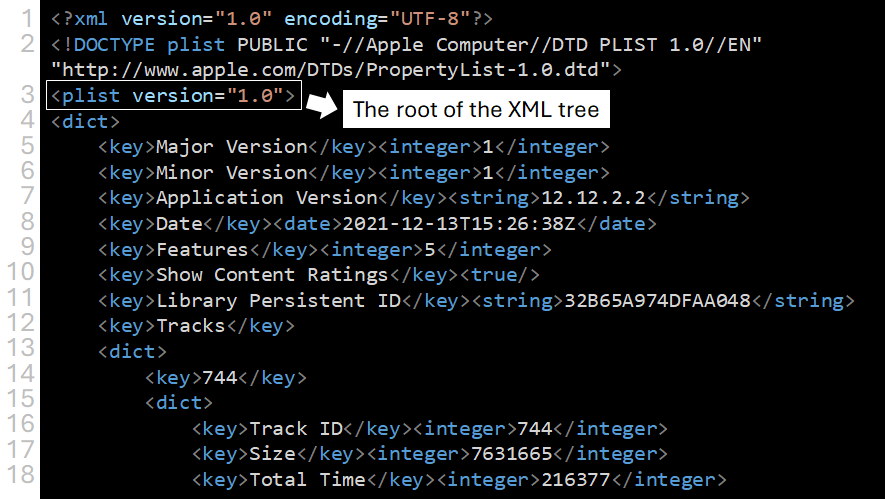
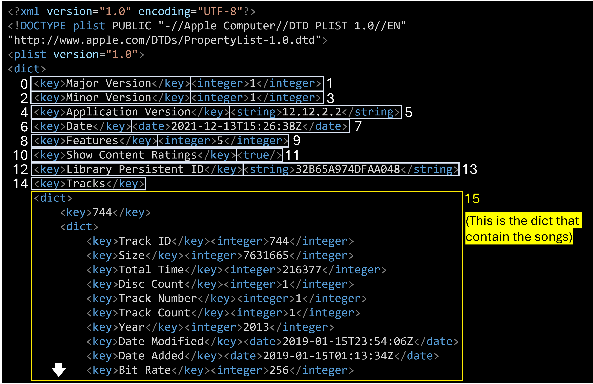
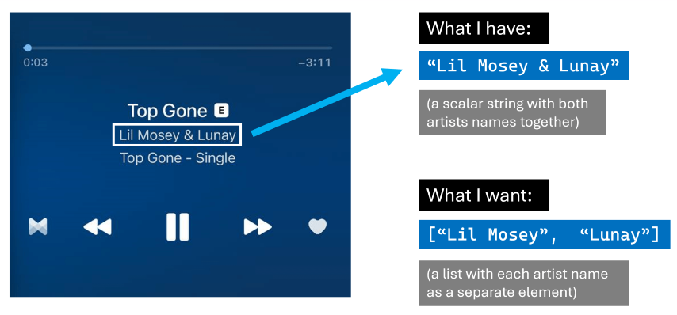

A couple of months ago, I decided that it was time for me to finally grow out of my R comfort zone and start studying **Python**. I began my Python journey by reading the book [*Python for Data Analysis*](https://www.oreilly.com/library/view/python-for-data/9781491957653/) from Wes McKinney (creator of pandas, the Python equivalent of the tidyverse), and having finished it I wanted to put into practice what I've learned through an **applied data analysis**.

And since I love listening to music, why not analyze my own music collection? I told myself. So here I am, sharing with you the insights and data visualizations I obtained from my music library, along with the code I used in this analysis.

In this post I will show you:

-   How to import the iTunes Library XML file into Python.

-   How to parse the contents of that file into a **pandas DataFrame**.

-   How I used pandas, matplotlib/seaborn, and regular expressions to answer questions on that DataFrame, such as: *Which are my most listened songs, albums and artists?* or *Which genres predominate in each decade of my music?*

-   And last but not least, how I expanded the analysis with R by using `reticulate` to **pass pandas DataFrames to an R session**, and then creating a nice table/playlist with the best songs of each era with the `gt` R package.

Also, note that if you use iTunes (or Apple Music), you can do this too. All you need to do is locate the 'iTunes Library.xml' file and then run the Python code in this post against that file (although you probably will need some minor modifications).

```{r setup, include=FALSE, warning=FALSE, message=FALSE}
knitr::opts_chunk$set(echo = TRUE)
knitr::opts_chunk$set(class.source="language-python", class.output="language-python")
library(reticulate)
knitr::knit_engines$set(python = reticulate::eng_python)
```

## Importing and parsing the iTunes Library XML file

First things first, we import the required Python libraries:

```{python load-packages}
import pandas as pd
import numpy as np
from lxml import objectify
import xml.etree.ElementTree as ET
import requests
import seaborn as sns
import matplotlib
matplotlib.use('Agg')
from matplotlib import pyplot as plt
from matplotlib import style
import os
import re
import pycats
```

To allow you to run the code of this post, I put my XML file in a public URL. This Python snippet downloads the file from that URL the first time is run (if the file has already been downloaded, it won't do anything).

```{python download-xml}
if not os.path.isfile('iTunes.xml'):
  path = 'https://onedrive.live.com/download?cid=59E4C7D110DACCCC&resid=59E4C7D110DACCCC%21595580&authkey=AM93Z8YvAb4JiBY'
  r = requests.get(path, allow_redirects=True)
  open('iTunes.xml', 'wb').write(r.content)
```

Once we have the iTunes.xml file in our working directory, we can load it in an "Element Tree" object through the function `ET.parse()`. As its name says, this data structure resembles a tree, which makes sense since XML files are a hierarchical data format.

We can extract the "root" of this "tree" by using the method `getroot()`. Then, we can use that root as a starting point for exploring the whole tree.

```{python load-xml}
tree = ET.parse('iTunes.xml')
root = tree.getroot()
```

At this point, I think it helps to take a look at the first lines of the XML to have an idea of how it actually looks like:

``` xml
<?xml version="1.0" encoding="UTF-8"?>
<!DOCTYPE plist PUBLIC "-//Apple Computer//DTD PLIST 1.0//EN" "http://www.apple.com/DTDs/PropertyList-1.0.dtd">
<plist version="1.0">
<dict>
    <key>Major Version</key><integer>1</integer>
    <key>Minor Version</key><integer>1</integer>
    <key>Application Version</key><string>12.12.2.2</string>
    <key>Date</key><date>2021-12-13T15:26:38Z</date>
    <key>Features</key><integer>5</integer>
    <key>Show Content Ratings</key><true/>
    <key>Library Persistent ID</key><string>32B65A974DFAA048</string>
    <key>Tracks</key>
    <dict>
        <key>744</key>
        <dict>
            <key>Track ID</key><integer>744</integer>
            <key>Size</key><integer>7631665</integer>
            <key>Total Time</key><integer>216377</integer>
            <key>Disc Count</key><integer>1</integer>
            <key>Track Number</key><integer>1</integer>
            <key>Track Count</key><integer>1</integer>
            <key>Date Modified</key><date>2019-01-15T23:54:06Z</date>
            <key>Date Added</key><date>2019-01-15T01:13:34Z</date>
            <key>Bit Rate</key><integer>256</integer>
            <key>Sample Rate</key><integer>44100</integer>
            <key>Play Count</key><integer>33</integer>
```

Nodes in XML files, such as `root`, should have a `tag` and a dictionary of attributes. We can get these with the following code:

```{python}
root.tag
```

```{python}
root.attrib
```

These values tell us that the `root` is located in the third line of the XML file:

{width="800"}

Below that root, we have a dict that contains keys such as `Major Version` (associated with the integer value "1") and `Application Version` (associated with the string value "12.12.2.2"). Then, at line 12, there is a key named `Tracks`. This key is different because its value is not a scalar but another dict, and if we look at its contents, we see what seems like information about a song.

**This nested dict** (`Tracks`) **is the piece of the XML tree that we're looking for**. Inside it, there are many dicts, one per song in the music collection, and each of these contains a set of attributes about the song they represent, e.g. Artist, Date Added to the collection, last time played, etc[^1].

[^1]: I have to credit [this blog post](https://leojosefm.medium.com/python-analyzing-itunes-library-97bec60e13cb) that helped me make sense of the iTunes XML file. Without it, it would have taken me much longer to figure all this out.

Now we need to use Python to navigate to that part of the tree and extract the `Tracks` dict to convert it into a pandas DataFrame.

The following code does that: it iterates over the main dict (the element that comes after 'plist') until it finds the `Tracks` dict (which can be recognized because it's the first element with `tag=="dict"`). Then it saves it in an object named `tracks_dict`.

```{python}
main_dict=root.findall('dict')

for index, item in enumerate(list(main_dict[0])):  
    print('index #{} = <{}>'.format(index, item.tag))
    if item.tag=="dict":
        print('The tracks dict has been found!')
        tracks_dict=item
        break

```

To better explain what's going on, I made the following illustration highlighting the items over which we're iterating, including the node that contains the dict with all the songs (i.e. the node we're looking for). Having reached that node, the for loop saves it as `tracks_dict` and stops the iteration.

{width="800"}

At this point, `tracks_dict` is a dict of dicts, and each dict inside it represents a track from my music collection. Let's convert this dict into a list

```{python}
tracklist=list(tracks_dict.findall('dict'))
```

I can check the length of the list, which should match the number of songs in my iTunes collection.

```{python}
len(tracklist)
```

Indeed, it's the same number of songs I have in iTunes, so we're on the right path.

## Creating a pandas DataFrame

By now, I have a list containing a dict per each song in my collection, but lists are not good data structures for doing data analysis. I want a DataFrame.

However, there remains a challenge for converting this list into a DataFrame: it contains different "kinds" of media (e.g. purchased music, ripped music, music videos, audiobooks), and each of these may have different attributes.

Let's see which are these "media kinds"

```{python}
kinds=set([])
for i in range(len(tracklist)):
  for j in range(len(tracklist[i])):
    if (tracklist[i][j].tag=="key" and tracklist[i][j].text=="Kind"):
      kinds.add(tracklist[i][j+1].text)

kinds=pd.Series(list(kinds))
kinds
```

I don't want to perform an analysis on audiobooks or music videos, so I will filter those out.

```{python}
kinds_i_want = pd.Series(['Archivo de audio AAC comprado',
                          'Purchased AAC audio file',
                          'Archivo de audio MPEG',
                          'Apple Lossless audio file',
                          'Audio Apple Lossless',
                          'Archivo de audio AAC'])
```

I plan to retrieve the available attributes for each of the `kinds_i_want` and then "merge" them to end up with a DataFrame containing all the existing features (even if some of them are not available for every kind). For example, if kind "purchased songs" has attributes A, B and C, and kind "ripped songs" has attributes B, C and D, I want to end up with a DataFrame with columns A, B, C and D.

My first step for doing so is to create the function `cols` which, for a given kind, will return a *set* containing the attributes available in the data.

```{python}
# This code will retrieve all the 'keys' (attributes) of the first track of the corresponding Kind
def cols(kind):
    cols=[]
    kind_found=False
    for i in range(len(tracklist)):
        for j in range(len(tracklist[i])):
            if tracklist[i][j].tag=="key":
                cols.append(tracklist[i][j].text)
            if (tracklist[i][j].text=="Kind" and tracklist[i][j+1].text==kind):
                kind_found=True
        if kind_found:
          return set(cols)
              

cols('Archivo de audio AAC comprado')
```

Once the function is defined, I use `map` to iterate over all the `kinds_i_want`, then I convert the `results` to a `result_list`.

```{python}
results = map(cols, kinds_i_want)
results_list = [list(item) for item in results]
```

`results_list`is a list of lists, so the next step is to "flatten" it out and convert it into a `set` to remove the repeated attributes (by definition, sets don't have duplicated elements).

```{python}
flat_list=[]
for item in results_list:
  for sub_item in item:
    flat_list.append(sub_item)

unique_cols=set(flat_list)
unique_cols
```

```{python}
len(unique_cols)
```

There we have it: a superset containing all the song attributes available in the XML file. There are 58 in total, and some are only available for specific kinds of media.

But the most important thing about this set is that it allows me to finally create a DataFrame with all the songs of my collection. The following code does that, using `unique_cols` and `tracklist` as input:

```{python}
df_tracks=pd.DataFrame(columns=unique_cols)

dict1={}

for song_i in range(len(tracklist)):
  for attribute_i in range(len(tracklist[song_i])):
    if tracklist[song_i][attribute_i].tag=="key":
      dict1[tracklist[song_i][attribute_i].text]=tracklist[song_i][attribute_i+1].text
  list_values=[i for i in dict1.values()]
  list_keys=[j for j in dict1.keys()]
  if dict1['Kind'] in kinds_i_want.unique():
    df_temp=pd.DataFrame([list_values],columns=list_keys)
    df_tracks=pd.concat([df_tracks,df_temp],axis=0,ignore_index=True,sort=True)

```

Please note that this code is very inefficient, probably because it does a DataFrame `concat` for each song in `tracklist`. I will leave it like that because it doesn't take long to run anyway (since my data is relatively small). But don't use it as a reference for anything.

The good news is that I now have a DataFrame with all my songs, so I can use all the pandas' functions and methods to manipulate and analyze them.

```{r}
py$df_tracks[1:5,c("Album", "Name", "Artist", "Year")]
```

## What are my most listened songs?

An obvious question to answer with this data is what are the **songs**, **albums**, and **artists** that I listen to the most.

I will start with the easiest ranking to obtain: my **most listened to songs**. Here no aggregation is needed, I just have to `sort_values` based on `Play Count`, and then extract the "head" of the resulting DataFrame:

```{python}
df_tracks[['Play Count']] = df_tracks[['Play Count']].apply(pd.to_numeric)
```

```{python}
top_songs=(df_tracks
  .sort_values(by='Play Count', ascending=False)
  [['Name', 'Artist', 'Play Count', 'Genre']]
  .head(10))
  
top_songs
```

Having done that, I can use `seaborn` to create a neat ranking plot with horizontal bars.

```{python plot-top-songs}
plt.clf()
ax=sns.barplot(x='Play Count',
            y='Name',
            hue='Artist',
            data=top_songs,
            dodge=False,
            palette=sns.color_palette("Set1", 3))
ax.figure.set_size_inches(7,5)
ax.xaxis.grid(True)  
ax.set(ylabel='Track')
plt.tight_layout()
plt.savefig('test.png', dpi=400)
plt.show()
```

## Most listened albums

Now I will do a ranking of my most listened to albums. For this, I need to aggregate Play Counts at album level. I will also discard singles or albums with too few songs.

First, I create a DataFrame with the albums I consider as "full" or "complete": those with five tracks or more.

```{python}
ntracks_album=df_tracks.groupby('Album').size()
full_albums=(ntracks_album[ntracks_album>5]
             .reset_index()
             .rename(columns={0: "n_tracks"}))
full_albums
```

Then I aggregate Play Count at album level, filter out incomplete or single albums by doing a "semi-join" with `full_albums`, and extract the `head(10)` from the DataFrame after doing `sort_values`.

```{python}
plays_by_album=(df_tracks
                .groupby('Album')['Play Count']
                .sum()
                .reset_index()
                .sort_values(by='Play Count', ascending=False))

full_albums_ranked=plays_by_album[plays_by_album.Album.isin(full_albums.Album)]
full_albums_ranked.head(10)
```

This is a lovely ranking, but I think it could be improved by removing the text between parentheses from some albums names (i.e. "Deluxe Version" from Four and 1989, and "Original Motion Picture..." from La La Land). That can be done through the string manipulation functions in Python:

```{python remove-text-parentheses, echo=TRUE, results='hide'}
full_albums_ranked['Album']=(full_albums_ranked
                             .Album.str.replace(' \(.+\)$', '', regex=True))
```

```{python}
full_albums_ranked['Album'].head(10)
```

The albums names now look better, so it's time to create a ranking plot showing their respective play counts. This plot will be very similar to the songs plot, but this time I will map the colour of the bars to Play Counts (continuous variable) instead of the Artists name (categorical variable).

```{python plot-top-albums}
plt.clf()
ax=sns.barplot(x='Play Count',
               y='Album',
               hue='Play Count',
              data=full_albums_ranked.head(10),
              dodge=False,
              palette='OrRd')
              
# Rotating labels trying to make them fit
ax.figure.set_size_inches(7,5)
ax.xaxis.grid(True)  
plt.tight_layout()
plt.legend([],[], frameon=False)
plt.show()
```

## Most listened artists

Obtaining the ranking of songs was straightforward, and so was the ranking of albums, despite involving a couple of extra steps. However, doing the ranking of artists will be a bit more complicated. The reason is that I will have to **split/parse the artist column to handle collaborations** (songs by more than one artist), so the play counts of these songs add up to all the collaborating artists.

For example, as you saw in the songs plot, one of my most played songs is "Top Gone" by Lil Mosey and Lunay. If I didn't parse the "artist" for that song, those play counts wouldn't count for Lil Mosey nor Lunay when doing the ranking, but for a third, totally different artist named 'Lil Mosey & Lunay". Obviously I don't want that.



The first thing here is to look at all the strings that signal a collaboration. In my collection, these are:

-   ' & '
-   ', '
-   ' Feat. '
-   ' feat. '
-   '/'

Then I can use regular expressions and the method `str.split` to obtain a list of individual artists for each song.

```{python split-artists-strings}
delimiters=' & ',', ',' Feat. ',' feat. ','/'
regexPattern = '|'.join(map(re.escape, delimiters))
reg_split=re.compile(regexPattern)
artists_splitted=df_tracks.Artist.str.split(regexPattern)
artists_splitted[:10]
```

I may also want to look for exceptions: cases where those strings are present, but there is no collaboration between several artists. I have three such cases:

-   Zion & Lennox
-   Wisin & Yandel
-   Now, Now

The first two are duos of reggaeton singers. However, their duo names are just the names of the members joined with an '&'. What's more, in both cases the members have released songs as solo artists. Therefore, I think it makes sense to regard these cases as **collaborations** and not add them as exceptions in the code.

The third case is different. It's an [indie rock duo from Minnesota](https://en.wikipedia.org/wiki/Now,_Now), and here the band name is not a combination of the members' names, but an indivisible artistic name, so I will add this as a hardcoded exception.

After splitting the artist strings, I want to create a data structure that allows a 1:N relationship between songs and artists, so the plays count of each track adds up to each of the contributing artists.

I think the appropriate data structure for this is a **list of dictionaries**, with each dictionary representing a song and containing a respective list of artists. The following code creates and populates such a list.

```{python}
songs=[]
for i, song in df_tracks.Name.items():
  ## Parse the artists of the song
  if df_tracks.Artist.values[i]=='Now, Now':
    artist_to_assign=[df_tracks.Artist.values[i]]
  else:
    artist_to_assign=artists_splitted.values[i]
  
  ## add elements to the list of songs
  songs.append({'Name': song,
                'Number': i,
                'Artists': artist_to_assign})

songs[:5]
```

However, by looking at some songs in the dictionary, I realize I have another problem: I'm leaving out the artists' names in the song name itself (for example, "Christina Aguilera" in "Do What U Want (feat. Christina Aguilera)").

Fortunately, for these cases, there is a pattern that I can rely on: the artist(s) name(s) in the song name, if there are any, are always preceded by "feat" (featuring).

This pattern has three variations, based on the kind of brackets that surrounds it:

-   **Round brackets:** *Song name (feat. Artists names)* (or sometimes just '(feat Artists names)', without the dot).
-   **Squared brackets:** *Song name \[feat. Artists names\]*.
-   **No brackets:** *Song name feat. Artist name*.

The easiest way to extract the artists' names in these pattern variations is to create three different regexes, one for each variation, and then apply them conditionally by using `str.contains`.

```{python}
# One regex for each pattern variation: round brackets, squared brackets, and no brackets
# Note how in the variations with brackets we have to look for the closing bracket, while in the "bare" variation we just extract everthying from "feat." to the end of the string
re_circ_brackets=re.compile(' \(feat\.* (.*)\)')
re_sq_brackets=re.compile(' \[feat. ([^\[]*)\]')
re_bare=re.compile(' feat. (.*)$')
```

```{python}
# Creating bolean arrays based on which of the pattern variations is present in the song name (note that it could be none)
feat_curved_brackets=df_tracks.Name.str.contains('\(feat.').values
feat_squared_brackets=df_tracks.Name.str.contains('\[feat.').values
feat_bare=df_tracks.Name.str.contains(' feat.').values

```

Once I have the regexes and the boolean arrays, it's possible to iterate over all the songs' names and use the corresponding regex to extract the artists' names (based on which boolean array as a True value for each track). Since the extracted string could have several artists' names, I have to split it in the same way I did with the Artists column. Finally, I use these new artists lists to extend the artists lists that already exist in `songs`.

```{python}
for i, song in df_tracks.Name.items():
  if feat_curved_brackets[i]:
    artists_feat=re_circ_brackets.search(song)[1]
  elif feat_squared_brackets[i]:
    artists_feat=re_sq_brackets.search(song)[1]
  elif feat_bare[i]:
    artists_feat=re_bare.search(song)[1]
    
  if (feat_curved_brackets[i] or feat_squared_brackets[i] or feat_bare[i]):
    splitted_artists_feat=reg_split.split(artists_feat)
    songs[i]['Artists'].extend(splitted_artists_feat)

```


By this point, the dicts in `songs` contain already all the artists that collaborated for each track in my collection (🥳).

However, I will do one more pre-processing step before moving on to the aggregation of play counts: I'm going to"'normalize" artists names (removing dots and applying title case) to avoid their play counts getting split due to different spelling (e.g. *ROSALÍA* vs *Rosalía*, or *J. Balvin* vs *J Balvin*).

```{python}
for i in range(len(songs)):
  for j in range(len(songs[i]['Artists'])):
    artist_name=songs[i]['Artists'][j]
    norm_artist_name=artist_name.title().replace('.', '')
    songs[i]['Artists'][j]=norm_artist_name
    

```

Then, finally, I can add up the play counts by artist:

```{python}
artists={}

for i in range(len(songs)):
  for j in range(len(songs[i]['Artists'])):
    if songs[i]['Artists'][j] not in artists:
      artists[songs[i]['Artists'][j]]=df_tracks['Play Count'][i]
    else:
      artists[songs[i]['Artists'][j]]+=df_tracks['Play Count'][i]

df_artists_plays=pd.DataFrame(artists.items(),
                              columns=['Artist', 'Play Count']) 
                              
df_artists_plays.head(5)
```

Having the artists ranking in a DataFrame, I can sort it and extract the top 10 rows to create the corresponding plot:

```{python}
df_artists_plot=(df_artists_plays
                 .sort_values(by='Play Count', ascending=False)
                 .head(10))
  
df_artists_plot
```

```{python plot-top-artists, message=FALSE}
plt.clf()
ax=sns.barplot(x='Play Count',
               y='Artist',
               hue='Play Count',
              data=df_artists_plot,
              dodge=False,
              palette='OrRd')
              
# Rotating labels trying to make them fit
ax.figure.set_size_inches(7,5)
ax.xaxis.grid(True) 
plt.title('My Top 10 artists by play count')
plt.tight_layout()
plt.legend([],[], frameon=False)
plt.show()
```

### My music across the ages (categorical data and more complex plots)

Another question I would like to answer is how my music listening habits relate to the **year when songs were released**. From the rankings above, you can already guess that I lean heavily into more modern/contemporary music and not so much into tracks from the 90's or previous decades. But there still could be some interesting variation between more recent periods (let's say, 2010-2014 vs 2015-2019 vs 2020-2022).

For this analysis, I will create a **five-year period column**, based on the release year of each song (for example, if a song was released in 1999, it will be in the 1995-1999 period, if it was in 2015, it will be in the 2015-2019 period, etc.)

First, I will create a `FiveYearPeriod` column in the original `df_tracks` dataframe:

```{python}
df_tracks[['Year']]=df_tracks[['Year']].apply(pd.to_numeric)

df_tracks=(df_tracks
.assign(FiveYearPeriod=pd.to_numeric(np.floor(df_tracks.Year / 5) * 5, downcast='integer')))
```

Now I can see how many songs per five-year period I have in my collection:

```{python}
df_tracks.groupby('FiveYearPeriod').size()
```

As I suspected, I have very little music from before 1995, so I will group them all in a category labelled as 'Before 1995'.

```{python}
df_tracks.FiveYearPeriod=['Before 1995' if year < 1995 else year for year in df_tracks.FiveYearPeriod]
```

I will also convert the `FiveYearPeriod` column to a Categorical data type and give each period a label that indicates its starting and ending year (e.g. "1995-1999").

```{python}
catg_years=pd.Categorical(df_tracks.FiveYearPeriod,
               ordered=True,
               categories=['Before 1995', 1995, 2000, 2005, 2010, 2015, 2020])

df_tracks.FiveYearPeriod=catg_years.rename_categories({1995: '1995-1999', 2000: '2000-2004', 2005: '2005-2009', 2010: '2010-2014', 2015: '2015-2019', 2020: '2020-Present'})
```

After doing that, it's very simple to obtain summary statistics by this new categorical column, such as the total number of songs for each period:

```{python}
songs_period=df_tracks.groupby(['FiveYearPeriod']).size()
songs_period
```

Or the average song play count per period:

```{python}
plays_period=df_tracks.groupby(['FiveYearPeriod'])['Play Count'].mean()
plays_period
```

What's more, now I can create a "combo" plot that displays the data from both aggregated datasets (total songs and average play counts) in the same figure:

```{python}
plt.clf()
fig, ax1 = plt.subplots()
sns1=sns.barplot(x=songs_period.index, y=songs_period.values, alpha=0.5)

# Adding labels to bar plot
for a, b in zip(songs_period.index, songs_period.values):
  plt.text(x = a, y = b+5, s = '{:.0f}'.format(b), size=7, color='black', ha='center')


ax2 = ax1.twinx()
sns2=sns.lineplot(x=plays_period.index, y=plays_period.values, marker='o')
sns2.set_ylim(0, 21)
sns1.set(xlabel='Periods', ylabel='Total songs')
sns2.set_ylabel('Average Play count', rotation=270, labelpad=12.0)
sns1.set_xticklabels(sns1.get_xticklabels(),rotation = 30)

# Adding labels to line plot
for x, y in zip(plays_period.index, plays_period.values):
  plt.text(x = x, y = y, s = '{:.1f}'.format(y), size=8, color='white', ha='center').set_backgroundcolor('#3A87BC')

sns1.set(title='Number of songs and Average Play count by era')
plt.tight_layout()
plt.savefig('fig_twop_plots.png')
plt.show()
```

I would also like to create a plot that incorporates the **genre** dimension. Here I have the problem that genre names are not standardized across my music collection, that is, I have "variations" or slightly different spellings for the same genre, such as "Alternative" and "Alternativa", or "Urbano Latino", "Urbano latino" and "Latin Urban". As a consequence, if I tried to add this variable "as-is" to a graphic I would have a severe overplotting problem.

I could try to remap/merge the genre variations through text manipulation and conditional logic, but I feel that that could easily become a rabbit hole similar to the artists names in collaborations.

Instead, I'll do something simpler and use a library named `pycats` (basically a port of R's `forcats`) to "lump" the less frequent genres as "Other", and only keep the four more frequent genres as individual categories.

```{python}
df_tracks['Genres_lumped']=pycats.cat_lump(pycats.as_cat(df_tracks['Genre']), 4)
df_tracks['Genres_lumped'].value_counts()
```

The four more frequent genres make up about 70% of my music collection, so I still have plenty of songs that will appear with genre information in the plot.

And now it comes the fun part: creating the plot. I specified a custom colour palette for the genres and then used the ~~geom~~ function `sns.stripplot` to create a scatter plot where the period categories are in the X-axis and each point represents a song. I also set `alpha=0.7` to show more darkness or density in the areas where is overplotting.

```{python}
colors = {'Other': "grey", 'Pop': "#4878CF", 'Alternative': "#ffb300", 'Rock':"#D65F5F", 'Urbano latino': "#B47CC7"}

plt.clf()
plt.figure()

# Draw a categorical scatterplot to show each observation
ax = sns.stripplot(data=df_tracks, y="Play Count", x="FiveYearPeriod", hue="Genres_lumped", size=5, alpha=0.7, jitter=0.25, palette=colors)
ax.set_xticklabels(ax.get_xticklabels(),rotation = 30)
ax.legend(title='Genres')
plt.title('Play count of my songs, by era and genre')
plt.tight_layout()
plt.show()
```

Something I like about this plot is that it makes it easy to see what are the predominant genres in each period (e.g. Rock in 2005-2009, and Pop in 2015-2019). It also highlights how most of my songs have a very low play count, while a few get much more reproductions[^2].

[^2]: An idea that comes to my mind after seeing this is to make a "Pareto analysis": sorting the songs from most played to least played, and see what share of the music collection I have to consider to reach the 80% of the total play counts (if Pareto is right, it should be close to 20%). This is left as an exercise to the reader 😆.

### Creating a mixtape with the best songs from each era

The last figure I would like to obtain is a list or table with the 3 most listened songs per era, that is, 21 songs in total (3 songs x 7 periods).

For doing this, I will create a function in Python that takes in a DataFrame of songs and returns the top 3 songs from that DataFrame, based on the values of the column `Play Count`. Then I will apply that function to each `FiveYearPeriod` by using `groupby` and `apply`.

```{python}
def top_songs(df, n=3, column='Play Count'):
  return df.sort_values(by=column, ascending=False)[:n]


top_songs_per_era=(df_tracks
                   .groupby('FiveYearPeriod')
                   .apply(top_songs)
                   [['Album', 'Artist', 'Name', 'Play Count', 'FiveYearPeriod', 'Genres_lumped']])
```

Next, I will use the magic of `reticulate` to pass this aggregated DataFrame to an R session. Once there, I'm going to use the R package `gt` (**g**rammar of **t**ables) to create a HTML table that displays the best songs from each period with cute formatting[^3].

[^3]: While doing this, I tried to follow the guidelines for better tables with R from [this blog post by Thomas Mock](https://themockup.blog/posts/2020-09-04-10-table-rules-in-r/). I highly recommend that post to you if you also want to create tables with the `gt` package.

```{r message=FALSE, warning=FALSE}
library(gt)
library(tidyverse)
```

```{r}
py$top_songs_per_era %>%
  dplyr::select(FiveYearPeriod,
                `Song` = Name,
                Album,
                Artist,
                `Play Count`,
                Genre = Genres_lumped) %>%
  
  group_by(FiveYearPeriod) %>% 
  mutate(row_n = row_number(),
         FiveYearPeriod = as.character(FiveYearPeriod)) %>% 
  ungroup() %>% 
  mutate(Era = if_else(row_n > 1, "", FiveYearPeriod)) %>% 
  select(-row_n) %>% 
  gt(groupname_col = "FiveYearPeriod",
     rowname_col = "Song") %>%
    cols_hide(columns = c(Era)) %>% 
  tab_style(
    style = cell_text(color = "black", weight = "bold"),
    locations = list(cells_row_groups(),
                     cells_column_labels(everything()))
  ) %>% 
  tab_options(
    row_group.border.top.width = px(3),
    row_group.border.top.color = "black",
    row_group.border.bottom.color = "black",
    table.font.names = "Bahnschrift") %>% 
   tab_source_note(
    source_note = md(
      "Source: My iTunes music library."
    )
  ) %>% 
    tab_header(
    title = md("My **favourite songs** across different eras"),
    subtitle = "(This would be a nice playlist imho)"
  ) %>% 
  tab_footnote(footnote="Yes, this song is from 1991, but it appears here because iTunes uses the release date of the 'The Best of' album.",
               locations = cells_stub(rows = "Losing My Religion")) %>% 
  tab_style(
    style = cell_fill(color = "#fff7e5"),
    locations = cells_body(rows = Genre == "Alternative")
  ) %>% 
  tab_style(style = cell_fill(color = "#ebf0fa"),
            locations = cells_body(rows = Genre == "Pop")) %>% 
  tab_style(style = cell_fill(color = "#faebeb"),
            locations = cells_body(rows = Genre == "Rock")) %>% 
  tab_style(style = cell_fill(color = "#f5edf7"),
            locations = cells_body(rows = Genre == "Urbano latino")) %>% 
    tab_style(style = cell_fill(color = "#f2f2f2"),
            locations = cells_body(rows = Genre == "Other"))
```

*Your feedback is welcome! You can send me comments about this article by [e-mail](mailto:francisco.yira@outlook.com).*
