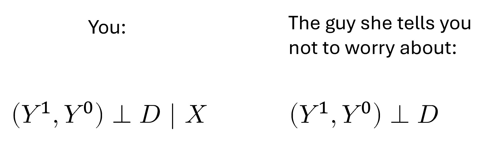
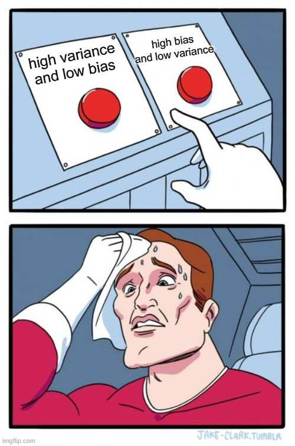

```{r setup, message=FALSE, warning=FALSE, include=FALSE}
knitr::opts_chunk$set(class.source="language-r", class.output="language-r")
```

Until this moment, [the posts about causal inference on this blog](https://www.franciscoyira.com/categories/causal-inference/) have been centred around frameworks that enable the discussion of causal inference problems, such as [Directed Acyclical Graphs (DAGs)](https://franciscoyira.com/post/2021-07-11-diagramas-causalidad-cap-3-causal-inference-mixtape/) and [the Potential Outcomes model](https://franciscoyira.com/post/potential-outcomes-causal-inference-mixtape/)[^1]. Now it's time to go one step further and start talking about the "toolbox" that allows us to address causal inference questions when working with **observational data** (that is, data where the treatment variable is not under the full control of the researcher).

[^1]: This blog post builds on top of the concepts introduced on those articles, so if you feel that there a lot of unknown words in this post, it may be helpful to check those previous posts first.

We've already seen that, in randomised experiments, it's relatively easy to obtain unbiased estimates of causal effects because [the **independence assumption holds**](https://www.franciscoyira.com/post/potential-outcomes-causal-inference-mixtape/#:~:text=The%20independence%20assumption%20(and%20the%20effectiveness%20of%20randomization)). If the data scientist has assigned the treatment variable in a way that has nothing to do with the potential outcomes of the units, then the simple difference in outcomes (SDO) between the control and treated group is enough to get an unbiased estimate of the average treatment effect (ATE).

But there are many situations when it's impossible to carry out a randomised experiment. In such cases, it's *almost certain* that the independence assumption doesn't hold.[^2].

[^2]: *Especially* if we have free agents deciding their treatment status on their own.

In fact, we could have experimental data and still not meet the independence assumption. How is that? Well, the treatment could be randomised within subgroups of the population (e.g. children grouped in schools or customers grouped in tiers or regions) but having different treatment probabilities across the subgroups. If these subgroups have systematic differences in potential outcomes, then there will be correlation between the potential outcomes and the treatment variable, and the independence assumption won't hold.

Fortunately, we still have a way out in situations like that. We can leverage the **conditional independence assumption**.

## The Conditional Independence Assumption

In most cases, expecting your data to meet $Y^1,Y^0 \perp D$ is asking for too much. A more realistic aspiration is to have $Y^1,Y^0 \perp D |X$, the cheap, more common version of the independence assumption, known as **conditional independence**.

What conditional independence says is that $D$ could be correlated with potential outcomes in the data as a whole (no bueno), but that if we look at subsets of observations with the same values of some covariates X (e.g. customers in the same tier or region, or children in the same school), then we have independence between $D$ and $Y^1,Y^0$ inside those subsets (good!).

{width="800"}

If the conditional independence assumption (CIA) is met, then we can estimate the ATE using any estimator that adjusts for X. The simplest of those is the **subclassification estimator**. In plain English, all that this estimator does is calculate the SDO in each subgroup with the same values of X (stratum) and then compute a **weighted average** of those SDOs using the frequency count of each stratum as weight. Thus, if some stratum has a lot of observations, its SDO is going to have a bigger influence on the final estimate.

Let's see a code example to understand this better. First, I'm going to declare the estimator as an R function:

```{r, message=FALSE, warning=FALSE}
library(tidyverse)
library(rlang)

subclas_estimator <- function(df, outcome = Y, treatment = D, covariates) {
    df %>% 
    # we create strata for each set of values of X present in the data
    group_nest({{ covariates }}) %>% 
    # Then, we compute a frequency count and an SDO for each stratum
    mutate(freq = map_dbl(data, nrow),
           strata_sdo = map_dbl(data, sdo, {{ outcome }}, {{ treatment }})) %>% 
    # The estimate is a weighted average of the strata-specific SDOs 
    # using the frequency counts as weights
    summarise(estimate_ATE = weighted.mean(strata_sdo, freq)) %>% 
    pull(estimate_ATE)

}

```

```{r}
# Auxiliary function that computes the SDO
sdo <- function(df, outcome = Y, treatment = D) {
  
  df <- df %>% 
    group_by({{treatment}}) %>% 
    summarise(mean = mean({{outcome}}))
  
  mean_t <- 
    df %>% 
    filter({{treatment}} == 1) %>% 
    pull(mean)
  
  mean_u <- 
    df %>% 
    filter({{treatment}} == 0) %>% 
    pull(mean)
  
  mean_t - mean_u
  
}
```

Now let's simulate a dataset where we have **conditional** independence (but not *un*conditional independence) and see the differences that emerge between the SDO and the subclassification estimator (i.e. the bias in the estimation due to not adjusting by X).

Just for fun, I'll give some back-story for this simulated data. You work as a salesperson at the paper company Dunder Muffin, and one day you suggest your boss, Miguel Scott, do an experiment to evaluate how much sales would increase if we given a promotional discount to our customers in this period of the year. Miguel likes your idea, but he requests you to have a smaller control group (i.e. giving the discount to more customers) in the regions with lower sales. He is assuming that the treatment will have a positive effect, and therefore the purpose of the experiment would be just to estimate by *how much* the sales will increase in each region.

The final design of the experiment is as follows:

```{r echo=FALSE}
tribble(
  ~Region, ~`Number of customers`, ~`Monthly sales per customer before the discount`, ~`Proportion Treated / Control`,
  "East", 130, 3000, "50% / 50%",
  "West", 220, 2000, "80% / 20%",
  "North", 500, 3500, "20% / 80%"
) %>% 
  kableExtra::kable(align = "c") 
```

We'll assume a homogeneous treatment effect across regions: a 300 USD average increase on monthly sales per customer (even after taking the discount into account).

As you may already suspect, under this setting the SDO will be biased because the treatment assignment is correlated with monthly sales (our outcome variable). The lower the monthly sales, the higher the chance of receiving a discount (i.e. having $D=1$).

```{r}
set.seed(1989)

n_east <- 130
n_west <- 220
n_north <- 500
n_total <- n_east+n_west+n_north

customers <-
  tibble(
    customer_id = seq(n_total),
    region = c(rep("East", n_east),
               rep("West", n_west),
               rep("North", n_north)),
    # Treatment effect is 300USD + random noise
    treatment_effect = rnorm(n_total, mean = 300, sd = 200),
    # Sales per customer when no discount is offered (untreated)
    y0 = c(
      rnorm(n_east, mean = 3000, sd = 200),
      rnorm(n_west, mean = 2000, sd = 200),
      rnorm(n_north, mean = 3500, sd = 200)
    ),
    # Sales per customer when discount is offered (treated)
    y1 = y0 + treatment_effect,
    # Treatment status
    d = c(
      rbinom(n_east, 1, 0.5),
      rbinom(n_west, 1, 0.8),
      rbinom(n_north, 1, 0.2)
    ),
    # Switching equation
    y = y0 + treatment_effect*d
    
  )
```

Obtaining the `sdo` over the whole customer base:

```{r}
sdo(customers, outcome = y, treatment = d)
```

And the `subclas_estimator` using `region` as covariate.

```{r}
subclas_estimator(customers,
                  outcome = y,
                  treatment = d,
                  covariates = region)
```

Because we have conditional independence after controlling by `region`, the `subclas_estimator` returns an estimate very close to the real treatment effect. Meanwhile, the `sdo` over the whole data has a huge negative bias, due to the correlation between the treatment assignment and the potential outcomes (lack of *un*conditional independence).

We can see this correlation more clearly in the following visualisations:

```{r}
customers_4_plot <- customers %>% 
  select(region, d, y1, y0) %>% 
  mutate(d = factor(d, levels = c(0,1),
                    labels = c("Untreated", "Treated"))) %>% 
  pivot_longer(cols = c(y1, y0),
               names_to = "potential_outcome",
               values_to = "value")

ggplot(customers_4_plot) +
  aes(potential_outcome, value, colour = factor(d)) +
  geom_boxplot() +
  labs(x = "Potential Outcome",
       y = "Monthly sales per customer",
       colour = "Treatment status",
       title = "There is no unconditional independence in this data",
       subtitle = "Potential outcomes are correlated with the treatment status")
```

```{r}
ggplot(customers_4_plot) +
  aes(potential_outcome, value, colour = factor(d)) +
  geom_boxplot() +
  facet_wrap(~region) +
  labs(x = "Potential Outcome",
       y = "Monthly sales per customer",
       colour = "Treatment status",
       title = "But there is conditional independence",
       subtitle = str_wrap("After controlling by X (Region), potential outcomes are no longer correlated with the treatment status"))
```

*Note that these kinds of visualisations are impossible to do with real-world data since counterfactual potential outcomes are unknown. Here we were able to look at them only because the data was created by ourselves.*

### When do we have conditional independence? And what variables should we include in X?

The best way to answer both questions is to draw a DAG (or causal diagram) of the relationships between the variables in our data. This diagram is the best representation of all the knowledge we have about the data generating process.

A convenient way of drawing the DAG is to use the `ggdag` package in R.

For our Dunder Muffin example, the DAG and code would be as follows:

```{r, message=FALSE, warning=FALSE, scale=0.5}
library(ggdag)

# The `dagify` function allows us to declare the DAG as a set of R formulas,
# plus a couple of arguments to specify the outcome and treatment variables
dag <- dagify(sales ~ discount + region,
              discount ~ region,
              exposure = "discount",
              outcome = "sales") %>%
  # This transforms the output of `dagify` into a tidy dataframe
  tidy_dagitty()

# And now we use the dataframe to create the visualisation
dag %>% 
 ggplot(aes(
    x = x,
    y = y,
    xend = xend,
    yend = yend
  )) +
  geom_dag_point(colour = "deepskyblue3", size = 15) +
  geom_dag_edges() +
  geom_dag_label_repel(aes(label = name)) +
  theme_dag()
```

This particular DAG tells us that:

-   `sales` (the outcome variable) is affected by both `region` and `discount` (the treatment variable)

-   `discount` is affected by `region`: there is a different chance of receiving the treatment according to the region where the customer is located.

The last relationship is the one that kills the independence assumption by opening a backdoor path between the treatment and the outcome:

`sales` ⬅️`region` ➡️`discount`

In this backdoor path, `region` acts as a confounder that creates spurious correlation between the treatment and the outcome.

```{r}
confounder_triangle(x = "sales", y = "discount", z = "region") %>% 
  ggdag_dconnected(text = FALSE, use_labels = "label") +
  theme_dag()
```

Fortunately, the confounder variable is *observable*: we know its values for each observation. Thus, we can condition on it and block the backdoor path. By doing this, we isolate the true causal effect of `discount` on `sales`.

This is what the `subclas_estimator` did, and it's the reason why it returned an appropriate estimate when the SDO was biased.

So, ***when do we have conditional independence?***

When it's possible to close all the backdoors between the treatment and the outcome by conditioning on a set of observable covariates (*X*).

***And what variables should we condition on?***

Well, the ones that allow us to close the backdoors!

**If there are backdoor paths that would require to condition on *un*observable variables to be closed, then we don't have conditional independence anymore (because we can't condition on variables that are not available in our data!).**

If we have an accurate DAG, we can use the function `ggdag_adjustment_set` from `ggdag` to discover what sets of variables (if any) allow us to meet the conditional independence assumption. Pretty handy.

```{r}
ggdag_adjustment_set(dag,
                     text = FALSE, use_labels = "name", shadow = TRUE) +
  theme_dag()

```

### Girls just want to have ~~fun~~ an accurate DAG

What we saw above highlights the importance of having an accurate DAG since it will tell us if we can achieve conditional independence or not.

Here someone may ask where does this magical accurate DAG come from. As it was said before, it is a representation of our current knowledge about the problem. This knowledge could be flawed, and then the DAG would be flawed too.


Unfortunately, there is no workaround to this conundrum. In order to do causal inference, we must have a clear understanding of the data generating process. **And whether we draw the DAG or not, we're assuming an underlying DAG anyway (a set of relationships between the variables)**.

If you go ahead and use the `subclas_estmator`, then you're assuming that you have conditional independence after adjusting by X. So, better to make these assumptions explicit in a DAG and then look at it and asks ourselves if it's a good representation of the data generating process or if we are missing something[^3].

[^3]: All this is explained with greater detail in a previous blog post about DAGs. If these paragraphs sound weird, then it's a good idea to pause and read that post first.

The good news is that whenever you have experimental data (i.e. when *you* decide the treatment assignment) drawing the DAG is relatively simple: you know exactly what is causing $D$, so you can easily adjust for it if it's a confounder (i.e. if it also affects $Y$). In our Dunder Muffin example, we are 100% sure that the treatment depends on `region` and nothing else, so closing the backdoor is a walk in the park[^4].

[^4]: The part that may be tricky in the real world is to know whether the variables that cause $D$ are also linked with $Y$. In our example, we know `region` affects `sales` because the data itself was created by us, but the relationships between $X$ and $Y$ are going to be assumptions most of the time.

On the other hand, if your data is *observational*, then drawing the DAG and arguing that the CIA is met is a much more challenging task. In this case, you may want to take more time to learn everything you can about how the data is generated[^5] and how the variables relate to each other (*especially* the variables linked to the outcome or the treatment)[^6].

[^5]: If you work as a data scientist in a company, get up from your desk, roll up your sleeves and ask questions to those involved in the data collection or data generation itself.

[^6]: Seriously, this is ***extremely important***. If you can't plausibly argue about having conditional independence in your data, then none of the estimators described in this post will help you to isolate the relevant causal effect.

## The Exact Matching Estimator

Now let's move on to a more advanced (and more commonly used) version of the `subclas_estimator`: the **Exact Matching Estimator**. This estimator does, in principle, the same thing as the `subclas_estimator`: it splits the dataset based on the values of the confounders X and then looks at the differences between treatment and control units within each sub-group.

However, instead of calculating the `sdo` in each sub-group and then weighting it by frequency, it tries to **impute the counterfactual value for *each observation* by matching them to another observation that has the same values in the variables X, but opposite treatment status**. Then, it computes the difference in outcome for each pair unit-counterfactual and takes the average of those differences.


In real-world analyses, exact matching often comes accompanied by *coarsening* or *binning* of continuous variables in X (in which case is called **coarsened exact matching** or CEM). The reason for this is that you will usually have continuous variables for which is impossible to find pairs of units with exactly the same value, even if the dataset is very large. So, you have to do a sensible discretisation (e.g. creating bins such as 0 to 2, 2 to 4, 4 to 6, and so on) and then match based on the categorical values.

Let's look at this exact matching estimator defined as an R function[^7]:

[^7]: I will leave the coarsening part out of this code because it can be regarded as pre-processing step you have to do on a case-by-case basis and, therefore, can't be abstracted away in the estimator function. The function itself will assume that the `covariates` are categorical (in the general sense, not necessarily R factors).

```{r}
# Extact Matching Estimator of the ATT
exact_matching_estimator_att <- function(df, #dataframe
                                         outcome, # variable name
                                         treatment, # variable name
                                         covariates # string or vector of strings
                                         ) {
  
   # Renaming the outcome column internally for convenience
  df <- df %>%
    rename(outcome := {{ outcome }}) %>% 
    mutate(id = 1:n())
  
  # Creating a dataset that contains only the treated units
  treated_df <- df %>% 
    filter({{ treatment }} == 1)
  
  # And another only with the untreated units
  control_df <- df %>% 
    filter({{ treatment }} == 0)
  
  # Matching the treated to untreated units with equal covariate values, 
  # thus creating a comparable control sample
  treated_matched <- treated_df %>% 
    left_join(control_df, by = covariates,
              suffix = c("_i", "_j"))
  
  estimate_att <- 
    treated_matched %>% 
    # averaging the outcomes of the matches if there are several
    group_by(id_i) %>%
    summarise(outcome_j = mean(outcome_j),
              outcome_i = first(outcome_i)) %>%
    # calculating differences between the outcome of each unit 
    # and the average outcome of their matches
    mutate(treat_effect = outcome_i - outcome_j) %>% 
    # averaging those differences
    summarise(estimate_att = mean(treat_effect)) %>% 
    # voila
    pull(estimate_att)

  estimate_att
}

```

Now let's try this estimator on a dataset (this one comes from the book [Causal Inference for the Brave and True](https://matheusfacure.github.io/python-causality-handbook/10-Matching.html#matching-estimator)):

```{r, message=FALSE, warning=FALSE}
trainees_df <- read_csv("https://github.com/matheusfacure/python-causality-handbook/raw/master/causal-inference-for-the-brave-and-true/data/trainees.csv",
                        show_col_types=FALSE) %>% 
  rename(trainee = trainees)

trainees_df

```

Here the treatment is a `trainee` program, and each observation is an employee who may have taken the program or not. `earnings` are the outcome variable, and `age` is a covariate that turns out to be a confounder since it affects both `earnings` and the likelihood to have taken the treatment: younger people are more likely to enrol in the program, but also have lower `earnings` because they have less experience.

```{r, message=FALSE, warning=FALSE}
library(ggside)

trainees_df %>% 
  mutate(treatment_status = factor(trainee,
                          levels = c(0, 1),
                          labels = c("Trainee", "Not Trainee"))) %>% 
ggplot() +
  aes(age, earnings, color = treatment_status) +
  geom_jitter() +
  geom_xsidedensity(
    aes(
      y = after_stat(density),
      fill = treatment_status
    ),
    alpha = 0.5,
    size = 1,
    position = "identity"
  ) +
  geom_ysidedensity(
    aes(
      x = after_stat(density),
      fill = treatment_status
    ),
    alpha = 0.5,
    size = 1,
    position = "identity"
  ) + 
  labs(title = "Trainees tend to be younger AND to have lower earnings") +
  theme(
    ggside.panel.scale.x = 0.3,
    ggside.panel.scale.y = 0.3,
    ggside.axis.text.y = element_blank(),
    ggside.axis.ticks.y = element_blank(),
    ggside.axis.text.x = element_blank(),
    ggside.axis.ticks.x = element_blank()
  )
```

Thus, the problem here is self-selection, not randomisation conditional on some variable. But we have conditional independence anyway (after adjusting by `age`):

```{r}
dag_trainees <- dagify(earnings ~ age + trainee,
                       trainee ~ age,
                       exposure = "trainee",
                       outcome = "earnings")

ggdag_adjustment_set(dag_trainees,
                     text = FALSE,
                     use_labels = "name",
                     shadow = TRUE) +
  theme_dag()
```

So, we can use matching use the `exact_matching_estimator_att` on this data:

```{r}
exact_matching_estimator_att(
  trainees_df,
  outcome = earnings,
  treatment = trainee,
  covariates = "age"
)
```

As we see, once we adjust by `age` using exact matching, we get a large and positive treatment effect estimate. But, unlike with the `subclas_estimator`, this new function is estimating the treatment effect *on the treated only*. You can tell this by looking at its source code above, where only the treated units are matched with a control unit, but the control units are not matched with comparable treated units. Therefore, it's an ATT estimator.

Let's see what an ATE exact matching estimator would look like (here I'm commenting only the parts that change compared to the ATT estimator).

```{r}
# Extact Matching Estimator of the ATE
exact_matching_estimator_ate <- function(df, #dataframe
                                         outcome, # variable name
                                         treatment, # variable name
                                         covariates # string or vector of strings
                                         ) {
  df <- df %>%
    rename(outcome := {{ outcome }},
           # renaming the treatment column for convenience
           treatment := {{ treatment }}) %>% 
    mutate(id = 1:n())
  
  treated_df <- df %>% 
    filter(treatment == 1)
  
  control_df <- df %>% 
    filter(treatment == 0)
  
  treated_matched <- treated_df %>% 
    left_join(control_df, by = covariates,
              suffix = c("_i", "_j"))
  
  # Now we also match the control units to treated units 
  control_matched <- control_df %>% 
    left_join(treated_df, by = covariates,
              suffix = c("_i", "_j"))
  
  estimate_ate <- 
    # We merge the two matched samples
    bind_rows(
      treated_matched,
      control_matched
    ) %>% 
    group_by(id_i) %>%
    summarise(outcome_j = mean(outcome_j),
              outcome_i = first(outcome_i),
              treatment_i = first(treatment_i)) %>%
    mutate(treat_effect = outcome_i - outcome_j,
           # We multiply by -1 the differences between controls
           # and their matches. This makes sense since those 
           # differences are like an "anti treatment effect"
           treat_effect = ifelse(
             treatment_i == 1,
             yes = treat_effect,
             no = -1*treat_effect
           )) %>%
    summarise(estimate_ate = mean(treat_effect)) %>% 
    pull(estimate_ate)

  estimate_ate
}
```

The key difference between this ATE estimator and the previous ATT estimator is that here we also create a `control_matched` sample with treated units that are regarded as counterfactuals of the true control units (because they have the same `covariates` values).

Then we `bind_rows()` both matched samples and compute the `mean` difference between actual and counterfactual outcomes as before, BUT first multiplying by -1 the differences between controls and their matches. We do this because, if you think about it, the difference between a control and its counterfactual can be seen as an "anti-treatment effect". If the treatment effect is positive, we expect this difference to be negative.

Now let's try this `exact_matching_estimator_ate` on our `trainee_df`:

```{r}
exact_matching_estimator_ate(
  trainees_df,
  outcome = earnings,
  treatment = trainee,
  covariates = "age"
)
```

We got `NA`. What happened? I'll do the matching manually to check what went wrong:

```{r}
treated_df <- trainees_df %>%
  filter(trainee == 1)

control_df <- trainees_df %>%
  filter(trainee == 0)

treated_matched <- treated_df %>%
  left_join(control_df, by = "age",
                     suffix = c("_i", "_j"))

control_matched <- control_df %>%
  left_join(treated_df, by = "age",
            suffix = c("_i", "_j"))
    
bind_rows(
  control_matched,
  treated_matched
)
```

We see several `NA`s in the columns with suffix `_j`, that is, the columns that should contain the values coming from the matches. Since the only change versus the previous estimator is that now we try to match the control units, the problem seems to be that **the "donor pool" of treated units doesn't contain exact matches for each control unit. Therefore, we can't estimate the ATE with** `exact_matching_estimator_ate`**.**

How unfortunate! But also convenient, because this helps to introduce a very important topic: the **common support assumption**.

## The Common Support Assumption

Exact matching is a powerful and useful method, as long as two key assumptions are met. The first one is the CIA (conditional independence assumption), which we already discussed in detail. If the CIA is not met, the estimate we get through exact matching will be biased, because there will still be backdoors open in our DAG.

The second one is the **common support assumption**. It states that there should be both control and treated observations for each combination of values of X that exists in the data. If this assumption is not met, we end up with units without matches, and the estimator for the ATE cannot be calculated (as it happened with `exact_matching_estimator_ate` and the `trainee_df`).


One way to approach the lack of common support is to **just give up on estimating the ATE and focus on the ATT instead**. When estimating the ATT, we still need control units for all the values of X that have treated units, but not vice versa, so we're "lowering the bar". And if our treated group is small compared to the whole dataset, then it's much more likely to have common support to estimate the ATT. In fact, we already saw an example of this with the `trainee_df`, where it was possible to estimate the ATT, but not the ATE, through exact matching.

But what if there is not even common support for the treated units? Well, then exact matching can't possibly estimate the ATT. Still, it could provide a treatment effect estimate for "those units who got matched" (for example, in `exact_matching_estimator_ate` we could have dropped the rows without matches and have gotten a result anyway), but since this is not an estimate of the ATT or the ATE (the averages we are usually interested in), this figure probably won't be helpful to our audience or stakeholders.

And now the time has come to meet the sinister archrival of the matching methodologies: **the curse of dimensionality**.

## The Curse of Dimensionality

This is a phenomenon that occurs whenever we work with a lot of variables (a.k.a. dimensions). If you come from the machine learning world, you may already be familiar with this problem, but for those who don't, I'm going to drop the [Wikipedia definition](https://en.wikipedia.org/wiki/Curse_of_dimensionality):

> when the dimensionality increases, the volume of the space increases so fast that the available data becomes sparse. In order to obtain a reliable result, the amount of data needed often grows exponentially with the dimensionality

For our matching estimators, this means that as more variables are considered in the covariate matrix X, the likelihood of finding exact matches[^8] for all units falls quickly. So, it may be almost impossible to meet the common support assumption when using a lot of variables in the matching process unless we also have *a lot* of data.

[^8]: Or even approximate matches!


The curse of dimensionality is *particularly* cruel with the matching estimators. While in predictive machine learning we have some sort of tradeoff, with more features bringing in more information at the expense of increasing the distance in the feature space (i.e. we have a choice), in matching methodologies we theoretically have a "true" set X of confounders for which we are obliged to control/adjust for.

In other words, when doing matching, it's not like we're using more covariates out of greed to "use as much information as we can"[^9], but instead, after carefully drawing our DAG, we should end up with a list of variables for which we **must** control for in order to close the backdoors. We shouldn't control for more, and we shouldn't control for less.

[^9]: Well, some people do that, but we shouldn't.

If our confounding problem is simple (such as randomisation conditional on some variable, like the Dunder Muffin example above), then likely we will only need a few covariates, or even just one, and thus the curse can be avoided.

But if we need to adjust for more, we could end up needing a really big dataset in order to have common support. That's why matching is often referred to as a **"data greedy"** method.

The good news is that we live in the age of big data, so it's not uncommon for data scientists to have access to tables with millions of observations. Assuming that the treated group is relatively small, these big datasets may allow finding matches for all the treated units even when we need to adjust for several covariates and, hence, estimate the ATT.

However, we may still have trouble finding exact matches for all the treated units, even with the so-called "big data". Additionally, some of you may feel uncomfortable with the arbitrariness of the *bining* or *coarsening* part of the exact matching estimator. We need to convert continuous variables into categorical by creating bins, but exactly how wide or narrow should these bins be?

These two issues serve as a motivation to move into the next matching estimator.

## The (Approximate) Distance Matching Estimator

As we saw, if we have to control for several features it's unlikely we'll find exact matches for all the treated units, let alone for the whole sample. Because of this, it's common to, instead of looking for perfect matches, use a proximity or distance metric that tells us how different or similar any two pair of units are and then match each unit with the most similar observation with opposite treatment assignment.

But before doing this, there are a couple of steps we should carry out.

### Scaling and choosing a distance metric

The first step is **scaling the covariates X**[^10]. This means dividing each feature by its standard deviation. The result is having all covariates with a standard deviation equal to 1. If we don't do this, some features will have more importance in the final proximity calculation just because of their measurement units.

[^10]: Again, if you come from the ML world, this is evident and straightforward, but I'll explain it anyway for people with different backgrounds.

For example, if one of the covariates is `age` and is measured in years, and another is `daily_food_intake` and its measured in calories, then the latter will have much more influence on the distance, just because of being measured in a scale with higher values and more variation. What's more problematic, we could change the weight of each covariate just by transforming it to another equivalent scale, e.g. increase the weight of age by measuring it in months or days. Obviously, all of this is undesirable, so that's why you must scale your covariates.

Then the second step is **to choose a distance or proximity metric**.

The most common distance metric is the euclidean distance, which just boils down to representing each observation as a point in a hyperplane with M dimensions (with M as the number of features) and then computing the length of a straight line between those two points. If you have calculated a distance between two points in a Cartesian plane, it probably was a euclidian distance.

```{r}
euclidian_distance <- function(x_i, x_j) {

  map2_dbl(x_i, x_j, ~(.x - .y)^2) %>%
    reduce(sum) %>% 
    sqrt()
    
}
```

But we can do better. According to [The Effect](https://theeffectbook.net/ch-Matching.html#matching-in-concept-a-single-matching-variable), the best proximity metric to use for approximate matching is the **Mahalanobis distance**. Not only does this metric scale the features to a standard deviation of 1, but it also divides by their *covariances* in order to eliminate the correlation between them before calculating the distance. Why would we do this? Nick Huntington-Klein, author of The Effect, provides a crystal-clear explanation:

> Because this keeps us from our matching relying *really strongly* on some latent characteristic that happens to show up a bunch of times. For example, say you were matching on beard length, level of arm hair, and score on a "masculinity index." All three of those things are, to one degree or another, related to "being a male." Without dividing out the covariance, you'd basically be matching on "being a male" three times. Redundant, and the matching process will probably refuse to match any males to any non-males, even if they're good matches on other characteristics. If we divide out the covariance, we're still matching on male-ness, but it doesn't count multiple times.

This idea of "dividing out the covariance" may be difficult to grasp, so here are a series of figures that illustrate what are we doing to the feature-space when computing the Mahalanobis distance:

*](images/mahalanobis.png){width="800"}

The top-left image represents the raw, original feature-space of two correlated variables and the bottom-left represents what the space we end up with after dividing out the covariance matrix. Then, a euclidian distance is calculated in this transformed space. That is the Mahalanobis distance.

Note that only doing the scaling can be seen as "stretching" the original space to achieve equal variance among all the dimensions, but dividing by the covariance implies also "rotating" it in order to eliminate the correlation[^11].

[^11]: If you're familiar with Principal Component Analysis, it may be helpful to see Mahalanobis distance as just euclidian distance in a PCA-rotated and standardised space. That is, a feature-space in which you applied PCA, but kept all the resulting uncorrelated features (i.e. no dimensionality reduction) and then scaled them to have the same variance.

Okay, that was the "intuitive" explanation. Now let's express this metric in code:

```{r}
# `x_i` and `x_j` are two numeric vectors representing two observations in the
# data. Both vectors have the same length M, where M is the number of covariates

# cov is the variance-covariance matrix of variables X, an MxM matrix
mahalanobis_distance <- function(x_i,
                                 x_j,
                                 cov){
  # We compute the inverse of the `cov` matrix
  inv_covar <- matlib::inv(cov)
  
  matrix_multiplication_output <-
    # a 1xM vector * a MxM matrix * a Mx1 vector = a scalar
    (t(as.matrix(x_i - x_j)) %*% inv_covar %*% as.matrix(x_i - x_j))
  
  sqrt(matrix_multiplication_output)
}
```

As a fun fact, if `cov` is equal to the identity matrix (a matrix with ones in the diagonal and zeros everywhere else), then the `mahalanobis_distance` is equal to the `euclidian_distance`. This means that if X is already scaled and there is zero correlation between the variables, both distance metrics should return the same value.

### More decisions: bias or variance?

So the proximity metric thing wasn't actually a choice because the Mahalanobis distance is always the best option. Good. Also, we don't have to decide on the bin sizes for continuous variables anymore (as we had to do with exact matching). However, approximate matching still requires us to take some other decisions.

-   **How many matches we'll use for each unit?** After calculating distances, we will have a sorted ranking of potential matches for each unit. So, how many units from that list we'll use to impute the counterfactual? Just one (the closest)? Two? Or more?[^12].

-   **Calliper** (also known as bandwidth): how far can two units be before we stop considering them as potential matches? Note that if we choose a very narrow calliper, we could end up with many unmatched units.

-   **Matching *with* replacement or *without* replacement?** If the treated unit *i* is matched to the control unit *j*, will the unit *j* remain available to be matched to other treated units? (i.e. will it remain in the control "donor pool"?).

[^12]: If you have worked with the K-nearest neighbours algorithm, this is equivalent to choosing the K parameter.

These seem like a lot of decisions, but the answer to all of them largely comes down to only one thing: the **bias-variance tradeoff**. The setting that minimises bias is the following:

-   Use just one match for each unit (the best/closest).

-   Choose a narrow calliper.

-   Do matching with replacement (so we have the whole donor pool available when matching each unit).

By doing this, we're ensuring that the matched samples are as similar as possible to the original units in their covariates values (i.e. that they have a minimum bias). This, in turn, maximises our chances of closing the nasty backdoors in our DAG.

{width="800"}

However, this setting also maximises variance: if we use just one match to estimate each counterfactual, then that estimate is going to be very noisy. And the problem becomes worse if we allow each unit in the donor pool to be matched to several original units. This is bad because we become susceptible to sample variance in the observed data. The *expected value* of the estimator will be close to the true ATT or ATE (little bias) but the specific *realisation* we observe, given our current sample, may fall far off from that.

To reduce variance, we may consider using more matches for each unit, widening the calliper, and doing matching *without* replacement. But all this would increase the bias.



So what should we do? For the number of matches, [*The Effect* suggests using more matches when our dataset is big](https://theeffectbook.net/ch-Matching.html#:~:text=So%20the%20choice,Not%20worth%20it.) because then we can reduce variance at the expense of just a small increase in bias. But if the data is small, the price of such variance reduction is much higher since the second-best or third-best matches could be far off the original unit in their covariate values.

Regarding replacement and calliper/bandwidth, I guess a similar principle comes into play. For bigger datasets, we could "afford" choices that reduce variance such as not using replacement and increasing the bandwidth, but for small data, it may be too much to ask[^13].

[^13]: *The Effect* also points out that there is extensive literature on choosing the optimal bandwidth/calliper when doing approximate matching, so you may want to look at that.

### Distance Matching Estimator ✨as code✨

Now let's implement a distance matching estimator as an R function. For this example, I'll to pick an estimator with replacement, without calliper restriction and with just one match per unit (the best/closest). This is not necessarily the most appropriate estimator for *your* data but is the easiest to code and understand[^14].

[^14]: And anyway, the purpose of these code examples is just to explain what these estimators do. If you really want to use matching estimators in your analysis, you should use an implementation from an R package such as `MatchIt`. I'm going to cover this in Part 2 of this blog post.

```{r, warning=FALSE}
distance_matching_estimator_att <- function(df,
                                            treatment,
                                            outcome,
                                            covariates) {
  # Renaming the treatment variable for convenience
  df <- df %>% 
    rename(treatment := {{ treatment }})
  
  # Copying the covariates in a separate DF to calculate the variance matrix
  covariates <- df %>% 
    select({{ covariates }})
  
  # Calculating the covariance matrix
  cov_matrix <- cov(covariates)
  
  # Pair-wise Mahalanobis distance between all the observations
  m_distances <- 
    HDMD::pairwise.mahalanobis(
      x = covariates,
      grouping = 1:nrow(covariates),
      cov = cov_matrix
      ) %>% magrittr::extract2("distance")
  
  # Getting the indexes of treated units
  treated_indexes <- which(df$treatment == 1)
  control_indexes <- which(df$treatment == 0)
  
  # Subsetting the distance matrix to keep only distances 
  # from treated units to untreated units
  dist_treated_to_control <- m_distances[treated_indexes, control_indexes]
  
  # Getting the index of the closest control unit for each treated unit
  indexes_matched_controls <- apply(dist_treated_to_control, 1, which.min)
  
  # Getting the outcome values of control matches
  matched_controls_values <- 
    df %>% 
    filter(treatment == 0) %>% 
    slice(indexes_matched_controls) %>% 
    select(outcome_match := {{ outcome }})
  
  # Binding those values to the corresponding treated units 
  # and then estimating the ATT
  df %>% 
    filter(treatment == 1) %>% 
    bind_cols(matched_controls_values) %>% 
    mutate(treat_effect := {{ outcome }} - outcome_match) %>% 
    pull(treat_effect) %>% 
    mean()
  
}
```

Again, we're going to try the estimator with some data. This time is a dataset measuring the effects of a new medication on the recovery period for some patients, measured in days (this dataset also [comes from the book *Causal Inference for The Brave and True*](https://github.com/matheusfacure/python-causality-handbook/blob/master/causal-inference-for-the-brave-and-true/data/medicine_impact_recovery.csv)).

```{r}
medicine_impact_recovery <- 
  read_csv("https://raw.githubusercontent.com/matheusfacure/python-causality-handbook/master/causal-inference-for-the-brave-and-true/data/medicine_impact_recovery.csv",
           show_col_types = FALSE)

medicine_impact_recovery

```

In this dataset, `medication` is the treatment variable and `recovery` is the outcome variable. The desired result of the treatment is to reduce the `recovery` days. As before, we have conditional independence after adjusting for confounders, but this time there are three confounders instead of one, and two of them are continuous variables. So, it looks like an appropriate setting for using distance matching.

```{r}
dag_medication <- dagify(recovery ~ age + severity + sex + medication,
                       medication ~ age + severity + sex,
                       exposure = "medication",
                       outcome = "recovery")

ggdag_adjustment_set(dag_medication,
                     text = FALSE,
                     use_labels = "name",
                     shadow = TRUE) +
  theme_dag()
```

Due to selection bias, the simple difference in means between treated and control groups implies that the `medication` has a negative effect: patients who take it have a longer recovery period.

```{r}
mean_treated <- medicine_impact_recovery %>% 
  filter(medication == 1) %>% 
  pull(recovery) %>% 
  mean()
  
mean_untreated <- medicine_impact_recovery %>% 
  filter(medication == 0) %>% 
  pull(recovery) %>% 
  mean()

mean_treated - mean_untreated
```

But after using distance matching to adjust for the confounders, we found a positive effect: the `medication` seems to reduce the `recovery` period by 6.74 days on average (for the treated group).

```{r, message=FALSE, warning=FALSE, cache=TRUE}
distance_matching_estimator_att(
  medicine_impact_recovery,
  treatment = medication,
  outcome = recovery,
  covariates = c(sex, age, severity)
)
```

### One more thing: Bias correction

Okay, this section has been pretty long, but that's because talking about the distance matching estimator necessarily entails talking about all those topics. And there is still one more topic left! It's the **bias correction method**, which is often used when doing approximate matching.

Since it's almost impossible for the distance between two units to be zero, we can take for granted that there will be some bias due to differences in covariates between the original and the matched units. Fortunately, [Abadie and Imbens (2011)](https://economics.mit.edu/files/11861) introduced a bias correction method, which leverages the fact that discrepancies in covariates are *observed*.

You can read the original paper or [the reference](https://mixtape.scunning.com/matching-and-subclassification.html?panelset3=r-code4#bias-correction) [books](https://matheusfacure.github.io/python-causality-handbook/10-Matching.html#matching-bias) if you want to go into more detail but, for the ATT, it basically mounts up to each unit contributing the following expression to the total amount of bias in the estimator:

$$
\mu_0(X_i)-\mu_0(X_{j(i)})
$$

The elements of this subtraction represent the expected potential outcome $Y_0$ given the covariates values inside the parenthesis. $X_i$ are the covariates values for the original unit, and $X_{j(i)}$ are the covariates values for the matched control unit. Since those covariate values are not exactly the same, the bias contributed by the unit will be non-zero.

We can **estimate this bias** and then **subtract it** from the treatment effect estimated for each unit:

$$
\hat{ATT} = \frac{1}{N_T}\sum_{i=1}^{N_T}{ (Y_i - Y_{i(j)}) -(\hat{\mu}_0(X_i)-\hat{\mu}_0(X_{j(i)})) }
$$

*In this expression* $N_T$ *is the number of treated units,* $Y_i$ *is the outcome of the original unit and* $Y_{i(j)}$ *is the outcome of the matched unit. The functions* $\mu(\cdot)$ *now have hats because they are being estimated.*

How to estimate the bias? A way of doing it is fitting a linear regression with the covariates as predictors and the outcome as response, *but using only data from the untreated units*. Then we'll feed $X_i$ and $X_{j(i)}$ to the fitted regression in order to obtain the corresponding predicted values. The difference between those predicted values is our estimate of the bias for the untreated matched sample.

Let's see it implemented in code. This example builds on top of the previously defined `distance_matching_estimator_att`, so now I'm only commenting the lines that are new:

```{r}
distance_matching_att_w_bias_adj <- function(df,
                                             treatment,
                                             outcome,
                                             covariates) {
  df <- df %>% 
    rename(treatment := {{ treatment }})
  
  covariates_df <- df %>% 
    select({{ covariates }})
  
  cov_matrix <- cov(covariates_df)
  
  m_distances <- 
    HDMD::pairwise.mahalanobis(
      x = covariates_df,
      grouping = 1:nrow(covariates_df),
      cov = cov_matrix
      ) %>% magrittr::extract2("distance")
  
  treated_indexes <- which(df$treatment == 1)
  control_indexes <- which(df$treatment == 0)
  
  dist_treated_to_control <- m_distances[treated_indexes, control_indexes]
  
  indexes_matched_controls <- apply(dist_treated_to_control, 1, which.min)
  
  # Fitting a regression Y ~ X using the control units
  df_reg <- df %>% 
    filter(treatment == 0) %>% 
    select(c({{ outcome }}, {{ covariates }}))
  # (don't mind the rlang part, it's R black magic for putting this 
  # inside a function, just focus on the regression)
  ysym <- rlang::ensym(outcome)
  rlang::inject(
    u0 <- lm(!!ysym ~ ., data = df_reg)
  )
  
  matched_controls_values <- 
    df %>% 
    filter(treatment == 0) %>% 
    slice(indexes_matched_controls) %>%
    # We add the predicted Y value based on the `u0` model 
    # and the covariates in the control matched sample
    modelr::add_predictions(u0, "u0_j") %>% 
    select(outcome_match := {{ outcome }},
           u0_j)

  df %>% 
    filter(treatment == 1) %>% 
    # And we also add predicted values corresponding to the covariates 
    # of the original treated units
    modelr::add_predictions(u0, "u0_i") %>%  
    bind_cols(matched_controls_values) %>% 
    mutate(treat_effect := {{ outcome }} - outcome_match,
           # subtracting both predicted values to get the bias correction term
           bias_correction = u0_i - u0_j,
           # and putting the bias correction into the final estimate
           treat_effect_debias = treat_effect - bias_correction) %>% 
    pull(treat_effect_debias) %>% 
    mean()
  
}
```

```{r, warning=FALSE, message=FALSE, cache=TRUE}
distance_matching_att_w_bias_adj(
  medicine_impact_recovery,
  treatment = medication,
  outcome = recovery,
  covariates = c(sex, age, severity)
)
```

How would this work if we were estimating the ATE instead? As in `exact_matching_estimator_ate`, we would also have a sample of matched treated units, acting as estimated counterfactuals for the original treated units. But in this case, the bias correction term has to be estimated with a linear regression *fitted only with the original treated units*. Everything else is the same. Then we do `bind_rows` of both matched samples and average the `treat_effect_debias` of each unit.

## But wait! There is even more!

Stay tuned for **part 2** of this post, where I'll be discussing more Matching estimators and topics, such as **Propensity Score** and **Inverse Probability Weighting**, the differences between Matching and Multivariate Linear Regression, and the **Double Robust Estimator**, a clever way to combine both Regression and Matching in order to increase our chances of obtaining a credible estimate of the average treatment effect.


*You can [subscribe](https://www.franciscoyira.com/subscribe/) to receive an email when I publish the next post (I'll never send you spam, and you can unsubscribe whenever you want).*

## References 📚

-   [Causal Inference: The Mixtape - Scott Cunningham. Chapter 5.](https://mixtape.scunning.com/matching-and-subclassification.html)

-   [The Effect - Nick Huntington-Klein. Chapter 14.](https://theeffectbook.net/ch-Matching.html)

-   [Causal Inference for the Brave and True - Matheus Facure Alves. Chapter 10.](https://matheusfacure.github.io/python-causality-handbook/10-Matching.html)

*Your feedback is welcome! You can send me comments about this article to my [email](mailto:francisco.yira@outlook.com).*
