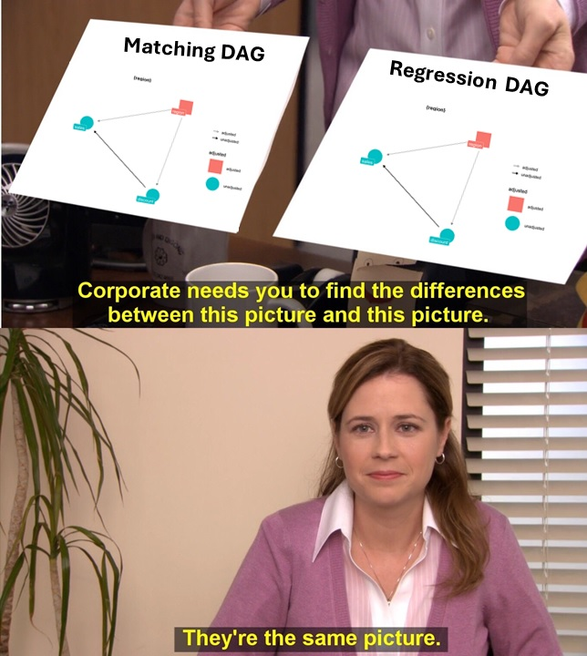
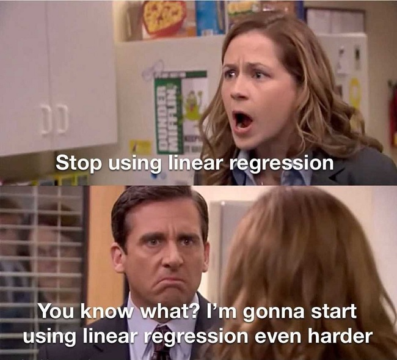

```{r setup, message=FALSE, warning=FALSE, include=FALSE}
knitr::opts_chunk$set(class.source="language-r", class.output="language-r")
```

Welcome to the second part of the series about **Matching estimators in R**. This sequel will build on top of [the first part](https://www.franciscoyira.com/post/matching-in-r-part-1/) and the concepts explained there, so if you haven't read it yet, I recommend doing so before you continue reading. But if you don't have time for that, don't worry. Here it's a quick summary of the key ideas from the previous past that are required to understand this new post.

> ***Series about Matching***
>
> -   [Part I: Subclassification, Common Support and the Curse of Dimensionality](/post/matching-in-r-part-1/)
>
> -   **Part II: You're here.**
>
> -   [Part III: Propensity score, Weighting and the Double Robust Estimator](/post/matching-in-r-3-propensity-score-iptw/)

## Quick recap of Part 1

-   First, we talked about the **conditional independence assumption** (CIA), which is like a "weak version" of [the "full" independence (between treatment assignment and potential outcomes) we find in completely randomised trials](https://www.franciscoyira.com/post/potential-outcomes-causal-inference-mixtape/#:~:text=The%20independence%20assumption,ATE!%20(it%E2%80%99s%20unbiased)). It states that the treatment assignment is "as good as random" inside subgroups of the data with the same values of some covariates X, despite not being random in the data as a whole.

-   How do we know if we have conditional independence? Technically, it's an untestable assumption, but we can assess how reasonable or far fetched it's to believe in it by **drawing a [causal diagram(DAG)](https://www.franciscoyira.com/post/2021-07-11-diagramas-causalidad-cap-3-causal-inference-mixtape/)**, which is a neat representation of all our current knowledge about the data generating process. By looking at our DAG, we can tell if it makes sense to assume conditional independence in our data.

 are independent of the treatment assignment after adjust/controlling for X (a set of covariates).*](images/conditional_indepence_believe.jpg)

-   After (honestly and rigorously) convincing ourselves that the CIA holds in our data, we can go ahead and use the methods we saw [in Part 1](https://franciscoyira.com/post/matching-in-r-part-1/): **Subclassification, Exact Matching, and Approximate Matching**, which adjust for the set X of confounders/covariates and thus estimate the true causal effect.

## Matching versus Regression: What's the difference?

After that brief recap, let's talk more about the contexts in which Matching should be used. Specifically, how can we decide when to use Matching and when Regression to control for confounders? After all, **both methods rely on the same type of DAG**: one where the conditional independence assumption is met[^1].

[^1]: Or, in DAG lingo, one where all the backdoors can be closed by adjusting for observable variables.



To answer that question, let's look into the differences between these two techniques.

### Regression is parametric, Matching is non-parametric

Regression requires us to **assume a functional form** that links the treatment ($D$) and the covariates ($X$) with the outcome ($Y$). We call this kind of model "parametric" because it has *parameters* to be estimated (which, in the context of regression, are usually known as "betas").

On the other hand, Matching provides more freedom by not imposing any functional form on the variables. The only two assumptions it relies on are the CIA (which is required by regression too) and common support (which is necessary to obtain an estimate).

For example, if your regression model is $Y = D + X_1 + X_2$ (where $X_1$ and $X_2$ are covariates and observable confounders), you're imposing a specification that assumes:

-   Independence between the treatment effect and the covariates values.
-   Linear and additive effects of the covariates on the outcome (the "beta" of $X_1$ is the same regardless of the value of $X_2$, and vice-versa).

These assumptions could be true or not, and if they are not true, then **our estimate may be biased due to misspecification**.

Meanwhile, if we did Matching using $X_1$ and $X_2$, the estimated counterfactual for each unit would be just the (average) *actual* outcome of the matched unit(s), so there would be no need to make any functional form assumptions. The relationships between the covariates, the treatment and the outcome could be highly non-linear, and the Matching estimator would still work just fine, as long as there is common support and the CIA holds[^2].

[^2]: It's worth mentioning that regression could also handle non-linear relationships, but we have to "declare" such non-linearity in the model specification.

Let's see an example with code. Pay close attention to the lines that generate the data (those inside the `tibble` call).

```{r, message=FALSE, warning=FALSE}
library(tidyverse)

# Data-generating code
df <- tibble(
  # x is our confounder
  x = runif(1000, -1, 4),
  # it affects the probabiity of receiving the treatment
  # in a NON-LINEAR way (step function)
  prob_d = ifelse(x > 0.5 & x < 2.5, 0.1, 0.9),
  d = rbinom(1000, 1, prob_d),
  noise = rnorm(1000, sd = 0.1),
  # for simplification, the treatment effect is homogeneous
  treat_effect = 1,
  # x also effects the outcome in a non-linear way
  y = sin(x) + d*treat_effect + noise
) %>% 
  mutate(d_factor = factor(d,
                           levels=c(0,1), labels=c("Untreated",
                                                   "Treated")))

ggplot(df,
       aes(x, y,
           color = d_factor)) +
  geom_point() + 
  labs(color = "Treatment status")
```

```{r}
linear_model1 <- lm(y ~ d + x, data = df)

confint(linear_model1)
```

Here `x` is a confounder because it affects both the outcome (`y`) and the probability of receiving the treatment (`d`). But simple linear regression can't help us, even if we include the confounder as control, because both relationships (X-\>D and X-\>Y) are highly non-linear. Therefore, the final estimate is so biased that the true value is outside the confidence interval. Sad!


Now let's use Matching with the same data. Here we're going to use a Matching estimator implemented by a CRAN R package instead of coding it ourselves[^3]:

[^3]: Which is what we should do most of the time. The "estimators as R functions" of the previous blog post had only pedagogical purposes, and, in general, it's better to leverage implementations of statistical methods available in CRAN packages. Not only are they less likely to have errors, but they also have extra goodies such as standard errors calculation and nice `print` or `summary` methods.

```{r, message=FALSE, warning=FALSE}
library(Matching)
M <- Match(df$y, df$d, df$x, M = 5, Weight = 2, caliper = 0.05)
summary(M)
```

As expected, the Matching estimate is much closer to the true treatment effect (and its confidence interval includes the true value) because it's not relying on false linearity assumptions[^4].

[^4]: Regression fans may object that regression is technically *capable* of handling datasets like this, given that we include the non-linear relationships in the specification (for example, `lm(y ~ d + sin(x), data = df)` returns a treatment effect estimate close to 1). But the point is that we should critically assess if we have enough information to assume a specific functional form between the variables. If we don't, then a non-parametric approach such as Matching may be a better option.

Here is an illustration that makes it clearer what each of the estimators is doing and why the linear regression estimate is so off[^5]:

[^5]: Yes, KNN regression is *technically not the same* as matching, but, for the effect of this visualisation, the KNN algorithm illustrates well what matching is doing.

```{r fig.height=5, fig.width=7, message=FALSE, warning=FALSE}
# Matching 
library(FNN)
knn1 <- knn.reg(
  train = dplyr::select(df, x, d),
  y = df$y,
  test = dplyr::select(df, x, d),
  k = 10,
  algorithm = "brute"
)

df_knn <- df %>% 
  mutate(pred_knn = knn1$pred)

# Regression
df_linear <- df %>% 
  modelr::add_predictions(linear_model1, var = "pred_linear")


# Plots
plot_matching <- 
  ggplot(df_knn) +
  aes(x = x, color = d_factor) +
  geom_point(aes(y = y), alpha = 0.3) +
  geom_line(aes(y = pred_knn), size = 1.5) +
  labs(color = "Treatment status",
       title = "Matching") + theme(
    axis.text.x = element_blank(),
    axis.ticks.x = element_blank(),
    axis.title.x = element_blank()
  )

plot_linear <- 
  ggplot(df_linear) +
  aes(x = x, color = d_factor) +
  geom_point(aes(y = y), alpha = 0.3) +
  geom_line(aes(y = pred_linear), size = 1.5) +
  labs(color = "Treatment status",
       title = "Linear regression")

library(patchwork)

(plot_matching / plot_linear) +
  plot_layout(guides = "collect") + 
  plot_annotation(subtitle = "In each subplot, the estimated ATE is the average distance between the two lines")
    
```

### Common support assumption versus Extrapolation

Up to this point, it seems that Matching is winning. Why would we want to assume a specific functional form when we can just... not?



Sadly, there is no free lunch, and the flexibility of Matching comes at a price: **the common support assumption**. In order to get a counterfactual estimate without a parametric model, we need to have observations with the same (or similar) covariate values and opposite treatment status for each of the original units. If we don't, Matching will fail.

However, Regression doesn't have such a requisite. Instead, it leverages the parametric specification to get estimates by "extrapolation" in the areas without common support. And, if our parametric specification appropriately reflects the data generating process, such extrapolation is a reasonable way to handle these cases[^6].

[^6]: Big If, though.

> **Regression leverages the parametric specification to get estimates by "extrapolation" in the areas without common support.**

Let's see an example with simulated data to understand better this idea. The code here will be very similar to the previous example, but with two key differences:

-   Treatment assignment (`d`) is now a *deterministic* function of `x`: for some values of `x`, all the units get the treatment, and for others, nobody is treated. This kills the common support assumption and any hope of using Matching and getting a good estimate ☠️.
-   However, now we assume that we *know* the non-linear function that links `x` with `y`. We put that knowledge in the regression specification (`y ~ d + sin(x)`) in order to get the extrapolation right.

Here is the simulated data:

```{r}
df_wo_common_support <-
  tibble(
    x = runif(1000,-1, 4),
    # Note how `x` now affects `d` in a deterministic way
    # There is no `prob_d` and no `rbinom`
    d = ifelse(x > 0.5 & x < 2.5, 0, 1),
    noise = rnorm(1000, sd = 0.1),
    treat_effect = 1,
    # x->y and x->d, just like in the previous example
    y = sin(x) + d * treat_effect + noise
  ) %>%
  mutate(d_factor = factor(
    d,
    levels = c(0, 1),
    labels = c("Untreated", "Treated")
  ))

ggplot(df_wo_common_support,
       aes(x, y,
           color = d_factor)) +
  geom_point() + 
  labs(color = "Treatment status",
       subtitle = str_wrap("Dataset without common support due to deterministic treatment assignement based on a confounder"))
```

And here is the regression with the new, non-linear specification:

```{r}
reg_wo_common_support <- lm(y ~ d + sin(x), data = df_wo_common_support)

confint(reg_wo_common_support)
```

You could argue that this dataset is more challenging than the previous one. Nevertheless, regression is able to handle it because it now extrapolates using an appropriate specification.

Here is a visualisation of what regression is doing under the hood:

```{r}
# Hacky data manipulation to avoid the plot looking weird
df_wo_common_support <- df_wo_common_support %>%
  mutate(group = case_when(
           x < 0.5 ~ "segment1",
           x > 2.5 ~ "segment3",
           TRUE ~ "segment2"
         ))

# Function to label the treatment variable 
creating_factor_d <- function(x) factor(x,
                                        levels = c(0, 1),
                                        labels = c("Untreated",
                                                   "Treated"))

df_wo_cs_treated <- df_wo_common_support %>% 
  mutate(extrapolation = ifelse(d == 1, "No", "Yes"),
         d = 1,
         d_factor = creating_factor_d(d)) %>% 
  modelr::add_predictions(reg_wo_common_support, var = "pred_treated")
  
df_wo_cs_untreated <- df_wo_common_support %>% 
  mutate(extrapolation = ifelse(d == 0, "No", "Yes"),
         d = 0,
         d_factor = creating_factor_d(d)) %>% 
  modelr::add_predictions(reg_wo_common_support, var = "pred_untreated")

plot_wo_cs_reg <- 
  ggplot() +
  aes(x, y, color = d_factor) +
  geom_point(data= df_wo_common_support, alpha = 0.3) +
  geom_line(data = df_wo_cs_untreated,
            aes(y = pred_untreated,
                alpha = extrapolation,
                linetype = extrapolation,
                group = group), size = 1.5) +
  geom_line(data = df_wo_cs_treated,
            aes(y = pred_treated,
                alpha = extrapolation,
                linetype = extrapolation,
                group = group), size = 1.5) +
  scale_alpha_manual(values = c("Yes" = 0.5, "No" = 1)) +
  scale_linetype_manual(values = c("Yes" = "dashed", "No" = "solid")) +
  scale_color_discrete(name = "Treated or Not") +
  theme(legend.key.width=unit(1.5,"cm")) +
  labs(subtitle = str_wrap("Regression extrapolates when there isn't common support, and if the model specification is correct, that may be a good thing"))

plot_wo_cs_reg
```

Nice.

Keep in mind that, in the real world, rarely do we have such perfect knowledge of the true functional form. But if you find yourself in this lucky situation, it's a good idea to leverage this knowledge through a parametric method like regression.

Now, just for fun, let's see what Matching would do in this dataset. We already know that **it will fail because there isn't common support**, so matches are likely to be *terrible* as in they won't be similar to the original units. But if you *really* want visual proof, here we go:

```{r}
x_values <- df_wo_common_support %>% dplyr::select(x)

knn_wo_cs_treated <- knn.reg(
  train = df_wo_common_support %>% 
    filter(d == 1) %>% 
    dplyr::select(x),
  y = df_wo_common_support %>% 
    filter(d == 1) %>% 
    dplyr::pull(y),
  test = x_values,
  k = 15,
  algorithm = "brute"
)

knn_wo_cs_untreated <- knn.reg(
  train = df_wo_common_support %>% 
    filter(d == 0) %>% 
    dplyr::select(x),
  y = df_wo_common_support %>% 
    filter(d == 0) %>% 
    dplyr::pull(y),
  test = x_values,
  k = 15,
  algorithm = "brute"
)

df_untr_matching_wo_cs <-
  tibble(
    y_pred = knn_wo_cs_untreated$pred,
    x = df_wo_common_support$x,
    d = 0
  ) %>%
  mutate(d_factor = creating_factor_d(d))

df_tr_matching_wo_cs <-
  tibble(
    y_pred = knn_wo_cs_treated$pred,
    x = df_wo_common_support$x,
    d = 1
  ) %>%
  mutate(d_factor = creating_factor_d(d),
         group = case_when(
           x < 0.5 ~ "segment1",
           x > 2.5 ~ "segment3",
           TRUE ~ "segment2"
         ))

plot_matching_wo_cs <- 
  ggplot() +
  aes(x, y, color = d_factor) +
  geom_point(data= df_wo_common_support, alpha = 0.3) +
  geom_line(data = df_untr_matching_wo_cs,
            aes(y = y_pred), size = 1.5) +
  geom_line(data = df_tr_matching_wo_cs,
            aes(y = y_pred, group = group), size = 1.5) +
  labs(color = "Treated or Not",
       subtitle = "Matching just fails when there isn't common support") 

plot_matching_wo_cs
```

The estimated ATE would be the average distance between the two lines (*clearly* a bad estimate).

In cases like this, you would like your matching estimation to throw an error instead of returning a terrible estimate[^7]. I couldn't find a way to make `Matching::Match()` throw an error in this situation, but at least we can set the `caliper` parameter to avoid matches that are too far away[^8].

[^7]: This is a general principle that should be followed in many code-related situations: fail early (so you know ASAP that there is a problem) instead of returning garbage (that will mess up with stuff downstream).

[^8]: This `caliper` is interpreted as standard deviations by the functions. If you're matching on several variables, you could also specify different callipers for each one. For more details, check the documentation of `MatchIt::Match()`.

```{r}
M_wo_cs <- Match(df_wo_common_support$y,
                 df_wo_common_support$d,
                 df_wo_common_support$x,
                 M = 5,
                 # Weight = 2 means we use Mahalanobis distance, weirdly 
                 Weight = 2,
                 caliper = 0.05)
summary(M_wo_cs)
```

Here our alarms should ring after seeing the number of dropped observations (588 of 604) and the number of matched units (only 16). This should be enough to convince yourself that there is no common support, even if you can't see it visually[^9].

[^9]: We should still visualise the data whenever we can, but if we were doing matching in more dimensions, the lack of common support would be more difficult to see.

{width="400"}

### Regression and Matching handle heterogeneous treatment effects differently

For simplicity's sake, all previous examples have assumed constant treatment effects over all the units. In real life, however, there are a lot of cases when units or subgroups respond differently to the treatment. This is known as having *heterogeneous treatment effects* (HTE). If you suspect this is the case in your data, you have two options:

-   Option 1: "sweep the heterogeneity under the rug" and **just estimate average effects** (ATE or/and ATT). This is OK if the variability of the treatment effects is low, but you are at risk of things like getting a positive estimate when the treatment is actually hurting some units.

-   Option 2: accept the challenge and try to **estimate specific treatment effects for each subgroup**, also known as CATEs (Conditional Average Treatment Effects).

CATE estimation could be another blog post on its own, so we're going to leave it out for now and focus on option 1. Here Matching and Regression differ in how each they weight the group-specific treatment effects to get the average: Matching does it by **weighting by the covariate frequency**, and Regression does it by **weighting by treatment variance**.

> **If there are heterogeneous treatment effects, Regression and Matching will likely return different ATE and ATT estimates, even if there is common support and the regression model is correctly specified.**

**Covariate frequency** is how many observations there are in each subgroup. The higher the frequency in a subgroup, the higher the weight of its specific treatment effect in the global ATE or ATT. For example, if there are different treatment effects for men and women, and 90% of the people in the data are women, then their treatment effect will have a weight of 90% in the "global" ATE estimated through Matching.

**Treatment variance** is literally the variance of `d`, the treatment assignment, inside each subgroup. This variance is maximised when there is a 50/50 split between treated and controls and is minimised when all the units have the same treatment status. Thus, if you use regression, the treatment effect of a subgroup with a 50/50 split will have a higher weight on the ATE than the effect of a group with a 10/90 split.

```{r}
sim_d <- tibble(
  prob_d = seq(0, 1, 0.01),
  d = map(prob_d, ~ rbinom(1000, 1, .)),
  var_d = map_dbl(d, sd)
)

ggplot(sim_d,
       aes(prob_d, var_d)) +
  geom_line() +
  scale_x_continuous(labels = scales::percent) +
  labs(x = "Percent of treated units",
       y = "Std. dev. of the treatment assignment",
       title = 
         str_wrap("The variance of the treatment assignment is maximised when there is a 50/50 control/treated split"))
```

Of course, none of this matters if the treatment effects are the same for all the units. The point is that, if they are different, regression and matching will likely return different estimates, even if there is common support and the regression model is correctly specified.

Let's see this idea in action with a code example. As in previous examples, we have an observable confounder (`gender`) that affects both the outcome `y` and the chance to get the treatment `prob_d`. BUT we also have different treatment effects according to `gender`: people with `gender == "other"` have a treatment effect equal to 3 (when they get the treatment) while everyone else has a treatment effect equal to 1.

```{r}
set.seed(1989)

# Code that generates the data
df_hte <- 
  tibble(
    gender = c(rep("men", 450), rep("women", 450), rep("other", 100)),
    baseline_mean = case_when(
      gender == "men" ~ 10,
      gender == "women" ~ 12,
      gender == "other" ~ 8),
    y0 = rnorm(1000, mean = baseline_mean),
    prob_d = ifelse(gender %in% c("men", "women"), 0.05, 0.5),
    d = rbinom(1000, 1, prob_d),
    treat_effect = ifelse(gender %in% c("men", "women"), 1, 3),
    y = y0 + d*treat_effect
  )
```

```{r}
lm(y ~ d + gender, data = df_hte)
```

```{r}
df_hte_matching <- df_hte %>% 
  fastDummies::dummy_cols("gender")

matrix_gender <- df_hte_matching %>% 
    dplyr::select(starts_with("gender_")) %>% 
    as.matrix()

Match(
  Y = df_hte_matching$y,
  Tr = df_hte_matching$d,
  X = matrix_gender,
  exact = TRUE,
  estimand = "ATE"
) %>% summary()
  
```

Regression gives us an ATE estimate equal to 1.716 while Matching returns an estimate equal to 0.986.

The explanation for this is the one given above: Regression weights the group-specific ATEs by treatment variance. The subgroup with `gender=="other"` has the highest treatment variance AND ALSO a higher treatment effect (3 vs 1 of the other units), so the final estimate is "pushed upwards" by these observations.

Matching, on the other hand, returns a lower estimate because it puts a higher weight on the treatment effects of groups with higher frequency (men and women), which in turn have a lower treatment effect (the final estimate is "pushed downwards").

```{r, echo=FALSE}
blogdown::shortcode("subscribe")
```

### Regression has more bias, while Matching has more variance

The last difference has to do with the bias-variance trade-off. We already saw how Matching could have more or less bias and variance depending on the way in which we perform it but, regardless of that, Matching tends to have more variance and less bias than Regression.

The main reason for this is that Matching drops the observations in the "donor pool" that aren't similar enough to the original units, while Regression uses them to fit the model anyway. This reduces the sample variance (due to having higher N) and could increase our statistical power (the chance of rejecting the null of zero effect given that there is a real effect), but leads to bias if the model specification is not appropriate[^10].

[^10]: <https://stats.stackexchange.com/a/50641/249455>

## Final remarks

All the examples in this blog post have been crafted to highlight the key differences between Matching in Regression, and in many of them, it's pretty clear which of these two methods should be used in order to obtain a credible estimate.

However, datasets in the real world are more likely to fall in some "middle ground" where is not so obvious which method is the best option. Therefore, it could be much more difficult to decide which is "the right tool" to use for our causal inference problem, even if we're sure that the CIA holds (which is another whole conversation on its own).

Luckily, there are estimators, known as "*double robust*", that allow us to combine a regression specification with a matching-based model in order to obtain a good estimate *even when there is something wrong with one of the two underlying models*. Sounds pretty cool, right?


Stay tuned to Part 3 of this series, which is going to cover this **Double Robust Estimator** in more detail, along with two additional and important Matching topics: the **Propensity Score**, a way to "collapse" all the confounders in a single scalar number, and **Inverse Probability Weighting**, an estimator that leverages the propensity score to achieve covariate balance by weighting the units according to their probability of being treated.

***UPDATE:** Check out Part 3 [here](/post/matching-in-r-3-propensity-score-iptw/).*


## References 📚

-   [Causal Inference for the Brave and True - Matheus Facure Alves. Chapter 10.](https://matheusfacure.github.io/python-causality-handbook/10-Matching.html)

*Your feedback is welcome! You can send me comments about this article to my [email](mailto:francisco.yira@outlook.com).*
