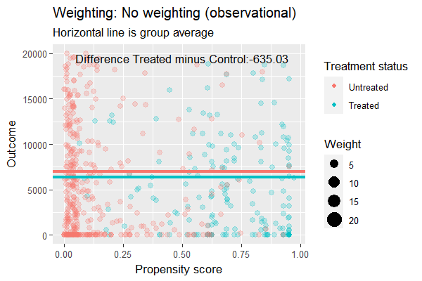

```{r setup, message=FALSE, warning=FALSE, include=FALSE}
knitr::opts_chunk$set(class.source="language-r", class.output="language-r")
library(tidyverse)
```

Welcome to the final post of this three-part article about **Matching estimators in R**. First, let's quickly recap what we've seen until now. In [the first part](https://www.franciscoyira.com/post/matching-in-r-part-1) we took a look at *when* we can use these kind of estimators (it's when the *conditional independence assumption* holds) and then we dived into some of them, like the **Subclassification estimator**, the **Exact Matching Estimator**, and the **Approximate Matching Estimator**.

Then, in [the second part](https://www.franciscoyira.com/post/matching-in-r-2-differences-regression), we looked at the **differences between matching and regression**. These mainly boil down to Matching being a *non-parametric* method (i.e. it doesn't assume a specific kind of relationship between the variables) that requires *common support* (that is, having both treated and control units for each set of values of the covariates/confounders). Meanwhile, regression requires us to impose a functional form, but, in return, it can estimate a causal effect even in areas without common support by extrapolating based on the functional form we give to it. This can be good or bad, depending on how accurate is the model specification we're imposing.

And now, for the last part, we'll examine another set of relevant Matching topics:

-   The estimation of **propensity scores**, a cool way to "collapse" all the confounders in a single scalar number (thus avoiding the curse of dimensionality).

-   The **inverse probability weighting estimator**, an estimator that leverages the propensity score to achieve covariate balance by weighting the units according to their probability of being treated.

-   The **double robust estimator**, a superb estimator that combines a regression specification with a matching-based model in order to obtain a good estimate *even when there is something wrong with one of the two underlying models*.

So, let's look into them!

## Propensity Scores

The use of **Propensity Scores** [was introduced by the famous economist Donald Rubin in the 70s](https://www.jstor.org/stable/1164933). As the name hints, these are *scores* that measure the *propensity* of receiving the treatment for a given unit, conditional on X (the observable confounders): $P(D=1|X)$.

Something cool about propensity scores is that they help us **avoid the curse of dimensionality**. Instead of dealing with the whole feature-space defined by the covariates X, we "collapse" it into a single variable that contains all the relevant information that explains the treatment assignment. In that sense, propensity scores constitute some sort of **dimensionality reduction**.

The DAG of a propensity score would be something like this:

.*](images/dag_propensity_score.png){width="500"}

As in every [DAG](https://franciscoyira.com/post/2021-07-11-diagramas-causalidad-cap-3-causal-inference-mixtape/), assumptions are expressed by the *existence* of arrows and also by the *absence* of them. In particular, note that **there is no arrow going directly from X to D**. This means we're assuming that all the effect of confounders X on D is "mediated" by the propensity score. Put another way, we're saying X can't provide any extra information about D after conditioning on the propensity score.

Therefore, **the propensity score is the only covariate we need to control for** to achieve conditional independence and isolate the causal effect of $D$:

$$
(Y^1, Y^0) \perp D  |  p(X)
$$

This leads to **the balancing property of propensity scores**: the distribution of the covariates X should be the same for units with the same propensity score, no matter their treatment status:

$$
P(X|D=1, p(X)) = P(X|D=0, p(X))
$$

And, good news: this property is testable. We can look at segments of our data with similar propensity scores, check if there are significant differences in their covariates, and thus determine if our propensity scores are "good enough".

### We still need common support

The propensity score can free us from the curse of dimensionality but not from the need of common support. For each combination of values of X (the original confounders) there should be a positive probability of both being treated and untreated. This means that **the propensity scores should be strictly between 0 and 1**. What's more, the distributions of propensity scores for the treated and untreated units should overlap.

There are several ways of checking this. The most basic and common (but still advisable) is to look at the histogram or density plot of $p(X)$ by treatment status. Here it's an example of a density plot where common support doesn't hold.

(CHECK THIS PART, AFTER READING CIBT I'M NOT SO SURE ABOUT WHAT I'VE WRITTEN HERE)

00224-6/fulltext)*](images/density_plot_no_common_support.jpg){width="550"}

Note that we don't need both distributions to look the same (if that was the case, there would be no need for adjustment) but, in order to estimate the ATT, we *do* need a positive density or weight of the untreated distribution along all the treated group distribution. In figure above, there is a big chunk on the upper section of the treated group distribution where we can't find any untreated units, so the existence of common support is questionable.

Another way of checking for common support (suggested by Dehejia and Wahba, 1999) is to create bins based on the propensity score and check that there are observations of both groups in each bin (or at least in the bins where there are treated units, if we just want to estimate the ATT).

(Propensity Score as diagnosis tool: how extreme is covariates imbalance?

if distributions are bunched at the ends, then it's pretty extreme, and matching can't salvage it)

### Estimating the propensity scores

Many of the properties mentioned above (e.g. the balancing property) refer to a theoretical *true propensity score*. In real life we don't have access to those but we have to use *estimated propensity scores* instead.

To estimate the propensity scores we have to fit a model using `d` (the treatment assignment) as the response variable and X (the covariates/confounders) as the predictors. A common model choice for this step is **logistic regression** but we could also use nonparametric machine learning methods such as **gradient boosting** or **random forest**[^1].

[^1]: A question you may have here is what is the point of estimating propensity scores using a parametric method like logistic regression when we could just add the covariates as a controls to a one-step multiple linear regression instead. After all, one of the benefits of matching-based methods was allowing for non-linear relationships in a nonparametric fashion but we're loosing that by using regression for the propensity score estimation.

    I looked for an answer to this and found two key advantages of propensity scores through regression versus the good ol' one-step regression ([source A](https://stats.stackexchange.com/questions/8604/how-are-propensity-scores-different-from-adding-covariates-in-a-regression-and), [source B](https://stats.stackexchange.com/a/3443/249455)).

    The first one is that you get common support checks in the second stage. As we saw before, regression extrapolates when there isn't common support and, what's worse, it does it *quietly*. By estimating propensity scores (even with a parametric logistic regression) we gain the chance to look at the histograms/density plots of the scores and use them as a diagnosis tools for how severe is the covariate imbalance and check if we can go ahead and estimate the ATE or the ATT without extrapolation. In fact, you have the option of usining propensity scores JUST as diagnosis tool and then drop them and go ahead with multiple linear regression.

    Another benefit is that, due to dimensionality reduction, we save degrees of freedom in the second stage (when the scores are used) by using just a single number (the score) instead of several covariates.

ML methods [had been shown to perform better at removing covariate imbalance](https://www.ncbi.nlm.nih.gov/pmc/articles/PMC2807890/), especially, of course, in contexts of non-linearity and non-additive relationships, so it may be a good idea to go ahead with them if possible.

There are, however, a couple things to keep in mind when using ML models. The first is to **avoid overfitting**, which is when our model learns from the noise or sampling variance instead of the true patterns in the data. Secondly, **we shouldn't optimise for accurately prediction of the treatment status** but for balancing confounders across treated and untreated groups (which is what the "true" propensity score is supposed to do).

This last point also implies that we shouldn't include in the propensity score model any variables that are not confounders (i.e. that don't affect *both* the treatment status and the outcome) *even* if they improve the precision of the treatment status prediction[^2]. Including such variables is not only unhelpful but it can even be harmful to our causal inference endeavour as it adds noise to the propensity scores (you can see an example of this [here in the book *Causal Inference for the Brave and True*](https://matheusfacure.github.io/python-causality-handbook/11-Propensity-Score.html#common-issues-with-propensity-score)).

[^2]: We're not trying to win a Kaggle competition, but to approximate $p(X)$, which, as it notation says, depends on X and nothing else.

The good news is that there are several packages in R that optimise for covariate balance when estimating the scores. I took a quick look at them and liked a lot one named `twang`. This package is being actively developed by the RAND Corporation, has nice methods to measure covariate balance, and supports `gbm` and `xgboost` models to perform the PS estimation.

Let's see a code example. Here we'll use the data from Lalonde ([1986](https://mixtape.scunning.com/references.html#ref-Lalonde1986)), which is included in the `twang` package and also appears in the book *Causal Inference: The Mixtape*. This dataset compares the covariates and outcomes of the participants in a randomised training program aimed at disadvantaged workers in the mid-70s with those of the general population in the same period.

(maybe talk a bit more about Lalonde? even if it's in a footnote)

Of course, there is confounding in this data due to selection bias, which makes a naive difference of means inappropriate as causal effect estimate. But there is also a big control donor pool (the comparison group comes is 2.3 times the size of the treated group). This gives us hope for estimating the ATT by balancing the covariates through propensity scores.

```{r, warning=FALSE, message=FALSE}
library(twang)
data(lalonde)

ps_lalonde_gbm <-  ps(
  # This is D ~ X, a model with the treatment as responde and
  # the confounders as predictors
  treat ~ age + educ + black + hispan + nodegree +
    married + re74 + re75,
  data = lalonde,
  n.trees = 10000,
  interaction.depth = 2,
  shrinkage = 0.01,
  estimand = "ATT",
  stop.method = "ks.max",
  n.minobsinnode = 10,
  n.keep = 1,
  n.grid = 25,
  ks.exact = NULL,
  verbose = FALSE
)
```

We use `twang::ps()` for estimating the propensity scores, which uses `gbm` by default. Most of the arguments are related to the `gbm` model. Two key argument are `n.trees`, the maximum number of iteration, and `stop.method`, which specifies the balance measure that will be used to choose the optimal number of iterations. Here we use `"ks.max"`, which is the maximum KS value (a measure of dissimilarity) among all the pairs of treated-untreated covariates distributions *after* adjusting for the estimated propensity scores. The lower the `ks.max`, the higher the balance.

We can use `plot()` on the output of `ps()` to visualise the evolution of the balance measure across the iterations:

```{r}
plot(ps_lalonde_gbm)
```

We can clearly see that the balance is maximised somewhere below the 2000th iteration. This "optimal" iteration is the one used for the "final" propensity scores, which are stored under the name `ps` in the returned object.

```{r}
head(ps_lalonde_gbm$ps)
```

### Inverse Probability of Treatment Weighting (IPTW)

Great! We estimated the propensity scores! But how do we use them? A common sense and actually popular answer would be to do *matching* based on them: match each observation with the unit in the donor pool that has the closest propensity score.

Surprisingly, it turns out that *matching on the propensity score* is a bad idea. A paper from 2018 by King and Nielsen showed several problems with this common approach that may even increase the imbalance between groups.

Okey, so matching is out, but then we go back to the first question: how do we use the propensity scores?! There are several valid strategies, but the more recommended in the reference books I checked was one called **inverse probability of treatment weighting** (IPTW).

The key idea of IPWT, as its name says, is to **weight the observations based on the probability of them having the *opposite* treatment status of what they actually have**. For example, if a unit has a low propensity score (indicating it was unlikely to be treated) but it was actually treated, then it will receive a high weight and vice-versa: a treated unit with high propensity score will have a low weight.

Here the book *Causal Inference for the Brave and True* nicely sums up why we do this:

> If [a treated individual] has a low probability of treatment, that individual looks like the untreated. However, [it] was treated. This must be interesting. We have a treated that looks like the untreated, so we will give that entity a high weight.

After weighting all the units in a group (treated or untreated) we'll end up with a *weighted sample* that looks more like the other group. For estimating the ATE, we weight *both groups* so they both become more similar to each other simultaneously. On the other hand, if we just want the ATE, we weight only the control group in order to make it similar to the unweigthed treated group[^3].

[^3]: Similarly, we could estimate the treatment effect on the *untreated* (ATU) by weighting only the treated group to make it similar to the unweighted control group.

Cool, now that we got the intuition, let's take a look at the estimators themselves. First, the ATE estimator, where we weight both groups simultaneously:

```{r}
iptw_ate <- function(data,
                     outcome,
                     treatment,
                     prop_score) {
  
  # Renaming the columns for convenience 
  # (i.e. not using {{ }} afterwards)
  data <- data %>% 
    rename(outcome := {{outcome}},
           treatment := {{treatment}},
           prop_score := {{prop_score}})
  
  # Estimation itself
  data %>% 
    mutate(iptw = ifelse(treatment == 1,
                         yes = outcome/prop_score,
                         no = -outcome/(1-prop_score))) %>% 
    pull(iptw) %>% 
    mean()

}
```

Note how the weighting is different (opposite) depending on the unit's treatment status (makes sense). Also note that, as in the matching estimators from the previous blog post, we *subtract* the weighted outcome of the *untreated* because we want the difference between the two groups (treated outcome minus untreated outcome)[^4].

[^4]: An alternative version of the `mutate(iptw = ...` line that you may see elsewhere is:

    ``` r
     iptw = outcome * (treatment - prop_score) / (prop_score * (1 - prop_score))
    ```

    This is actually the same that the `ifelse` logic shown before. When `treatment==1`, it collapses to `outcome/prop_score`, and when `treatment==0`, it simplifies to `-outcome/(1-prop_score)`. IMHO the `ifelse` version is clearer/more explicit, but just know that if you see this other expression in textbooks, they're referring to the same thing.

There is also an ATT version of the estimator:

```{r}
iptw_att <- function(data,
                     outcome,
                     treatment,
                     prop_score) {
  
  # Renaming the columns for convenience 
  # (i.e. not using {{ }} afterwards)
  data <- data %>% 
    rename(outcome := {{outcome}},
           treatment := {{treatment}},
           prop_score := {{prop_score}})
  
  # Estimation itself
  n_treated <- data %>% filter(treatment == 1) %>% nrow()
  
  data %>% 
    mutate(iptw = ifelse(treatment==1,
                         yes = outcome,
                         no = -outcome*prop_score/(1 - prop_score))) %>% 
    pull(iptw) %>% 
    sum() %>% 
    magrittr::divide_by(n_treated)

}
```

As we know, the treated units are left untouched for the ATT estimation. However, the weight given to the untreated is slightly different. Why is that? [*The Effect* by Nick H-K](https://theeffectbook.net/ch-Matching.html#:~:text=The%20treated%20group%20gets,is.) gives us a nice explanation:

> The 1/(1−p), which we did before, sort of brings the representation of the untreated group back to neutral, where everyone is counted equally. But we don't want equal. We want the untreated group to be *like the treated group*, which means weighting them *even more* based on how like the treated group they are. And thus p/(1−p), which is more heavily responsive to p than 1/(1−p) is.

To make all of this even clearer, let's create a `gganimate` visualisation that shows the weighting in action. For this I'll attach the propensity scores to the original `lalonde` dataset and then create two version of the data:

-   A weighted dataset using the ATT inverse weighting formula (i.e. weighting the control units to look more like the treated, but leaving the treated units untouched).

-   An unweighted dataset, where every unit has `weight == 1`.

Then we'll compute the weighted difference in each dataset. In the first dataset this difference will be **the ATT estimate through IPTW**, and in the second one it will just be the **"simple difference in outcomes"** (the difference we would find in the raw, observational data).

```{r}
# Data manipulation stage
lalonde_w_ps <- lalonde %>% 
  dplyr::select(treat, outcome = re78) %>% 
  mutate(prop_score = ps_lalonde_gbm$ps[[1]])

lalonde_for_gganimate <-
  bind_rows(
    lalonde_w_ps %>%
      mutate(
        weighting = "ATT",
        weights = ifelse(treat == 1,
                         yes = 1,
                         no = 1 * prop_score / (1 - prop_score))
      ),
    lalonde_w_ps %>%
      mutate(weighting = "No weighting (observational)",
             weights = 1)
  ) %>% 
  mutate(treat = factor(treat,
                        levels = c(0,1),
                        labels = c("Untreated", "Treated")),
         weighting = factor(weighting,
                            levels = c("No weighting (observational)",
                                       "ATT")))

# Second dataset: means
lalonde_means_gganimate <- lalonde_for_gganimate %>% 
  group_by(treat, weighting) %>% 
  summarise(mean_outcome = weighted.mean(outcome, weights),
            .groups = "drop")


# Third dataset with the estimated ATT
sdo <- function(df) {
  outcome_treat <- df %>% 
    filter(treat == "Treated") %>% 
    pull(mean_outcome)
  
  outcome_untreated <- df %>% 
    filter(treat == "Untreated") %>% 
    pull(mean_outcome)
  
  outcome_treat - outcome_untreated
}

lalonde_treat_effect <- lalonde_means_gganimate %>%
  group_nest(weighting) %>%
  mutate(sdo = map_dbl(data, sdo)) %>% 
  dplyr::select(-data)
```

```{r, eval=FALSE, echo=TRUE}
library(gganimate)
# requires: install.packages("gifski")

iptw_plot <- ggplot(lalonde_for_gganimate) +
  geom_point(aes(prop_score, outcome, color = treat,
                 size = weights, alpha = weights)) +
  geom_hline(data = lalonde_means_gganimate,
             aes(yintercept = mean_outcome, color = treat),
             size = 1.3,
             show.legend = FALSE) +
  geom_text(data = lalonde_treat_effect,
            aes(label = str_c("Difference Treated minus Control:", round(sdo, 2))),
            x =0.5,
            y =19500) +
  scale_alpha_continuous(range = c(0.2, 0.9),
                         guide = NULL) +
  ylim(c(0, 20000)) +
  labs(title = 'Weighting: {closest_state}',
       subtitle = "Horizontal line is group average",
       x = 'Propensity score',
       y = 'Outcome',
       color = 'Treatment status',
       size = 'Weight') +
  # gganimate code
  transition_states(
    weighting,
    transition_length = 2,
    state_length = 1
  ) +
  enter_fade() + 
  exit_shrink() +
  ease_aes('sine-in-out')

# Exporting as GIF
animation_obj <- animate(iptw_plot, nframes = 150, fps=35,
        height = 400, width = 600, res=110,
        renderer = gifski_renderer())

anim_save("iptw.gif", animation_obj)
```



I think this animation illustrates very well what IPTW is doing under the hood. Also, it hints one of the pitfalls of this method: a disproportionate sensibility to observations in the extremes of the propensity score distribution. Specifically, the weights will approach infinity when `ps_score` approaches 0 for treated units or 1 for untreated units, which, of course, makes the final estimate more vulnerable to sample variance (and what's more, the weight becomes undefined if the `ps_score` is exactly 0 for a treated unit or 1 for an untreated unit).

What can we do to mitigate this problem?

A solution commonly seen in papers is performing **trimming**. This means just dropping out the units with extreme propensity scores values, for example less than 0.05 and more than 0.95. This has the potential drawback of changing our estimand. As in matching, if you discard an important number of units you're no longer estimating the ATE or the ATT, but an average causal effect on the units that remain in your sample. Depending on the context, this effect may or may not be relevant to your audience and stakeholders, so keep that in mind[^5].

[^5]: There is an alternative formulation of this technique which consist in capping out the weights at some value (e.g. 20). If a unit ends up with a weight higher than that, we just change its weight to the maximum value. This doesn't drop observations but introduces bias in the estimate.

Another alternative is using the ✨**normalised IPTW estimator✨**, proposed by [Hirano and Imbens (2001)](https://oconnell.fas.harvard.edu/files/imbens/files/estimation_of_causal_effects_using_propensity_score_weighting_an_application_to_data_on_right_hear_catherization.pdf), which is aimed at better handling the extremes of the propensity score distribution. This estimator *normalises* the weights based on the sum of the propensity scores in the treated and control groups and thus makes the weights themselves sum to 1 in each group (so we avoid the awkward situation of weights approaching infinity).

Here we have it implemented as code:

```{r}
iptw_norm_att <- function(data,
                     outcome,
                     treatment,
                     prop_score) {
  
  # Renaming the columns for convenience 
  # (i.e. not using {{ }} afterwards)
  data <- data %>% 
    rename(outcome := {{outcome}},
           treatment := {{treatment}},
           prop_score := {{prop_score}})
  
  # Estimation itself
  treated_section <- data %>% 
    filter(treatment == 1) %>% 
    summarise(numerator = sum(outcome/prop_score),
              denominator = sum(1/prop_score))
  
  untreated_section <- data %>% 
    filter(treatment == 0) %>% 
    summarise(numerator = sum(outcome/(1-prop_score)),
              denominator = sum(1/(1-prop_score)))
  
  (treated_section$numerator / treated_section$denominator) -
    (untreated_section$numerator / untreated_section$denominator)
}
```

As a side note, there are ways to use the propensity scores in a more regression-like fashion. One of them is to just include the propensity score as a control variable in a regression model. Another is to pass the inverse probability weights to the `weights` argument in a `lm()` call.

In fact, the IPTW estimators we've seen until now are equivalent to a simple regression model `y ~ d` weighted by the corresponding inverse probability weights. It's easy to conceive extensions to that basic model to account for more complex relationships between the treatment and the outcome.

## Variance of the estimators: bootstrap or analytical formulas?

As we come closer the end of the post, an element that the more "stats savvy" readers may be missing is **standard errors estimation**. After all, 99.99% of the time we'll get a difference greater than zero between treated and untreated but without standard errors we can't tell if that's due to a true causal effect or just because of chance (sample variance).

So, let's get to the point: how do we compute standard errors for Matching and Inverse Probability Weighting?

An option that may look handy for this is **bootstrapping**. This is a common procedure that involves obtaining a lot of samples *with replacement* from the original dataset and then computing the estimate on each of this samples. The result is a sample distribution of estimates, which can be used to estimate the standard deviation of the estimate itself.

And, in fact, **Bootstrapping is an appropriate way of obtaining standard errors for the IPTW estimator**. It also has the advantage of taking into consideration the uncertainty of the *whole* process (both the propensity score estimation AND the construction of the weighted samples).

Bootstrap standard errors are often included in packages that perform IPTW, but we can also code them ourselves by passing the data and a bootstrap-compatible function to `boot::boot()`[^6]. Here is a code example:

[^6]: They key thing to remember is that you have to bootstrap *all the steps*, not just the last part.

```{r, message=FALSE, warning=FALSE}
library(boot)
```

```{r, cache=TRUE}
# This example is an adaptation of this code script shown in The Effect: https://theeffectbook.net/ch-Matching.html?panelset6=r-code7#panelset6_r-code7 
iptw_boot <- function(data, index = 1:nrow(data)) {
  
  # Slicing through the bootstrap index
  # (this enables the "sampling with replacement")
  data <- data %>% slice(index)
  
  # Propensity score estimation
  ps_gbm <-  ps(
    treat ~ age + educ + black + hispan + nodegree +
      married + re74 + re75,
    data = data,
    n.trees = 10000,
    interaction.depth = 2,
    shrinkage = 0.01,
    estimand = "ATT",
    stop.method = "ks.max",
    n.minobsinnode = 10,
    n.keep = 1,
    n.grid = 25,
    ks.exact = NULL,
    verbose = FALSE
  )
  
  # Adding the propensity scores to the data
  data <- data %>% 
    mutate(prop_score = ps_lalonde_gbm$ps[[1]]) %>% 
    rename(outcome = re78)
  
  # IPTW weighting and estimation
  treated_section <- data %>% 
    filter(treat == 1) %>% 
    summarise(numerator = sum(outcome/prop_score),
              denominator = sum(1/prop_score))
  
  untreated_section <- data %>% 
    filter(treat == 0) %>% 
    summarise(numerator = sum(outcome/(1-prop_score)),
              denominator = sum(1/(1-prop_score)))
  
  (treated_section$numerator / treated_section$denominator) -
    (untreated_section$numerator / untreated_section$denominator)
  
}

b <- boot(lalonde, iptw_boot, R = 100)

b
```

Sadly, bootstrapping can't be used with the Matching estimators, only with IPTW. The reason is that Matching makes a sharp in/out decision when constructing the matched samples (in contrast to the more gradual weighting done by the IPTW estimator), and this kind of sharp process just doesn't allow the bootstrap to produce an appropriate sampling distribution[^7].

[^7]: For a more detailed explanation of this, see *"On The Failure Of The Bootstrap for Matching Estimators"* by [Abadie and Imbens (2008)](https://economics.mit.edu/files/11862).

Because of that, **when doing Matching we have to use analytical formulas to compute the standard errors of our estimates**. These expressions can be quite complex and, what's more, they have different formulations depending on the choices we made when doing the Matching itself. Fortunately, most of the R packages designed for Matching (such as `MatchIt`) already implement appropriate standard error formulas and report the corresponding SEs in their output. So, if you're a practitioner (like me), it's better to just stick to these "package-generated" standard errors instead of attempting to compute them manually.

## Double Robust Estimator

At the beginning of this post we saw the strengths and weaknesses of Matching and Regression when adjusting for confounders, along with examples of one of them succeeding in estimating the true causal effect while the other method failed.

But what if we could have [the best of both worlds](https://www.youtube.com/watch?v=uVjRe8QXFHY) and use an estimator that leverages both Regression *and* Matching to get the causal effect right most of the time? Sounds pretty cool, right?


Well, that's exactly what the **Double Robust Estimator** does. It combines the Regression and the Matching estimations in a way that requires just one of these methods to be right in order to appropriately estimate the true causal effect. Matching right and Regression wrong = we're fine. Matching wrong and Regression right = we're also fine.

However, that if *both* methods have problems, then not even this super cool estimator can salvage our analysis. We need one of them to be appropriately specified. Still, a big improvement over using Regression or Matching on their own.

Before showing you a code definition/implementation, note that *double-robustness* is actually a property that many estimators have, so if you look at the literature you can find a lot of "double robust estimators". But let's just look at the one that is shown in *Causal Inference for the Brave and True*:

```{r}
# Here I REALLY wanted to parametrise the outcome, treatment and covariates variable names, but doing so requiered to add a lot of rlang "black magic" code that made the script harder to understand, so what you're seeing here is an implementation with the `lalonde` variable names hardcoded.

# TL:DR, change the variable names if you want to re-use this function with your own data

double_robust_estimator <- function(data,
                        # `index` makes the estimator bootstrap-able
                        index = 1:nrow(data)) {
  
  
    data <- data %>% slice(index)
    
  # Getting the "ingredients" to compute the estimator
  # 1. Propensity scores
  ps_gbm <-  ps(
    # D ~ X
    treat ~ age + educ + black + hispan + nodegree +
      married + re74 + re75,
    data = data,
    n.trees = 10000,
    interaction.depth = 2,
    shrinkage = 0.01,
    estimand = "ATT",
    stop.method = "ks.max",
    n.minobsinnode = 10,
    n.keep = 1,
    n.grid = 25,
    ks.exact = NULL,
    verbose = FALSE
  )
  
  ps_val <- ps_gbm$ps[[1]]
  
  # 2. Regression model for treated
  lm_treated <- 
    lm(re78 ~ age + educ + black + hispan + nodegree +
      married + re74 + re75,
      data = data %>% 
        filter(treat == 1))
  
  mu1 <- lm_treated$fitted.values

# 3. Regression model for untreated
  lm_untreated <-
    lm(re78 ~ age + educ + black + hispan + nodegree +
         married + re74 + re75,
       data = data %>%
         filter(treat == 0))
  
  mu0 <- lm_untreated$fitted.vales
  
  # 4. Outcomes and Treatment status
  outcome <- data$re78
  treatment <- data$treat
  
  # ✨THE DOUBLE ROBUST ESTIMATOR ✨
  estimator <- 
    mean(treatment * (outcome - mu1)/ps_val + mu1) -
      mean((1-treatment)*(outcome - mu0)/(1-ps_val) + mu0)
  
  estimator
}
```

```{r, message=FALSE, warning=FALSE, cache=TRUE}
# Estimation through bootstrap to get standard errors
# 'dre' stands for Double Robust Estimator
#b_dre <- boot(lalonde, double_robust_estimator, R = 100)

#b_dre
```

## Final remarks: the most important question

We've seen a lot of methods and estimators on this two-part blog post. Sometimes the differences between them are pretty clear, but a lot of times they are much more nuanced. However, if you have to bring one idea home, I think it should be the **Conditional Independence** concept we reviewed on the first part (also known as "selection on observables") and how *none* of these methods can help you if your data doesn't meet that assumption.

So, [***are the confounders directly available in your data as variables you can condition on?***]{.underline} THIS is the first-order question you should ask yourself before doing anything else. Only if you have reasons to answer "yes!" to this question you can start weighing if you should perform Regression, Subclassification, Exact Matching, Approximate Matching, Inverse Probability Weighting, or use the Double Robust Estimator.

To check if the "selection on observables" is a credible assumption you should always summarise your current knowledge about the data generating process in a DAG, and then see if this DAG shows a way to close all the backdoors by conditioning on observables[^8]. The package `ggdag` and its function `ggdag_adjustment_set` come in handy for this.

[^8]: If you don't understand what these sentences mean, check the [Introduction to DAGs](https://www.franciscoyira.com/post/2021-07-11-diagramas-causalidad-cap-3-causal-inference-mixtape/) blog post.

{width="550"}

If, after doing this, you find that some of your confounders are *un*observable, then, as I said before, none of the estimators we've just reviewed are appropriate for estimating the causal effect and you'll have to look for other causal inference methodologies. The good news is that, starting with the next blog post, I'll now move on to reviewing techniques that deal with unobservable confounders, such as Instrumental Variables, Differences in Differences, and Regression discontinuity design, so stay tuned!

## References 📚

-   [Causal Inference: The Mixtape - Scott Cunningham. Chapter 5](https://mixtape.scunning.com/matching-and-subclassification.html).

-   [The Effect - Nick Huntington-Klein. Chapter 14](https://theeffectbook.net/ch-Matching.html).

-   Causal Inference for the Brave and True - Matheus Facure Alves. [Chapters 11](https://matheusfacure.github.io/python-causality-handbook/11-Propensity-Score.html) [and 12](https://matheusfacure.github.io/python-causality-handbook/12-Doubly-Robust-Estimation.html).

*Your feedback is welcome! You can send me comments about this article to my [email](mailto:francisco.yira@outlook.com).*
