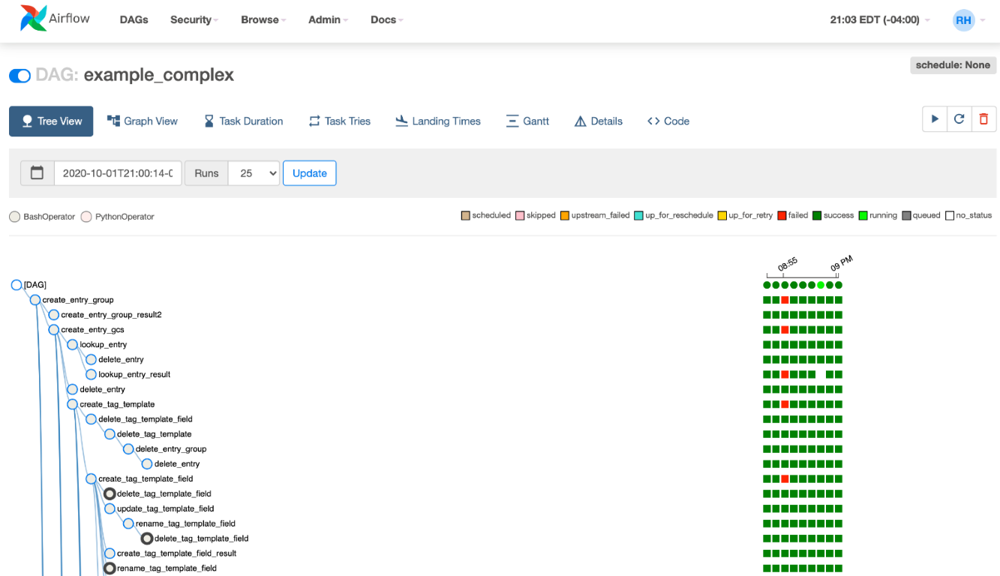
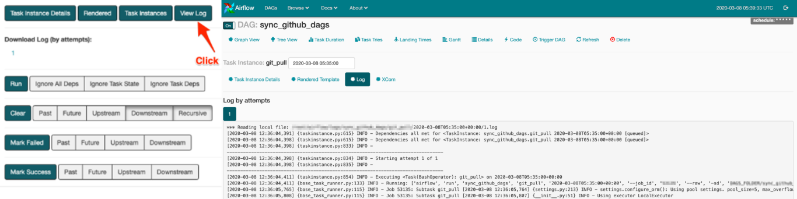
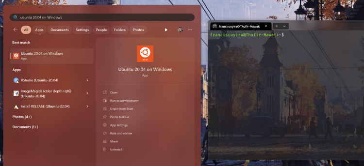
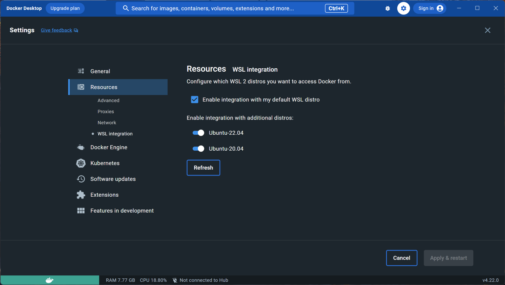
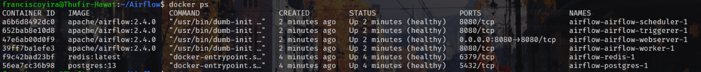
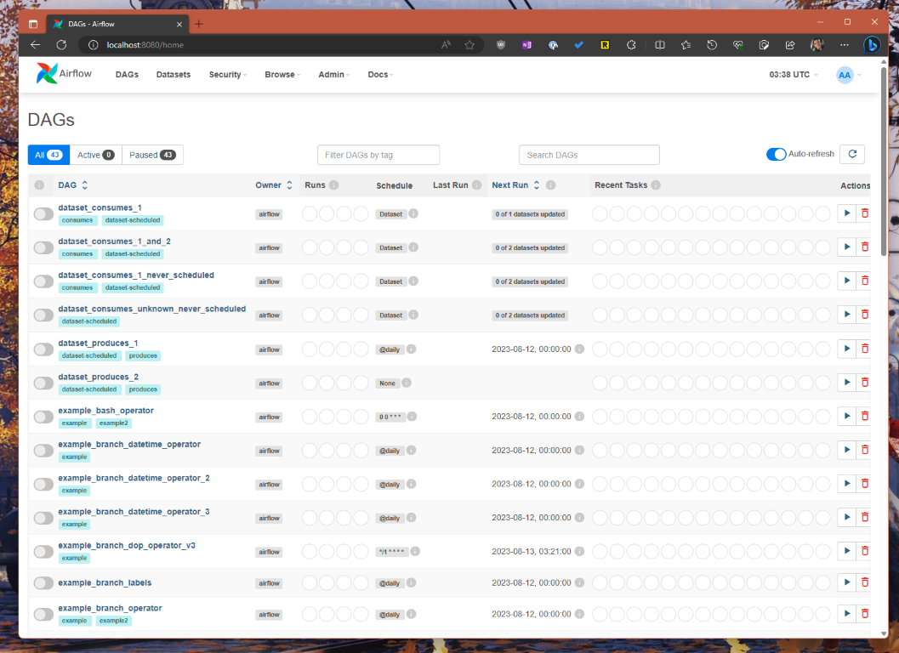
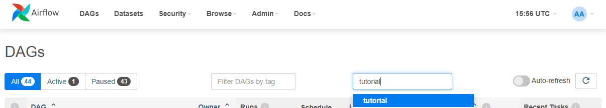
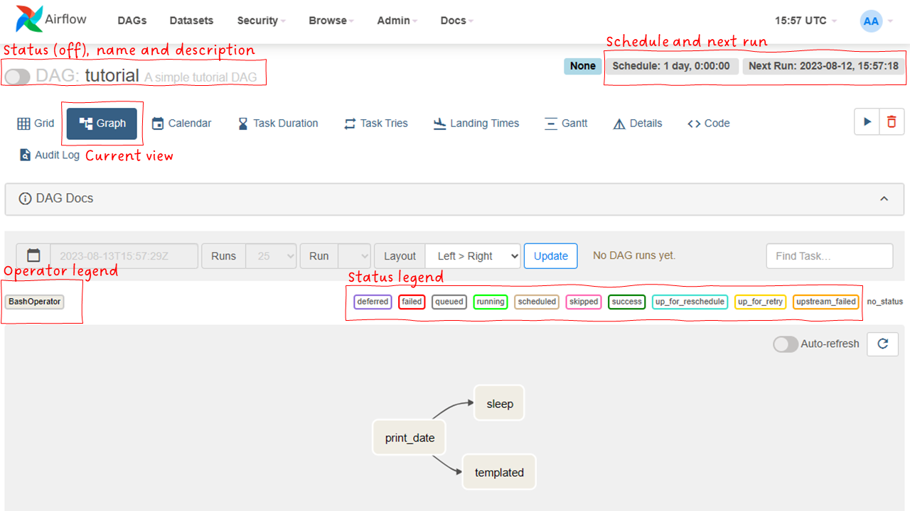
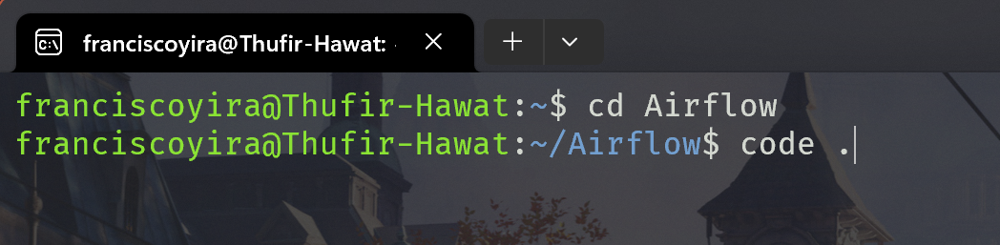
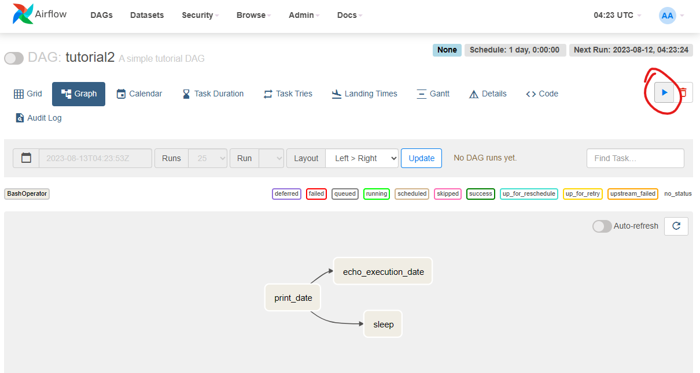

```{r setup, include=FALSE, warning=FALSE, message=FALSE}
knitr::opts_chunk$set(echo = TRUE)
knitr::opts_chunk$set(class.source="language-python", class.output="language-python")
library(reticulate)
knitr::knit_engines$set(python = reticulate::eng_python)
```

After a long hiatus (sorry about that 😳), I'm excited to post again on this blog and share with you what I've been learning recently: how to use Apache Airflow and Docker to build scalable data pipelines that interact with AWS cloud services, such as S3 (object storage) and RDS (relational databases).

If you're new to Airflow and curious about what it's good for (maybe you've heard some data engineers talking about it or have seen it on data science job postings?), then this will be a great place to start, because the post won't assume any previous knowledge about it.

By the end of this post, you will:

-   Understand what Airflow is used for, what its main capabilities are, and how to tell if it's a suitable solution for your data pipelines.
-   Know how to install and run Airflow on a local environment through Docker.
-   Know how to create and schedule simple DAGs and tasks.
-   Have some familiarity with the core components of the Airflow UI, including how to monitor the status of your DAGs.

One thing that I'll have to assume, though, is that you have some basic familiarity with the Python and Docker, but I'll also provide links to introductory resources on them that you can refer to if you feel lost at some point 🙂.

> ***Data Pipelines in the Cloud Series***
>
> -   **Part I: You're here.**
>
> -   [Part II: Using Amazon Web Services with the Command Line](/post/aws-command-line-data-pipelines-cloud-part-2/)
>
> -   *Part III: Building an Airflow Pipeline That Talks to AWS. (Coming soon! [Subscribe to get notified](/subscribe))*

## What problem does Airflow solve?

*You can skip this part if you already know what Airflow is and just want to learn to use it.*

If you've been working on data science for some time, you've probably encountered the need to set up automatic, scheduled pipelines. Typical examples of this are retrieving data from an API on daily basis or loading scores from a predictive model to your company's database.

For the simplest pipelines, this can be achieved through a Cron Job[^1] or even using the Windows' Task Scheduler. If your pipeline consists only of SQL queries, you can also leverage the [scheduling features available on some databases](https://docs.aws.amazon.com/redshift/latest/mgmt/query-editor-schedule-query.html).

[^1]: A task scheduler for Unix-based operating systems.

However, as your pipelines grow in number and complexity, you may reach a point where these tools are no longer enough. Some signals that you've reached this threshold are:

-   You need detailed logs for most of your pipelines but you're setting up the logging system "manually" for each one of them. Even worse, each of the data scientists on your team has implemented their own logging mechanism.

-   Some of your pipelines are very intensive on compute and would benefit from being distributed on a scalable infrastructure (i.e. run on more computers).

-   Other processes must run before your pipeline, but their end time is variable or unknown (you need to "detect" or "listen to" when they're done).

-   Your pipelines are becoming more critical in your organisation so you're starting to develop a dashboard to check their status and receive alerts when something goes wrong.

All of these involve using some features (logging, scalability, dependencies, monitoring, etc) that you *technically* can code on your own, but why waste on that time if someone else already has done this for you? **This is where Airflow comes in handy**.

### Airflow, the orchestrator of data pipelines


Apache Airflow can be defined as an **orchestrator for complex data flows**. Just like a music conductor coordinates the different instruments and sections of an orchestra to produce harmonious sound, Airflow coordinates your pipelines to make sure they complete the tasks you want them to do, even when they depend on each other in very complex ways.

The analogy falls short, however, in depicting the full range of Airflow benefits: it's not only the coordination but also the **monitoring**, **logging** and **scaling**.

For example, Airflow provides an extremely thorough web UI that allows you to **monitor** the status and history of your pipelines, sparing you the need to develop your own dashboard.



The same UI gives you access to **detailed logs**, which can be used to to debug your pipeline's code when a task is failing. You can also receive **mail** **alerts** when a task fails or exceeds a certain duration, and configure Airflow to automatically **re-try tasks** that fail under certain conditions. And when fixing the error requires manually modifying your code, you can **re-run only the failing tasks** and their downstream dependencies, while keeping the upstream tasks untouched, thus saving time and processing power.

{width="850"}

Airflow also helps you **better manage your computing resources** by setting up a queue of tasks that get assigned to the available computers (called nodes or workers), and by letting you **scale up or down** the pool of nodes dedicated to your tasks. This allows you to run your pipelines faster or to lower your cloud computing bill, depending on your needs

```{r, echo=FALSE}
blogdown::shortcode("subscribe")
```

Finally, with Airflow you also get **extensibility**, which makes it easy to re-use code across pipelines and teams. For example, a data engineer on your team can create a parametrised *Operator* (more on them later!) that performs a frequent task on your company's data warehouse. Then you can just reuse that operator instead of having to code the task on your own. Even better, you can find ready-to-use extensions on the [Airflow plugin repository](https://airflow.apache.org/plugins.html) so most of the time nobody in your team will have to write anything from scratch.

### Do you *really* need Airflow?

All of this sounds pretty neat, right? You may even be wondering why anyone would not want to use Airflow for their data pipelines. Here the music director analogy becomes appropriate again: **you wouldn't hire a music conductor to direct a solo performance or a small band**. If your pipeline involves few steps and has no complex dependency logic, then you'll spend more time and resources setting up Airflow than you'll gain from using it, and you'll be better off with a simpler tool, like a Cron Job.

One way to think about Airflow is as a **lesser evil**: you pay up-front for a lot of complexity ~~and annoyance~~ in order to get a more scalable and robust system on which each additional pipeline or component adds less marginal complexity.


## How to declare our pipelines in Airflow: introducing *dag.py*

Okay, now we know what Airflow is and what it's good for. Time to learn how to use it!

First, we need to learn how to declare our pipelines in Airflow. For this we use a concept named **DAG** or **Directed Acyclic Graph**[^2]. A DAG is a *graph* with **nodes** and ***directed*** **edges** (arrows) that represent the tasks and dependencies in our pipelines. It is "acyclic" because it doesn't allow loops or cycles: **you can't plug the output of a task back into an upstream dependency** (it would be a paradox as if Marty McFly from Back to Future met his younger self in 1955).

[^2]: Yes, we're talking about DAGs [again](/post/2021-07-11-diagramas-causalidad-cap-3-causal-inference-mixtape/), but not the same kind. Here, DAGs are for managing tasks and workflows, not for modeling causality. Still, Airflow DAGs will be more intuitive to you if you know causal DAGs because both share the same logic.


In the context of Airflow, the nodes of the DAG represent tasks to performed, and the edges or arrows represent the relationships of dependency between those tasks.


How do we declare these DAGs in our code? Here is a basic example:

```{python reticulate=FALSE, eval=FALSE, include=TRUE}
from airflow import DAG
from airflow.operators.bash import BashOperator
from datetime import datetime, timedelta

with DAG(
    "tutorial2",
    description="A simple tutorial DAG",
    schedule_interval=timedelta(days=1),
    start_date=datetime(2021, 1, 1),
    catchup=False,
    tags=["example_tag"],
) as dag:
    
    # Task 1
    t1 = BashOperator(
        task_id="print_date",
        bash_command="date",
    )

    # Task 2
    t2 = BashOperator(
        task_id="sleep",
        bash_command="sleep 5",
        retries=3,
    )

    # Task 3
    t3 = BashOperator(
        task_id="echo_execution_date",
        bash_command="echo {{ ds }}",
    )


    t1 >> [t2, t3]
```

Let's explain it line by line. First, we import the necessary libraries:

```{python reticulate=FALSE, eval=FALSE, include=TRUE}
from airflow import DAG
from airflow.operators.bash import BashOperator
from datetime import datetime, timedelta
```

We always need to import the `DAG` class when using Airflow, but what comes after that depends on what *our* DAG is going to do.

In this case, we import **`BashOperator`**. You can think of *Operators* as blue prints or building blocks for tasks. By importing this `BashOperator`, we can create tasks that perform actions on the Bash shell (a Unix command line tool), but there are many more operators that allow to perform other kinds of actions.

Finally, we import a couple of `datetime` functions. These are common imports on Airflow code since they help us to declare the schedule on which the DAG will run.

Then, we declare the DAG itself:

```{python reticulate=FALSE, eval=FALSE, include=TRUE}
with DAG(
    "tutorial",
    description="A simple tutorial DAG",
    schedule_interval=timedelta(days=1),
    start_date=datetime(2021, 1, 1),
    catchup=False,
    tags=["example_tag"],
) as dag:
```

For this we use the constructor of the `DAG` class to create a `dag` object[^3]. Here we can specify some parameters or options of the DAG we're creating.

[^3]: Fun fact: You're not obliged to name this object `dag`. It can be assigned to any valid variable name. However, it's a convention and best practice to name it `dag` for readability and standardisation reasons, much like predictors are named `X` and the response variable is named `y` in `sklearn`.

-   The first line indicates the *name* of the DAG (*"tutorial"*, in this case). This name must be a string, unique across your Airflow instance and can't contain spaces or special characters (but it does allow underscores, dashes, dots and numbers). This name will appear next to your DAG in the Airflow UI and is also used for searching, so it's a good idea to make it descriptive and memorable (but not too long).

-   The second line is the *description*. Here you can go into more detail about what your DAG does.

-   `schedule_interval` specifies the schedule on which your DAG runs. In this case, `timedelta(days=1)` defines a daily schedule: the DAG will run every 24 hours after the `start_date`. Some other common schedule intervals are `timedelta(hours=12)` for twice daily, `timedelta(weeks=1)` for once a week and `timedelta(minutes=30)` for every 30 minutes. You can also use [Cron expressions](https://crontab.guru/) for this argument.

-   `start_date` indicates the moment when the DAG becomes active (i.e. when the execution schedule begins). If `start_date` is in the future, the DAG will wait until that moment to run for the first time. If it's in the past, then what happens depends on the `catchup` parameter, since you may have some *missed executions.* For example, with a *daily* execution schedule and a `start_date` set to 7 days ago, you would have *7 missed executions*. If `catchup=True`, Airflow will try to run those missing executions (a process known as *backfilling)*. If it's `catchup=False`, Airflow will skip those past executions and only try to run the next scheduled execution.


-   `tags`: this parameter allows you to assign descriptive labels to your DAG, making it easier to filter and search for specific DAGs in the Airflow UI. This can be particularly useful in large environments where many DAGs are in operation, as it enables quick identification of DAGs that relate to specific systems, departments, or functionality (e.g. Marketing, Operations, Compliance, etc).

Finally, we declare the tasks that make up the DAG, along with their execution order:

```{python reticulate=FALSE, eval=FALSE, include=TRUE}
    # Task 1
    t1 = BashOperator(
        task_id="print_date",
        bash_command="date",
    )

    # Task 2
    t2 = BashOperator(
        task_id="sleep",
        bash_command="sleep 5",
        retries=3,
    )

    # Task 3
    t3 = BashOperator(
        task_id="echo_execution_date",
        bash_command="echo {{ ds }}",
    )


    t1 >> [t2, t3]
```

In this section, we are declaring three individual tasks, each of them using `BashOperator` as *blue print*[^4].

[^4]: Keep in mind that indentation is necessary to tell Python that these tasks are part of the previously declared DAG.

All tasks utilise the `task_id` argument to define a name. This name should be descriptive, as it will show up next to the task in the Airflow UI. It also must be unique *within the context of a particular DAG*, but you can have two tasks with the same name in different DAGs. Note that each task also has a variable name (t1, t2, etc). This name is used only within the context of the DAG script and don't need to match the `task_id.` However, it's a good idea to make them the same can for the sake of clarity and readability.

Another argument that is used by all these tasks is `bash_command`. This argument is specific to tasks that use the `BashOperator`. It literally receives the commands that will be executed on the Bash terminal during the task's run.

In this example, every task passes different commands through this argument, thus defining the specific actions performed by each one:

-   `t1` (`'print_date'`): Prints the current date using the UNIX `date` command.
-   `t2` (`sleep`): Executes the `sleep 5` command, which pauses the process for 5 seconds.
-   `t3` (`echo_execution_date`): Prints the execution date of the DAG by using `{{ ds }}`, a special template field provided by Airflow that represents the execution date in the format `YYYY-MM-DD`[^5].

[^5]: These templates are known as *Jinja templates* and are especially useful when you want your task to do something using the execution date as a parameter (for example, creating a temporary SQL table that includes the execution date in the name). It's important to note that this execution date corresponds to the scheduled execution date, not the actual execution date. How could these two be different? Well, remember the case when you have missing executions, and Airflow tries to catch up on them. For these, the execution date will be the original date on which they were supposed to run, according to the DAG's schedule. Another possible scenario is that a DAG fails to run on the scheduled date (e.g., 1st January), and then you attempt to run it again on a later date (5th January). In this case, the execution date will still be 1st January when you try to re-run the DAG on 5th January.

Something cool about the `BashOperator` is that it can be used for executing almost any command that runs on a Bash terminal: moving, renaming or deleting files, installing or updating packages, running Python or R scripts, generating Quarto reports, etc. While some of these tasks may benefit from custom Operators specifically designed for them (e.g. `PythonOperator`), it's nice to know that **if you can run something on Bash, then you can automate it with Airflow**.

Finally, the line `t1 >> [t2, t3]` sets up the **execution order**, indicating that Task 1 (t1) must be followed by both Task 2 (t2) and Task 3 (t3). Tasks t2 and t3 being contained in a list `[...]` means that they both run in parallel after t1 completes.

## How to install Airflow and run the DAG

Okay, so now we have a minimal *dag.py* script that declares a DAG with several tasks, specifying dependencies between them. But how can we make this pipeline run?

To make our script work, we need to install and set up an Airflow environment. There are many ways to do this, but I'll go ahead and explain **how to do it on the Windows Subsystem for Linux (WSL) with Docker**. Why? Because this way the instructions work for most people.

-   If you use Windows, the instructions are literally meant for you.
-   If you use Linux, you just run the Bash commands and skip the parts about setting up WSL, since you're running Linux already.
-   If you use Mac, 95% of the Ubuntu Bash instructions should work for you, since both operating systems are Unix-like.

Also, proficiency with **Docker** is another valuable skill if we're planning to immerse ourselves in the realms of data engineering and cloud computing.

{width="650"}

While we could technically run Airflow directly on WSL/Linux without Docker, by leveraging Docker features, such as Docker Compose files (which are like cooking recipes for software environments), we can ensure the reproducibility of our environment and avoid the hassle of setting up each Airflow component manually. **By defining the entire process using these 'recipes,' we get a consistent set of instructions that reduces the chance of errors and ensures we'll end up with the same Airflow environment wherever we execute those instructions**[^6].

[^6]: The alternative to Docker Compose would be to execute A LOT of instructions on Bash, line by line. This is a manual and error-prone process that can lead to misconfigurations, version mismatches, and a bunch of other issues that we don't want to deal with.

So, off we go!

### Installing Airflow on the Windows Subsystem for Linux

{width="650"}

Before we install Airflow this way, we need to make sure that we have the following prerequisites:

-   **Windows 10 version 2004 or higher** (to run WSL 2.0).

-   **WSL 2.0 enabled and configured**. If you don't have this already, you can just open PowerShell or Windows Command Prompt in administrator mode (by right-clicking and selecting "Run as administrator"), then enter the `wsl --install` and then restart your machine.

-   **Ubuntu 20.04 LTS installed on WSL 2.0.** After enabling WSL you can install it [directly from the Microsoft Store](https://apps.microsoft.com/store/detail/ubuntu-20046-lts/9MTTCL66CPXJ?hl=en-us&gl=us). Then it will appear as an app on your Start Menu. You just click on it and follow the instructions to configure your UNIX user account[^7].

[^7]: I would also recommend installing the [Windows Terminal](https://apps.microsoft.com/store/detail/windows-terminal/9N0DX20HK701?hl=es-cl&gl=cl&rtc=1), but this is very much optional.



Next, we launch the Ubuntu Bash and run the following commands (for updating the system and `python3` and installing `pip`).

``` bash
sudo apt update && sudo apt upgrade
sudo apt upgrade python3
sudo apt install python3-pip
```

Next, we'll need to install [**Docker for Windows**](https://www.docker.com/products/docker-desktop/) (or the appropriate version for macOS or Linux if that's what we're running). If we're using Windows, Docker should automatically recognise and integrate with the Ubuntu distro that we've installed through WSL.

After installing Docker, it is recommended to restart your Windows system. Once restarted, just launch Docker and then open the Ubuntu Bash again. There you can run the following command to check that the integration between WSL and Docker is working properly:

``` bash
sudo service docker start
```

*(This command should also run on Linux and macOS if you installed Docker successfully on your system).*

If you get an error, it may be helpful to check the following Settings within the Docker UI on Windows:



Then, we proceed to create a specific directory structure on Ubuntu for our Airflow setup:

``` bash
mkdir Airflow && cd Airflow
```

This line combines two commands:

-   `mkdir Airflow`: This creates a new directory named "`Airflow`."

-   `cd Airflow`: This changes the current working directory to the newly created "`Airflow`" directory.

By combining these with `&&`, we ensure that the second command only runs if the first is successful.

Then, we creates three directories: "`dags`", "`logs`," and "`plugins`", inside the current working directory (here the `-p` option ensures that the command will not produce an error if the directories already exist). These directories correspond to the typical folder structure of an Airflow environment.

``` bash
mkdir -p ./dags ./logs ./plugins
```

We then execute the following command:

``` bash
echo -e "AIRFLOW_UID=$(id -u)" > .env
```

This line is a bit more complex, but suffices to say that it creates a file named `.env` and writes into it a user ID value related to Airflow's setup. This ensures the system can access this value later.

Next, we move on to **downloading the necessary Docker Compose file (**using the `curl` command) **and initialising the Airflow service**. As I said before, you can think of a Docker Compose file as some sort of "recipe" to create and configure all the necessary components of a software application, ensuring that they work together in harmony. This specific `docker-compose.yaml` file outlines the instructions for setting up Airflow version 2.4.0.

``` bash
curl -LfO 'https://airflow.apache.org/docs/apache-airflow/2.4.0/docker-compose.yaml'
```

Then, the following command starts the `airflow-init` service defined in the Docker Compose file:

``` bash
docker compose up airflow-init
```

-   `docker compose up` starts the services defined in the `docker-compose.yaml` file.

-   `airflow-init` is the specific service we want to start, responsible for initialising Airflow.

Once the initialisation is complete, we can finally start the Airflow services and verify them with the following commands:

``` bash
docker compose up -d
docker ps
```

If everything went well, your Ubuntu bash should spit out something like this after running **`docker ps`**:

Looks like quite a bit to take in, doesn't it? **That's because an Airflow environment consists of several components, like the database, scheduler, web UI, and more.** Each one runs in its own container (which you can think of as a lightweight virtual machine), all working together. But all you really need to focus on for now is the `STATUS` column. If the containers are marked as "healthy," everything's set up right, and you're good to go![^8].

[^8]: If things didn't go well, you can restart the process by running `docker compose down` to shut down the containers, followed by `docker compose up -d` to start them again. Finally, check the status once more with `docker ps`.

Now, just navigate to <http://localhost:8080/> in your browser, and you'll be able to access the Airflow UI using `airflow` as both username and password.

If you see something like the screenshot below, congratulations! You're looking at the UI of your very own self-hosted Airflow instance 🙌🏽👏🏽🥳🎉🪅



### Deploying our DAG

Let's wrap things up by deploying our DAG to Airflow. To do this, we simply need to **copy the code of our DAG as a .py file into the '`dags`' folder** of our Airflow environment.

Since there are various ways to accomplish this, I'll offer two methods:

-   **Saving `dag.py` using the Ubuntu Bash**: This method is quick to set up, although it might be less convenient if you plan on regularly modifying the DAG.

-   **Saving `dag.py` using Visual Studio Code:** This may take a bit more effort initially but will make future modifications and ongoing development of the DAG much simpler.

#### Saving `dag.py` using Bash

1.  Copy [the DAG's code](assets/dag.py).
2.  **Navigate to the `dags` folder inside the `Airflow` directory we created earlier.** If you see `~/Airflow$` on your Bash, you just need to execute this command: `cd dags`.
3.  **Create a subfolder named `tutorial_dag`** with the following command `mkdir -p tutorial_dag` (it's good practice to keep the `dags` folder tidy by having each DAG in a corresponding subfolder).
4.  Navigate to the `tutorial_dags` subfolder by executing this command: `cd tutorial_dags`.
5.  **Use the `cat` command to create the `dag.py` file.** Execute `cat > dag.py`.
6.  Paste the entire DAG code you copied in step 1 and press Enter.
7.  Press `Ctrl+D` to save the file and exit.

Done.

After this, we should be able to see our DAG (named `tutorial`) on the Airflow UI. We can use the Airflow search box for that, it should be the first result so we could just write "tutorial" and press Enter.



Then we can see different views of the DAG in the Airflow UI, one of them is the **Graph View**. Here you can see a visual representation of the DAG, what Operator is used by each task, and the current status of each one.



Another relevant view is the Code View, where you can see the source code of the DAG (the same code that lives in the `dag.py` file):


Here, if you pay close attention, you can notice that we've made an error: the DAG we're seeing is not our DAG; it's an example DAG that came with the Docker image we deployed 😯😅. Since DAG names have to be unique and this DAG was first on the Airflow instance, we can't use the name '`tutorial`' for a new DAG like ours.

This seems like a good opportunity to learn how to edit the DAG files inside WSL, so we can amend mistakes like this one or make further modifications.

#### Editing `dag.py` using Visual Studio Code

For this to work, you need to first download and install [Visual Studio Code](https://code.visualstudio.com/download), and then install the [WSL extension](https://marketplace.visualstudio.com/items?itemName=ms-vscode-remote.remote-wsl) (this last step is only necessary if you're using Windows; what comes next should work fine on Linux and macOS with VS Code installed).

Now, we go back to Bash and, while still in the `Airflow` directory, we write `code .` and press Enter.

{width="450"}

VS Code will automatically open the `Airflow` directory, providing you with a full IDE to edit, create and delete DAG files (and if you're using WSL, it will integrate seamlessly with Bash too).

Once here, just navigate to our `dag.py` file, open it, change the name from "tutorial" to "tutorial2" (or whatever name you want; it doesn't matter) and save it.


Now you can you back to the Airflow UI, where, after a couple seconds, a new DAG with the unique name we just defined should appear. The names of the tasks should match the `task_id`s we defined previously (print_date, sleep and echo_execution_date), and the code you see on the "Code" tab should also match the code of the dag.py file we just edited.

If everything checks out, then we can initiate the DAG run by pressing the "Play" button in the top-right corner and then pressing "Trigger DAG".



If you're in the Graph view, you should then see how each task in the DAG changes colour to light green (indicating it's running) and then to dark green (indicating it ran successfully).


## We did it!


Congratulations! You successfully created and ran your first Airflow DAG using Docker, and you are starting to unlock the power of Airflow to automate your data workflows! 🎉

In this post, you learnt:

-   The basics of why we use Airflow and how it works
-   How to install and run Airflow using Docker on Ubuntu
-   How to create and schedule simple DAGs and tasks using Python
-   How to monitor the status and logs of your DAGs using the Airflow UI

Note that if we keep Docker and the Airflow instance running, the `tutorial2` DAG will run again every day, and we'll have access to the history, status, and logs of those executions. But in this case, it doesn't make much sense because it's just a toy DAG that doesn't do anything really useful.

In my next post, I will show you **how to build a more functional DAG that performs useful data transformations**, interacting with data sources and services on AWS such as RDS (relational databases) and S3 (object storage). You will learn how to use operators, hooks, sensors, variables, and more. Don't miss it![^9]

[^9]: In the meanwhile, I recommend you to continue exploring the different ways the Airflow UI lets you monitor your DAGs' status. Some are more helpful than others, but all are worth a peek.

```{r, echo=FALSE}
blogdown::shortcode("subscribe")
```

*If you enjoyed this post, please [share it with your friends and colleagues](https://www.linkedin.com/feed/?shareActive&text=Just%20finished%20reading%20this%20insightful%20guide%20on%20creating%20and%20running%20a%20first%20Airflow%20DAG%20using%20Docker.%20It's%20packed%20with%20practical%20steps%20and%20tips.%20If%20you're%20interested%20in%20data%20automation%20and%20Airflow,%20this%20is%20a%20must-read!%20%23ApacheAirflow%20%23DataAutomation%20%0Afranciscoyira.com/post/data-pipelines-cloud-intro-airflow-docker/) who might be interested in learning about Airflow. And if you have any questions or feedback, feel free to reach me through [LinkedIn](https://www.linkedin.com/in/franciscoyira/) or [Mastodon](https://techhub.social/@franciscoyira). I would love to hear from you. Thanks for reading!*

### References 📚

-   [The Complete Hands-On Course to Master Apache Airflow](https://www.udemy.com/course/the-complete-hands-on-course-to-master-apache-airflow/) by Lamberti, Marc.

-   ["My Journey with Apache Airflow." Medium, 28 Feb. 2020](https://medium.com/@ericfflynn/my-journey-with-apache-airflow-d7d364fc84ba) by Flynn, Eric.
