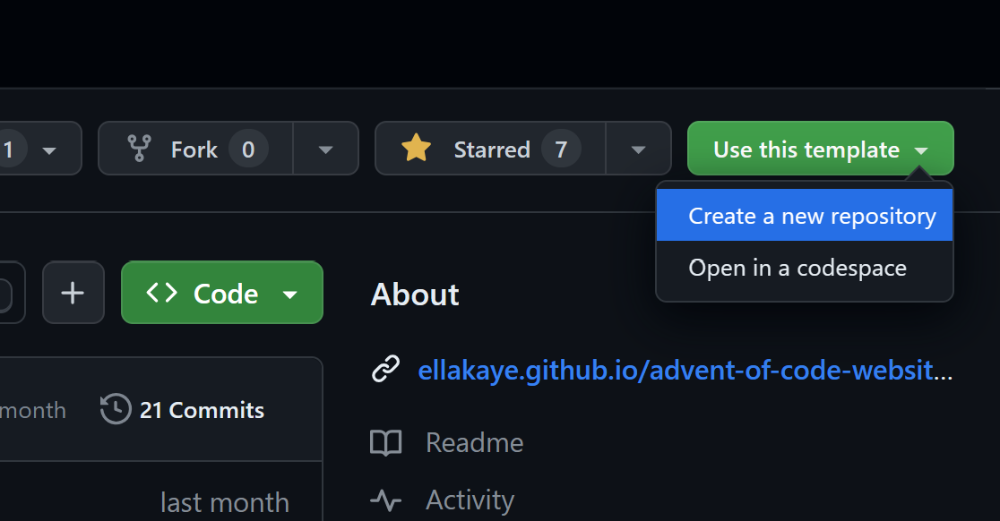
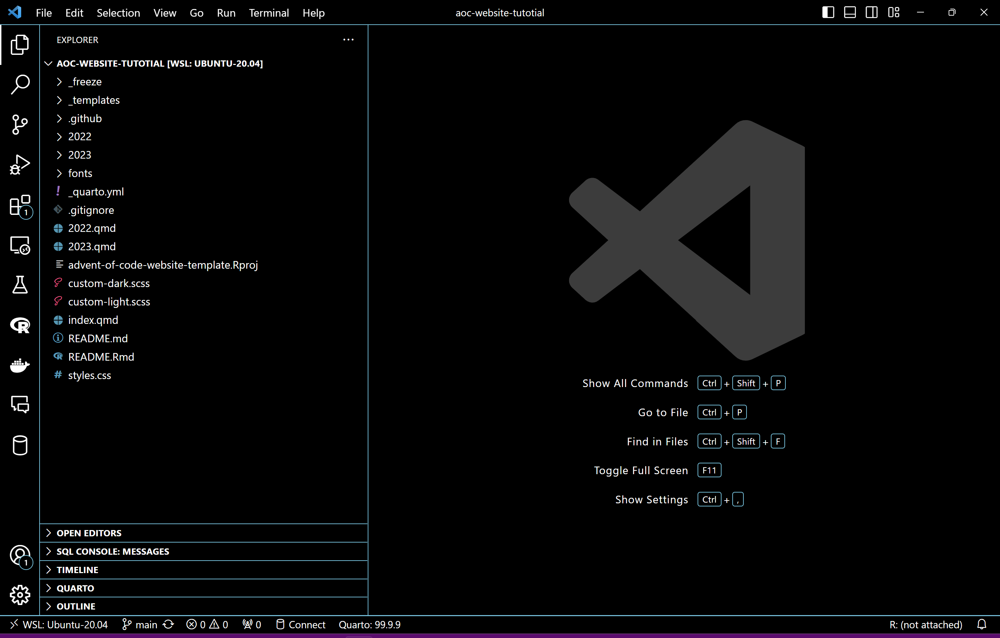

As a Christmas enthusiast, I've always felt attracted and intrigued by the [Advent of Code](https://adventofcode.com/). This is a series of programming puzzles, of increasing difficulty, that are posted daily during the Advent period that precedes Christmas. Each riddle is woven into an ongoing narrative that lasts the entire month (this year, for instance, snow production has mysteriously stopped and we need to work with elves and other creatures to restore it). But, most importantly, these challenges can be solved using any programming language, allowing for many different coding styles and techniques.

This year, I'm attempting to solve these puzzles with either R or Python, using a spinning wheel to choose between them each day for extra whimsy.

<center>

.*](images/wheel.jpg){width="400"}

</center>

Moreover, I'm sharing my solutions through a special, advent-of-code-themed website created with [Quarto](https://quarto.org/): [**adventofcode.franciscoyira.com**](https://adventofcode.franciscoyira.com)**.**


I've already posted there solutions [up to day 10](https://adventofcode.franciscoyira.com/2023).

## How to get your own Advent of Code website

Of course, I didn't code the website itself on my own. Instead, I used [this amazing Quarto template created by Ella Kaye](https://github.com/EllaKaye/advent-of-code-website-template).

This template is not only a great way to share and showcase your solutions, but also provides a tidy environment for working on the problems before publishing your progress (in fact, you can use the template just as a personal scratchpad if you want, without sharing anything on the Internet).

That's because of its tight integration with the `aochelpers` package, which facilitates retrieving and parsing the puzzles' input and spares you the hassle of writing the boilerplate code chunks that precede working on the solutions themselves.

Without further ado, here's how you can get one for yourself.

First, log in to GitHub and go the the [template repo](https://github.com/EllaKaye/advent-of-code-website-template). There you clic on the "Use this template" button located in the top-left corner, and then choose "Create a new repository".

{width="650"}

On the new page that appears, select the 'Include all branches' option (as this facilitates publishing the website to GitHub Pages) and write a repository name and description of your choice. Make it public.

{width="850"}

You'll get your own repo with a copy of all the contents from the original template[^1]. Next, you can (and should) clone this repo to your favourite IDE. I'll proceed with the assumption that you're using Visual Studio Code, one of the most popular IDEs, which also has excellent Quarto support. However, most of the following steps should also easily apply to RStudio.

[^1]: As a side note, this process is similar to, but distinct from, forking the original repo. In this case, you'll get a brand new repo with no commit history, and, unlike what happens with forks, your commits to this repo will count towards your contribution graph (in case you care about that). [Check this link for more information about templates.](https://docs.github.com/en/repositories/creating-and-managing-repositories/creating-a-repository-from-a-template)

{width="1024"}

And here we are, with the repo cloned to our local environment. The project has many folders and files and it can be somewhat overwhelming to know where to start in order to get the website up and running (it was for me at least 😅).

Assuming you're beginning with 2023, here is a simplified workflow to start sharing your solutions:

1.  Edit the `index.qmd` file, which corresponds to the *content* of the homepage of your website (except the navigation bar).
2.  Edit the `website:` section in the `_quarto.yml` file. This controls the title and navigation bar of the website. For example, here you can remove `2022.qmd` from the navigation bar if you're not going to post solutions from previous years yet. You can also add more external links and icons (for example, [here is the navbar I'm using](https://github.com/franciscoyira/advent-of-code-website/blob/80a8895c2f7ba228636a8c464f58e3a7a35afdfb/_quarto.yml#L16-L32)).

From here, you can just start adding `.qmd` files manually with the following structure: `2023/day/[NUMBER OF THE DAY]/index.qmd` and also manually download the text input of each puzzle to the corresponding folder (e.g. `2023/day/[NUMBER OF THE DAY]/index.qmd`).

This .qmd files need to have a YAML header like this:

``` yaml
---
title: "2023: Day 1"
date: 2023-12-1
categories:
  - MY_CATEGORY
draft: false
---
```

And the rest is just a regular `.qmd` file, where you can also use Python or other languages. Then you commit and push your changes. Pushing should automatically trigger a GitHub Action that publishes the site onto GitHub pages in a URL like this: [`https://[your`](https://%5Byour)`username].github.io/[your repo]/`. Voilà! You already have your own Advent of Code mini website!

Now, bear with me if you're interested in using the `aochelpers` R package to automate the process of retrieving the inputs and creating the `.qmd` files. It requires a bit of initial set up, but it pays off if you're planning to work through many of the puzzles. Here is how to do it:

1.  Install the `aochelpers` R package. This package is not in CRAN yet, so you have to install it from GitHub:

```{r, echo=TRUE, eval=FALSE}
# install.packages("remotes")
remotes::install_github("EllaKaye/aochelpers")
```

2.  For the automated retrieval of inputs to work, you need to save the **session token** of your [Advent of Code account](https://adventofcode.com/) as an R environment variable. I would say this is the most difficult part of the process. Here is how to get the cookie or session token using a Chromium web browser (Chrome, Edge, Brave, etc):
    -   Visit [adventofcode.com](adventofcode.com)
    -   Log in
    -   Right click anywhere and then click on **Inspect** to view **Developer Tools**
    -   Select the **Network** tab
    -   Refresh the page
    -   Select the **"adventofcode.com" request** under Request Headers
    -   There should be a cookie including `session=<cookie here>`. Copy the cookie without the `session=` part
3.  Once you have the cookie, go back to R and execute `usethis::edit_r_environ()` to open your `.Renviron` file, which is where you can set your environment variables. Here, add a new line like this: `ADVENT_SESSION = <cookie>`, replacing `<cookie>` with the token you got in the previous step.
4.  Restart R (in VS Code you can do this by just killing the terminal and openning a new one).

And that's all! Now you can execute this command `aochelpers::aoc_new_day([NUMBER OF THE DAY])` which will automatically create the corresponding folder and `.qmd` file for that date, with all the boilerplate Markdown and YAML already written for you, and also download the input for that day in the same folder.

You can also call the function with a second argument named `year` to work on puzzles for previous years (if you omit it, it defaults to the current year).

Then you work on your solution inside the corresponding `index.qmd` file, and when you're done, you just go to the terminal (not R), execute the command `quarto render`, and commit and push your changes.
