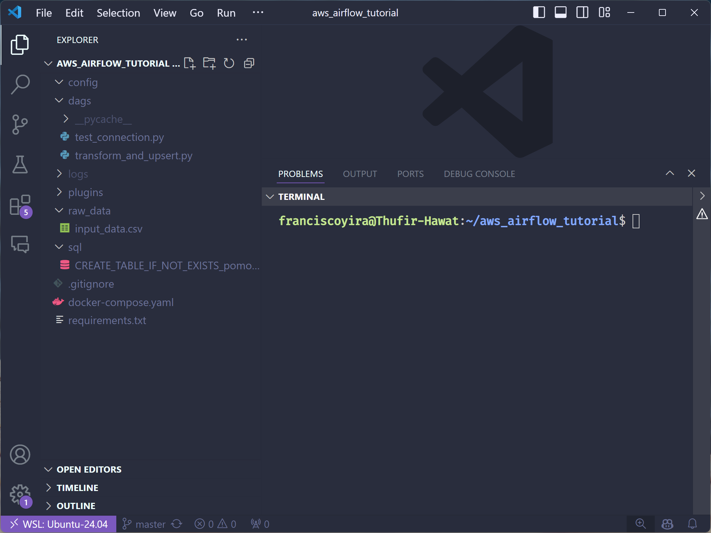
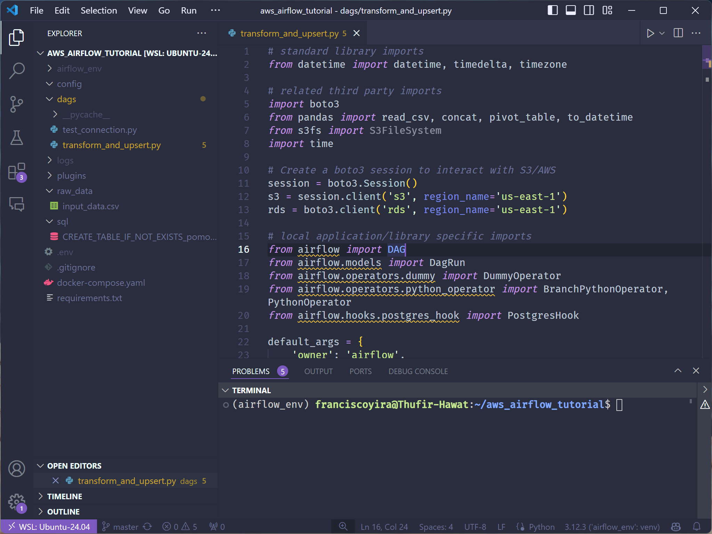
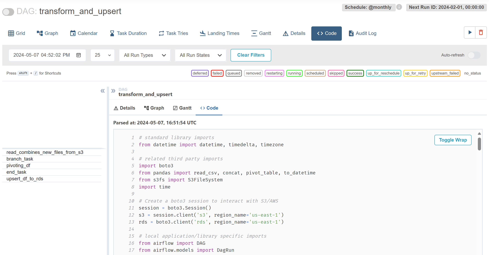
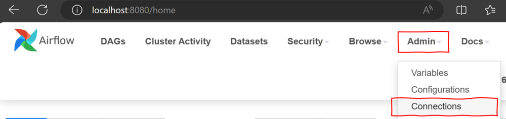
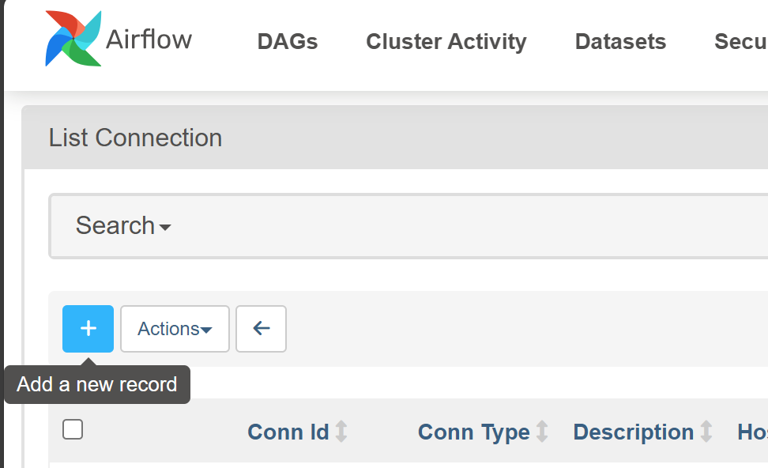
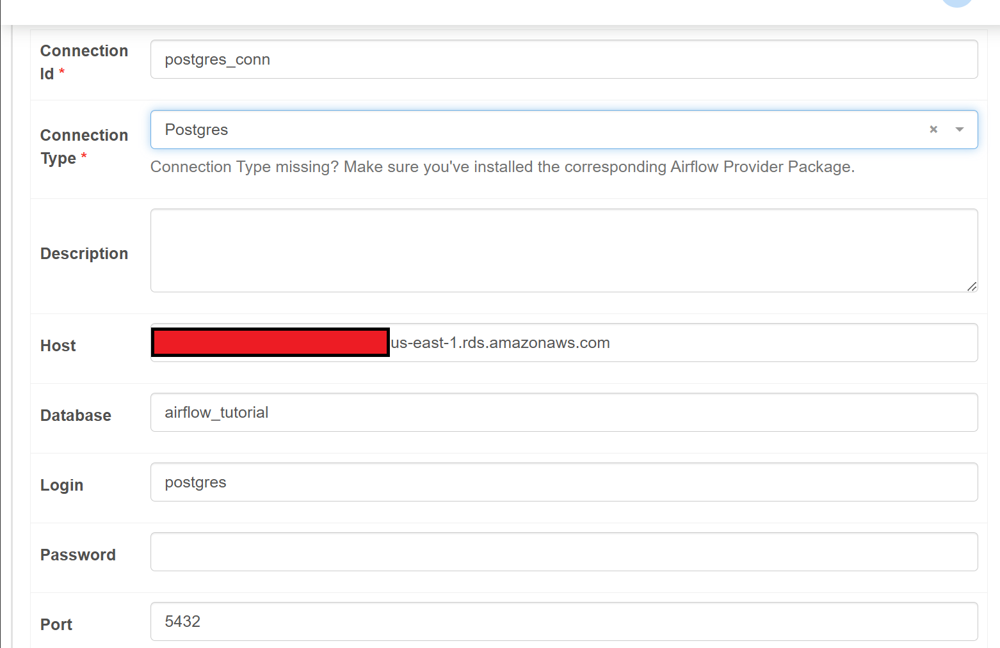
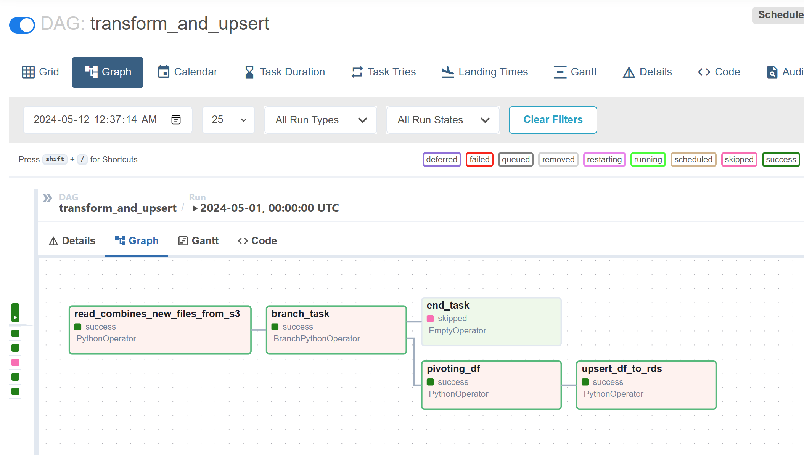

```{r setup, include=FALSE, warning=FALSE, message=FALSE}
knitr::opts_chunk$set(echo = TRUE)
knitr::opts_chunk$set(class.source="language-python", class.output="language-python")
Sys.setenv(RETICULATE_PYTHON = "/usr/bin/python3")
library(reticulate)
use_python("/usr/bin/python3")
knitr::knit_engines$set(python = reticulate::eng_python)
```

Welcome back, everyone, to the third part of this series on Data Pipelines in the Cloud! In the [first part](post/data-pipelines-cloud-intro-airflow-docker/), I introduced Apache Airflow, a powerful tool for orchestrating data pipelines. In the [second part](post/aws-command-line-data-pipelines-cloud-part-2/), we learned how to interact with Amazon Web Services (AWS) using the command line. And today, **we will put all the pieces together and build an Airflow pipeline that talks to AWS** 🥳.

> ***Data Pipelines in the Cloud Series***
>
> -   [Part I: A Beginner’s Introduction to Airflow](/post/data-pipelines-cloud-intro-airflow-docker/)
>
> -   [Part II: Using Amazon Web Services with the Command Line](/post/aws-command-line-data-pipelines-cloud-part-2/)
>
> -   **Part III: You're here.**

## Pre-requisites 📝

Before moving on, keep in mind that what comes next assumes:

-   **You are familiar with Airflow's fundamentals**. If you are 100% new to this tool, consider reading [the guide for beginners provided in the first part of this series](/post/data-pipelines-cloud-intro-airflow-docker/).
-   You have access to a **Linux or macOS Terminal (Bash shell or Z shell)**, which is where the AWS CLI and Docker commands are meant to be executed. If you use Windows, check [the first part of this series](/post/data-pipelines-cloud-intro-airflow-docker/#installing-airflow-on-the-windows-subsystem-for-linux) for instructions on setting up the Linux Subsystem for Windows.
-   You have **Docker Desktop** set up on your machine. [The first part of this series](/post/data-pipelines-cloud-intro-airflow-docker/) explains how to do this.
-   You have the **AWS Command Line Interface tool installed and configured with an AWS account**. [The second part of this series](post/aws-command-line-data-pipelines-cloud-part-2/) provides help with that. **There you can also find detailed explanations of all the AWS CLI commands and AWS services used in this third part**. I’ll skip explaining these again in this new post to focus on the Airflow DAG instead.

Without further ado, let's go through the data pipeline we'll build today.

## The Data Pipeline 🏗️

{alt="Flowchart depicting a data processing workflow with Apache Airflow, AWS S3, and AWS RDS. It starts with a red S3 bucket icon labeled ‘Raw Data’ containing project details, followed by Apache Airflow for data processing. The steps include reading raw CSV from S3, data transformation through pivoting, and upserting transformed data to AWS RDS. The final output is shown as a blue database icon labeled ‘Amazon RDS Database’ with a ‘Final Table’ that has columns for date, work_minutes, and learning_minutes" width="1000"}

Our goal is to implement an Airflow DAG that:

-   **Reads** input data from an S3 bucket on AWS.
-   Performs some meaningful **data transformations** in an automated way (more details below about what these transformations are).
-   **UPSERTS** this transformed data into a **PostgreSQL database** running on Amazon RDS. *UPSERT* means that data corresponding to *new* records will be appended to the table, whereas data about *existing* records will overwrite or update the previous information. A Primary Key column will be used to determine whether a record is new.

## The Input Data 📥

{alt="A digital painting of an hourglass with galaxies and celestial bodies contained within, set against a backdrop of swirling cosmic clouds and stars. The hourglass, with its wooden frame and detailed carvings, symbolizes the intertwining of time and space. The scene is mystical and awe-inspiring, with dynamic swirls of orange, yellow, blue, and white clouds, and a bright star shining prominently to the right" width="1000"}

Our source data consists of a sample of [Pomodoro sessions](https://en.wikipedia.org/wiki/Pomodoro_Technique): short periods in which a person performed **focused work** on some project. The data is at the **Session** level of detail, so the columns contain attributes about each session:

-   **Project**: indicates whether session was spent on Paid Work ("*Work"*) or study and side-projects ("*Learning"*).

-   **Duration (in minutes)**: a decimal number indicating the duration of the session. Typically 25 minutes, but it may vary.

-   **Start date** and **End date**: timestamps in local time indicating when each session started and ended.

Here is a glimpse of the values in the data:

```{python load-packages, include=FALSE}
import pandas as pd
import numpy as np
```

```{python read-data}
df = pd.read_csv('https://raw.githubusercontent.com/franciscoyira/aws_airflow_tutorial/master/raw_data/input_data.csv')
df.sample(n=10, random_state=1989)
```

And this is what we want our Airflow DAG to do:

-   Remove the time component of `Start Date` (turn it into a date instead of a timestamp).

-   Group the data by `Start Date` and `Project`. Note that there might be multiple rows or no rows at all for each day and project.

-   Sum up `Duration` for each `Start Date` and `Project`, so we end up with a table that shows how much time was spent on each project per day.

Here is how these transformations look like when expressed as `pandas` code:

```{python}
# Parsing `Start date` as datetime and removing its time component
df['Start date'] = df['Start date'].str[:10]

df['Start date'] = pd.to_datetime(
        df['Start date'],
        format='%Y-%m-%d').dt.date

# Aggregate Duration by Start date and Project
df = df\
  .drop('End date', axis=1)\
  .groupby(['Start date', 'Project'])\
  .sum()\
  .reset_index()

df.sample(n=5, random_state=1989)
```

-   Then, we will **pivot the data** to obtain a DataFrame with three columns: **`Date`**, **`work_minutes`** (total of minutes in *Work* sessions during that day) and **`learning_minutes`** (same but for *Learning* sessions).

```{python}
# Pivot the table
df_pivoted = pd.pivot_table(data=df,
                            values="Duration (in minutes)",
                            index="Start date",
                            columns="Project",
                            fill_value=0)

# Rename columns and reset index
df_pivoted = df_pivoted\
  .rename(columns={
    'Learning': 'learning_minutes',
    'Work': 'work_minutes'})\
  .reset_index()

# Remove the hierarchical index on columns
df_pivoted.columns.name = None

df_pivoted.sample(5, random_state=1989)
```

-   The last step is to *UPSERT* the data from the previous step into a PostgreSQL table, using `Start Date` as the primary key. As hinted before, this means that for each `Start Date` in the input data, we will either:

    -   *INSERT* a new record (row) if that Date does not exist in the destination table or...

    -   *UPDATE* (overwrite) the existing values of `work_minutes` and `learning_minutes` if it does.

    The goal is to end up with a table that contains up-to-date information for each `Start Date` but no duplicate records.

{width="900"}

As you can see, the whole pipeline (except the UPSERT part, which we still need to write) can be expressed as a few lines of Python code. Still, it performs a meaningful transformation on the data (it isn't just a `print('Hello world')`, [like the dummy DAG we implemented in the first part](/post/data-pipelines-cloud-intro-airflow-docker/)) and outputs a table in a format that may be suitable for dashboards or reports. The main challenge is to perform these transformations in an automated way, under Airflow orchestration, while also interacting with AWS cloud services like S3 and RDS.

## Getting Things Ready 🛠️

### Cloning The Repo

To get started, clone this repo that contains all the code we'll be working with, and then open it in your favourite IDE: <https://github.com/franciscoyira/aws_airflow_tutorial.git>

There are many ways to do this, but the workflow I prefer is to use `git clone` from the Terminal:

``` language-bash
git clone https://github.com/franciscoyira/aws_airflow_tutorial.git
```

And then navigate to the repo and use `code .` to open it in Visual Studio Code (if you're using Linux on Windows, you need to first download and install the [WSL Remote](https://marketplace.visualstudio.com/items?itemName=ms-vscode-remote.remote-wsl) extension for this to work)

``` language-bash
cd aws_airflow_tutorial
code .
```

If all goes well, you should see something like this on your VS Code window:

{alt="Visual Studio Code interface with a dark theme. The ‘EXPLORER’ panel displays files and folders for a project named ‘AWS AIRFLOW_TUTORIAL.’ The file structure includes folders like ‘config,’ ‘dags,’ and files such as ‘.gitignore,’ ‘docker-compose.yaml,’ and ‘requirements.txt.’ A terminal at the bottom shows the user prompt in the ‘aws_airflow_tutorial’ directory." width="1000"}

To finalize the repository setup, we should create a Python environment and install/restore all the necessary packages from `requirements.txt`.

``` language-bash
python3 -m venv airflow_env
source airflow_env/bin/activate
pip install -r requirements.txt
```

### Setting Up AWS Resources

Before going into details over the Airflow code, we need to provision the AWS resources Airflow will communicate with: the S3 bucket and the Postgres database on Amazon RDS.

First, let's set up an S3 bucket and copy the input data to it

``` language-bash
bucket_name="tutorial-airflow-$(date +%Y-%m-%d-%H-%M-%S)"
aws s3 mb s3://$bucket_name
echo "Bucket created: $bucket_name"

aws s3 cp raw_data/input_data.csv s3://$bucket_name/input_data/input_data.csv
```

[*Explanation of the commands above.*](/post/aws-command-line-data-pipelines-cloud-part-2/#an-s3-bucket-to-store-the-raw-data)

**🚨 Important: take note of the name of the `$bucket_name`**, as we'll need it later when setting up the DAG.

Now, let's provision an Amazon RDS instance and its corresponding security group, enabling incoming traffic from our IP:

``` language-bash
GROUP_ID=$(aws ec2 create-security-group --group-name airflow-rds-sg --description "Security group for RDS accessible by Airflow" --query 'GroupId' --output text)

MY_IP=$(curl ipinfo.io/ip)

aws ec2 authorize-security-group-ingress --group-id ${GROUP_ID} --protocol tcp --port 5432 --cidr ${MY_IP}/32

MY_PASSWORD=$(openssl rand -base64 24 | tr -dc 'a-zA-Z0-9' | fold -w 12 | head -n 1)

aws rds create-db-instance \
    --db-instance-identifier airflow-postgres \
    --db-instance-class db.t3.micro \
    --engine postgres \
    --publicly-accessible \
    --allocated-storage 20 \
    --db-name airflow_tutorial \
    --master-username postgres \
    --master-user-password ${MY_PASSWORD} \
    --vpc-security-group-ids ${GROUP_ID}
```

[*Explanation of the commands above.*](/post/aws-command-line-data-pipelines-cloud-part-2/#provisioning-the-database)

In order to connect to the instance, we need to download the corresponding Certificate Authority (CA) and install the PostgreSQL client and the jq tool:

``` language-bash
curl -o us-east-1-bundle.pem https://truststore.pki.rds.amazonaws.com/us-east-1/us-east-1-bundle.pem

sudo apt install jq postgresql-client
```

Now wait a couple of minutes until the Postgres database instance is provisioned and then connect to it with these commands:

``` language-bash
output=$(aws rds describe-db-instances --db-instance-identifier airflow-postgres --query 'DBInstances[*].Endpoint.[Address,Port]')

ENDPOINT_URL=$(echo $output | jq -r '.[0][0]')

PORT=$(echo $output | jq -r '.[0][1]')

psql "host=${ENDPOINT_URL} port=${PORT} dbname=airflow_tutorial user=postgres password=${MY_PASSWORD} sslmode=verify-ca sslrootcert=us-east-1-bundle.pem"
```

[*Explanation of the commands above.*](/post/aws-command-line-data-pipelines-cloud-part-2/#testing-the-connection)

You should see this on-screen:

`airflow_tutorial =>`

if the connection was successful. Once there, you can create the table where our processed data will live by executing the following SQL statement:

``` language-sql
CREATE TABLE IF NOT EXISTS pomodoro_day_catg (
  date DATE NOT NULL,
  learning_minutes NUMERIC NOT NULL,
  work_minutes NUMERIC NOT NULL,
  CONSTRAINT date_unique UNIQUE (date)
);
```

Then you can exit the Postgres client with `\q`.

🚨️ **Important: you must save the values of `ENDPOINT_URL`, `PORT`, and `MY_PASSWORD`** (in a secure location, obviously), as we'll need them later to set up a connection from Airflow to the database.

``` language-bash
echo $ENDPOINT_URL
echo $PORT
echo $MY_PASSWORD
```

### Setting Up Airflow for Use with AWS

Before initializing our Airflow environment with Docker, we must add our AWS credentials and other information to a file named `.env`.

First, execute the following command to create a `.env` file containing the Airflow User ID as `AIRFLOW_UID`.

``` {.bash .language-bash}
echo -e "AIRFLOW_UID=$(id -u)" > .env
```

Now **open the .env file** and add the following lines to it, replacing the placeholders with the corresponding AWS keys:

``` language-bash
AWS_ACCESS_KEY_ID=[WRITE YOUR OWN ACCESS KEY ID]
AWS_SECRET_ACCESS_KEY=[WRITE YOUR OWN SECRET ACCESS KEY]
_PIP_ADDITIONAL_REQUIREMENTS: s3fs
```

[*Here* *you can find instructions to obtain these keys from AWS*.](/post/aws-command-line-data-pipelines-cloud-part-2/#configuring-the-aws-cli-with-an-aws-account)

Now, the only step left to have a functional Airflow environment is to initialize the Airflow containers through Docker. To do this, open Docker Desktop on your machine and then execute the following commands on the Terminal:

``` {.bash .language-bash}
sudo service docker start
docker compose up airflow-init
docker compose up -d
docker ps
```

Some commands may take a while, but after they're finished you should be able to access the Airflow Web UI through [localhost:8080](http://localhost:8080/) on your web browser:

{width="1000"}

Here you can log in using `airflow` as username and `airflow` as a password.

Lastly, we must add a variable to the Airflow environment indicating the name of our S3 bucket. You can do that directly from the Airflow Web UI by **going to the Admin menu \> Variables \> '+' button.**

{alt="Screenshot of the Airflow Web UI, highlighting the button 'Variables' under the Admin menu, and the light blue Plus button, below the Search box in the List Variable section" width="1000"}

Then, on the "*Edit Variable*" page, write *BUCKET_NAME* as *Key* and paste **your own** `$bucket_name` as *Val*[^1].

[^1]: If you forgot to take note of it, you can print it again on the Terminal by executing `echo $bucket_name`. If you lost access to the variable, execute `aws s3 ls --output text | awk '{print $3}'` to see the name of all of your buckets and copy and paste the one that you created for this tutorial.

{alt="Screenshot of the Airflow Web UI, showing the 'Edit Variable' page with a form to add a new variable. The 'Key' field is filled with 'BUCKET_NAME' and the 'Val' field with the name of the S3 bucket" width="1000"}

And there you have it! Our Airflow environment is now operational. Now, let's move on to the pipeline code itself.

```{r, echo=FALSE}
blogdown::shortcode("subscribe")
```

## Building Our Pipeline on Airflow 🪂

This section is all about taking a deep dive into the Airflow code that declares our pipeline. This code lives inside the `dags/` folder in a file named `transform_and_upsert.py`.

{width="1000" alt="Screenshot of Visual Studio Code with the file 'transform_and_upsert.py' open in the editor. The file contains Python code for an Apache Airflow DAG."}

You can also access this code through the Airflow Web UI by clicking on `transform_and_upsert` from the "DAGs" tab and then selecting the "*Code*" tab. Airflow automatically monitors the `dags/` folder and parses its contents as proper DAGs that can be managed and monitored on the Web UI. As a result, the *Code* tab is extremely useful for checking if Airflow has already parsed any changes you've made to your DAG files.

{width="1000" alt="Screenshot of the Airflow Web UI, showing the 'transform_and_upsert' DAG in the 'Code' tab. The Python code for the DAG is displayed."}

This DAG file can seem intimidating if you're new to Airflow, but I'll go through it line by line to make it easier to understand. **By the end of this article, you'll have a good grasp of how to code a similar Airflow DAG on your own**.

*(Note: all of this code is meant to be run by Airflow itself when executing the DAG. It is not designed to run interactively on your Terminal.)*

### Boilerplate Code

First, we have what we could consider as *boilerplate code*, imports of packages required for the DAG to work:

``` {.python .language-python}
from datetime import datetime, timedelta, timezone
from pandas import read_csv, concat, pivot_table, to_datetime
import time

import boto3
from s3fs import S3FileSystem
```

All these dependencies should have been installed when you executed `pip install -r requirements.txt` in the previous section.

From these, I'll explain the ones that are less common in Python:

-   `boto3` is the AWS Software Development Kit (SDK) for Python, which allows writing Python code that interacts with services like Amazon S3 and RDS.
-   `s3fs` is a Pythonic file interface to Amazon S3. It builds on top of `boto3` to provide typical file-system style operations like `cp`, `mv`, and `ls`, along with put/get of local files to/from S3.

Now, we put these packages to use by instantiating a `boto3.Session()` to interact with AWS services and create clients for S3 and RDS.

``` {.python .language-python}
session = boto3.Session()
s3 = session.client('s3', region_name='us-east-1')
rds = boto3.client('rds', region_name='us-east-1')
```

If you are wondering how this code handles authentication to AWS, the answer is that it relies on the `AWS_ACCESS_KEY_ID` and `AWS_SECRET_ACCESS_KEY` environment variables we previously added to the `.env` file. So, make sure you didn't skip that part of the tutorial!

Then, we utilize the `Variable.get()` method to retrieve the name of our S3 bucket from the Airflow variables.

``` {.python .language-python}
from airflow.models import Variable
bucket_name = Variable.get("BUCKET_NAME")
```

And now we have some other imports related to Airflow itself. I'll explain these when we use them later, so let's skip over this for now.

``` {.python .language-python}
from airflow import DAG
from airflow.models import DagRun
from airflow.operators.dummy import DummyOperator
from airflow.operators.python_operator import BranchPythonOperator, PythonOperator
from airflow.hooks.postgres_hook import PostgresHook
```

Next, we declare a Python dictionary with default arguments to be used by our DAG.

``` {.python .language-python}
default_args = {
    'owner': 'airflow',
    'depends_on_past': False,
    'start_date': datetime(2024, 2, 1),
    'catchup': False,
    'retries': 1,
    'retry_delay': timedelta(minutes=1) 
}
```

Here is an explanation of what each of these arguments mean:

-   `'owner': 'airflow'` defines the user "*airflow*" as the owner of this DAG. Since "*airflow*" is the default username of our Airflow environment and the one we used to access the Web UI, this gives us ownership of the DAG.

-   `depends_on_past` controls whether the DAG should run even if the previous scheduled execution failed. A value of `False` means that the DAG will be triggered anyway under this scenario.

-   `start_date` is like a lower bound for DAG executions. In this case, the DAG will not run for any execution dates before February 1st, 2024. The DAG could run for execution dates between `start_date` and the current date depending on the value of the `catchup` argument, but...

-   ...since `'catchup': False`, Airflow won't run the DAG for any scheduled dates before the current date. Running a DAG for execution dates scheduled in the past is known as *backfilling,* and it makes sense in some scenarios but not for our sample pipeline.

-   `'retries': 1` and `'retry_delay': timedelta(minutes=1)` means that if something fails when running the DAG, Airflow will wait one minute and then will attempt to run it again. If that run also fails, Airflow will give up and the DAG run will be marked as "failed".

Then, we instantiate the DAG itself:

``` {.python .language-python}
dag = DAG(
    dag_id='transform_and_upsert',
    default_args=default_args,
    schedule="@monthly"
)
```

We use the class constructor `DAG()` to create the `dag` object, passing the `default_args` to it, giving it the name `transform_and_upsert`[^2] and setting up a *monthly* `schedule` (it should run the first day of each month).

[^2]: Note that *THIS* is the name that will appear on the Airflow Web UI as the DAG name and NOT the name of the .py file inside the `dags/` folder. It is recommended have one DAG per .py file and to name these files with the same name as the `dag_id`s to keep our repo tidy and easy to navigate, but Airflow itself doesn't care about the name of the Python files.

### Declaring Our Pipeline Through Python Functions

Okay, enough with the boilerplate. Let's move on to the code that defines the *actions* that our DAG will execute.

For this, we'll express the pipeline as a set of **Python functions**, which will then be executed via corresponding `PythonOperator`s.

#### Reading Input Files from S3

The first function is `read_combines_new_files_from_s3`. As its name hints, it aims to retrieve and merge any new CSV files found in the S3 bucket where we're storing our input data. The definition of *new file* for these purposes is *any file whose modification date is later than the last successful run of the DAG*.

Here are the first lines of the function and their explanation:

``` {.python .language-python}
def read_combines_new_files_from_s3(**kwargs):
    
    objects = s3.list_objects_v2(
        Bucket=bucket_name,
        Prefix='input_data/')['Contents']
```

-   [`s3.list_objects_v2`](https://boto3.amazonaws.com/v1/documentation/api/latest/reference/services/s3/client/list_objects_v2.html) is a function that returns a dictionary with *information about* the objects in our bucket (not the objects themselves). We use the argument `Prefix` to retrieve just the objects within the `input_data/` directory of the bucket.

-   From this dictionary, we access `'Contents'` to keep only the information pertinent to the individual, discarding a bunch of metadata that is not relevant to our function.

You may wonder what the `**kwargs` is for. In Python, it serves as a placeholder for handling multiple arguments passed in a key-value pair format (*kwargs = Keyworded Arguments*). Within Airflow, it is used by the `PythonOperator` to pass custom arguments and relevant context to the callable functions. We'll see an example of this later!

``` {.python .language-python}
   # Find the last successful run of the current DAG
    dag_runs = DagRun.find(dag_id='transform_and_upsert', state='success')
    
    if len(dag_runs) > 0:
        # Use the execution date of the last successful run
        last_dag_run_date = dag_runs[-1].execution_date
    else:
        # If this is the first run, or no successful runs, use a date far in the past
        last_dag_run_date = datetime(2000, 1, 1, tzinfo=timezone.utc)

    print('Last dag run date: ', last_dag_run_date)
```

Now, we use the [`find()`](https://airflow.apache.org/docs/apache-airflow/stable/_api/airflow/models/dagrun/index.html#airflow.models.dagrun.DagRun.find) method from the [`DagRun`](https://airflow.apache.org/docs/apache-airflow/stable/_api/airflow/models/dagrun/index.html#airflow.models.dagrun.DagRun) class to query all the successful executions of our current DAG, and we save them in the `dag_run` variable.

Then, we ask whether there are any successful runs at all (`len(dag_runs) > 0`?). This is **to handle the case where the pipeline has never run before** and thus lacks a last `execution_date`. We handle this by setting a fallback `last_dag_run_date` way back in the past (1st January 2000). In practice, this will cause any file in the S3 bucket to be considered as a *new file*.

When *there are* previous successful runs, we just retrieve the `execution_date` attribute from the last one with `dag_runs[-1].execution_date`. Here, `dag_runs[-1]` uses [Python's negative indexing](https://medium.com/@journalehsan/what-is-negative-indexing-in-python-and-how-to-use-it-34ec7ac5b36) to access the last element of `dag_runs`.

Also, notice there is a `print()` statement at the end, which I added for debugging purposes (it is not really necessary). We can view the output of print statements like this in the **Logs** section of the **Airflow Web UI**. I'll show you how to do that in the conclusion of this article.

``` {.python .language-python}
    # Reading the objects that are more recent than last_dag_run_date into a Pandas DataFrame 
    dfs = []
    df_combined = None
    
    for obj in objects:
        print('Last modified object: ', obj['LastModified'])
        if obj['LastModified'] > last_dag_run_date:
            dfs.append(read_csv(f's3://{bucket_name}/' + obj['Key']))
    
    if len(dfs) > 0:
        df_combined = concat(dfs, axis=0)
        df_combined.to_csv(f's3://{bucket_name}/intermediate_data/df_combined.csv', index=False)
        return True
    else:
        return False
```

Then, having the list of input files from the bucket (`objects`) and the `last_dag_run_date`, we proceed to read into a pandas DataFrame all the files that are more recent than this date. We do this by:

-   Iterating through each file ('`obj`') in the list `objects`.

-   Checking its `['LastModified']` attribute. If the CSV file was modified after the `last_dag_run_date`, it's read and `append`ed to the `dfs` list, using the `obj['Key'` to access it.

-   If any new files are found, the DataFrames in `dfs` are combined (`concat`) into a single `df_combined`. This DataFrame is saved as a CSV file in the `/intermediate_data` directory of our S3 bucket. The function ends up returning a `True` value (why? explanation to come!).

-   If no new files are found, no further action is performed and the function returns `False`.

#### Flow Control: Are There New Input Files or Not?

The reason why the previous function returns a boolean value is so it can be used as a *condition* for determining the next steps in the DAG. Specifically, we want to **continue executing the DAG only if new files are found, but to stop otherwise**. This allows our Airflow pipeline to end gracefully if no new data has been added since the last run (a common scenario in data pipelines that run on a regular schedule).

{width="500" alt="A stylized, colorful abstract landscape painting featuring a large, bright celestial body in the sky, amidst dark swirling clouds. The foreground shows two diverging paths in bright yellows and oranges, contrasting with dark silhouetted trees and distant rolling hills."}

So, we define a very short `branch_function` that returns **the name of the task to be executed after it** based on whether the previous task found new input files.

``` {.python .language-python}
def branch_function(**kwargs):
    ti = kwargs['ti']
    # Pull the Boolean value indicating if the df was saved successfully
    df_saved_to_s3 = ti.xcom_pull(task_ids='read_combines_new_files_from_s3')

    if df_saved_to_s3:
        return 'pivoting_df'
    else:
        return 'end_task'
```

-   If new files are found, the next task to be executed will be `pivoting_df`, which performs the pivot operation on `df_combined.csv`.

-   Otherwise, the next task will be `end_task`, a dummy task that performs no action and signals the end of the whole DAG.

Our function relies on an Airflow feature named [**XCom Communication**](https://www.youtube.com/watch?v=8veO7-SN5ZY "Video: Airflow XCom for Beginners in 10 minutes") that **allows tasks to share data between them**. To pull this shared data, the function accesses the `ti` or *task instance* object from the `**kwargs` argument (this is one of the uses of *kwargs* mentioned earlier!). The `ti` object provides the `.xcom_pull()` method, which allows us to 'pull' the outputs of previously executed tasks identified by their `task_ids`.

In this case, what we pull is the boolean returned by `read_combines_new_files_from_s3`. After pulling it and assigning it to `df_saved_to_s3`, we can use it as **a regular Python boolean for flow control** and make `branch_function` return the name of the corresponding next task.

#### Pivoting Our Data with `pivoting_df`

Next up is the function that transforms the input data (if present): `pivoting_df`. Its purpose is to carry out [the pivot operation already described here](/post/data-pipelines-3-cloud-build-airflow-pipeline-aws/#the-input-data).

``` {.python .language-python}
def pivoting_df(**kwargs):
    s3_file_path = f's3://{bucket_name}/intermediate_data/df_combined.csv'
    df = read_csv(s3_file_path)

    df = df.drop('End date', axis=1)

    # Converting the column 'Start date' to date
    df['Start date'] = df['Start date'].str[:10]

    df['Start date'] = to_datetime(
        df['Start date'],
        format='%Y-%m-%d').dt.date
    
    # Aggregate 'Duration (in minutes)' by 'Start date' and 'Project'
    df = df.groupby(['Start date', 'Project']).sum().reset_index()

    df_pivoted = pivot_table(
       data=df,
       values="Duration (in minutes)",
       index="Start date",
       columns="Project",
       fill_value= 0
    )

    # Rename columns
    df_pivoted = df_pivoted.rename(
       columns={'Learning': 'learning_minutes',
                'Work': 'work_minutes'}
       ).reset_index()

    df_pivoted.columns.name = None

    # Remove df_combined.csv from S3
    file_key = 'intermediate_data/df_combined.csv'
    s3.delete_object(Bucket=bucket_name, Key=file_key)

    df_pivoted.to_csv(f's3://{bucket_name}/intermediate_data/df_pivoted.csv', index=False)
```

Most of this function consists of pandas code already explained when we talked about [the input data](/post/data-pipelines-3-cloud-build-airflow-pipeline-aws/#the-input-data), so I'll skip over that and focus just on **the code that interacts with AWS**:

-   We use the [f-string](https://www.geeksforgeeks.org/formatted-string-literals-f-strings-python/) `f's3://{bucket_name}/intermediate_data/df_combined.csv'` to set the path to the CSV file created by `read_combines_new_files_from_s3`[^3].

-   Then, the function performs the pivoting transformation using pandas functions and methods, resulting in a new DataFrame called `df_pivoted`.

-   We invoke the [`s3.delete_object()`](https://boto3.amazonaws.com/v1/documentation/api/latest/reference/services/s3/client/delete_object.html) method to delete `df_combined.csv` from S3, which is no longer needed since it was only an intermediate file for passing data between `read_combines_new_files_from_s3` and `df_pivoted`.

-   We save the output of the pivoting operation to S3 as a CSV named `df_pivoted.csv`.

[^3]: Remember that, thanks to the branch function, `pivoting_df` is only executed when `read_combines_new_files_from_s3` succeeded in writing `df_combined.csv` to S3, so we can be pretty confident of the file's existence at the time this code runs.

Some may wonder why we use S3 to write temporary files and pass data between tasks when we could use the XCom feature instead. The answer is simple - **the XCom feature is designed to pass small pieces of data, such as variables and parameters. It is not intended for transferring larger datasets or files**. Doing so may result in unreliable behaviour of XCom and thus is considered bad practice.

{alt="A four-panel meme from the TV show Doctor Who. The first panel shows a character asking, ‘Is my data too big for Airflow XCom?’ The second panel has another character replying, ‘It depends.’ In the third panel, the response is, ‘If it’s a variable, no.’ The fourth panel concludes with, ‘If it’s a dataframe, yes.’ The meme humorously addresses the limitations of Airflow’s XCom feature when dealing with different types of data"}

#### UPSERT to PostgreSQL Database on Amazon RDS

We're now reaching the last part of our pipeline. At this point, the data already has the desired structure: each row represents a single day, and each column represents the time (in minutes) spent on each kind of project: either *Paid work* (`work_minutes`) or *Learning* (`learning_minutes`).

{alt="A flowchart illustrating a data processing workflow using Apache Airflow, AWS S3, and AWS RDS. It begins with ‘Raw Data’ containing project details in an S3 bucket, processed by Apache Airflow. Steps include reading raw CSV from S3, performing pivot transformation, and upserting transformed data to AWS RDS. The final output is stored in an Amazon RDS Database as a ‘Final Table’ with fields for date, work_minutes, and learning_minutes. A note ‘We are here’ indicates the current step in the process." width="1000"}

The only step left to code is the UPSERT operation to our PostgreSQL database, so let's go ahead with that!

``` {.python .language-python}
def upsert_df_to_rds(**kwargs):
    
    db_instance_identifier = 'airflow-postgres'
    s3_file_path = f's3://{bucket_name}/intermediate_data/df_pivoted.csv'
    
    dtype_spec = {'work_minutes': 'float', 'learning_minutes': 'float'}
    df = read_csv(s3_file_path, dtype=dtype_spec, parse_dates=['Start date'])
```

Here, we begin by initializing the variables required to talk to the database and S3: the `db_instance_identifier` of our database and the `s3_file_path` of the file with the transformed data.

Then, we `read_csv` the data from S3, taking some extra precautions to ensure we parse the file using the same data types as the destination table in PostgreSQL.

-   For the numerical columns, we specify the correct data types in the dictionary `dtype_spec` and pass it to the argument `dtype`.

-   For the `Start date` column, we ask `read_csv` to parse it as a date using the `parse_dates` argument.

Then, there is a bunch of code whose only purpose is to **minimize AWS costs** by enabling public accessibility of the PostgreSQL database only when required by the DAG execution.

``` {.python .language-python}
    # Change Database PubliclyAccessible to True
    rds.modify_db_instance(
            DBInstanceIdentifier=db_instance_identifier,
            PubliclyAccessible=True,
            ApplyImmediately=True
        )
    
    # This change takes some time to be applied, so we need to wait a bit
    elapsed_time = 0
    timeout = 300
    interval = 30
    is_public = False

    while elapsed_time < timeout:
        try:
            db_instances = rds.describe_db_instances(DBInstanceIdentifier=db_instance_identifier)
            db_instance = db_instances['DBInstances'][0]
            is_public = db_instance['PubliclyAccessible']

            if is_public == True:
                print(f"RDS instance '{db_instance_identifier}' public accessibility is now {is_public}.")
                time.sleep(40)
                break
            else:
                print(f"Waiting for RDS instance '{db_instance_identifier}' to become {'publicly accessible' if True else 'private'}. Checking again in {interval} seconds.")
                time.sleep(interval)
                elapsed_time += interval
        except Exception as e:
            print(f"An error occurred: {e}")
            break

    if not is_public:
        print(f"Timeout reached: RDS instance '{db_instance_identifier}' did not reach the desired state within {timeout} seconds.")
        # Exit task
        return
```

**The goal here is to keep the time we use a Public IP for our database to a minimum as it is the only AWS resource in this tutorial that is not included in the AWS Free Tier.**

To achieve this, our database will be `PubliclyAccessible=False` most of the time, but the `upsert_df_to_rds` function will change this property to `True` when needed.

We ask to `ApplyImmediately` this change but it may still take some time to take effect. Therefore, we set up a **while loop** that checks every `interval` of 30 seconds if the database is already publicly accessible. Once `db_instance['PubliclyAccessible']` is `True`, we exit the loop and proceed with the UPSERT operation[^4]. Later, when the UPSERT is completed, the function will set `PubliclyAccessible` to `False` again.

[^4]: However, if the database is still not publicly accessible after a `timeout` of 300 seconds, the function will exit, and the task will fail.

*Note that none of the code above is essential. If you're willing to pay the cost of having a Public IP address available all the time (which is not that much), you can skip the above chunk from your DAG.*

``` {.python .language-python}
    # Get the RDS connection using PostgresHook
    rds_hook = PostgresHook(postgres_conn_id='postgres_conn')
```

The next step is to create a **hook to our Postgres database**. In Airflow, a hook is like a **bridge** that allows our DAGs to interact with external systems and services.

Here, we create the `rds_hook` using the class constructor `PostgresHook`. This constructor asks for the argument `postgres_conn_id`, which is the name of a connection to PostgreSQL created in the Airflow Web UI. We have a problem here because **we haven't created any connections there ye**t, so let's go back to [localhost:8080](http://localhost:8080/) to set this up[^5].

[^5]: Remember that, to access the web UI, the Airflow environment must be running on Docker. If you shut it down, you can turn it back on by launching Docker Desktop and then running the following commands on the Terminal (from the directory that contains the `docker-compose.yaml` file): `sudo service docker start; docker compose up -d`.

On the Airflow UI, go to **Admin** and then to **Connections**.

{width="1000" alt="Screenshot of the Airflow Web UI, showing the 'Admin' menu and the 'Connections' option highlighted."}

Then click on the light blue '+' button (*Add a new record*).

{width="400" alt="Screenshot of the Airflow Web UI, highlighting the light blue Plus button to add a new connection, inside the 'List Connection' section."}

And then fill out the details of the new connection. If you followed the instructions in the [Setting Up AWS Resources] section, then you can use the same values as the ones shown on the screenshot below, except for **Host**, **Password** and **Port**. The values for these parameters should be available on your Terminal as variables named `ENDPOINT_URL` (Host), `PORT` and `MY_PASSWORD`. Print them with the following Terminal commands:

``` language-bash
echo $ENDPOINT_URL
echo $PORT
echo $MY_PASSWORD
```

And paste them on the corresponding sections of the *Edit Connection* page[^6]. Also, take care of **removing any text present in the *Extra* field** (below *Port*), as it may cause problems when connecting to the database.

[^6]: If you didn't take note of these values when creating the database and *also* lost access to these variables due to, e.g, a restart of your environment, you can try deleting the database instance with this command `aws rds delete-db-instance --db-instance-identifier airflow-postgres --skip-final-snapshot` and then creating it again (following the instructions in the [Setting Up AWS Resources] section).

{width="1000" alt="Screenshot of the Airflow Web UI, showing the 'Edit Connection' page with the fields 'Connection Id', 'Connection Type', 'Host', 'Database', 'Login', 'Password', and 'Port' filled with the connection data for the PostgreSQL database."}

Then we *Save* the connection, and we're done! An Airflow Connection with Id `postgres_conn` now exists, so `rds_hook= PostgresHook(postgres_conn_id='postgres_conn')` should run without any issues when our DAG is executed.

Returning to the `upsert_df_to_rds` function, we meet again our old friend `kwargs`.

``` {.python .language-python}
    # Get the table name and schema from the parameters
    table = kwargs['params']['table']
    schema = kwargs['params']['schema']
    
    # Create a temporary table with the same structure as the target table
    rds_hook.run(f"CREATE TEMPORARY TABLE tmp_{table} (LIKE {schema}.{table});")
```

But this time it plays a different role. We're not using it to access the *task instance* object, but to retrieve *parameters*. These parameters can be passed to a Python function by the `PythonOperator` that executes the function. In this case, the Operator that calls `upsert_df_to_rds` is passing two parameters: `table` and `schema` (the code where that happens will be shown in a moment!).

These parameters, as you may guess, correspond the the name and schema or the destination table for our data, within the Postgres database.

After retrieving the parameters, we use them to create a temporary table that has the same columns and data types as the final destination table, but adding the prefix `tmp_` to its name. **The purpose of this temporary table is** **to facilitate the UPSERT operation in SQL,** as we'll see in a moment.

``` {.python .language-python}
    # Insert the dataframe into the temporary table using to_sql method
    df.to_sql(
       f"tmp_{table}",
       rds_hook.get_sqlalchemy_engine(),
       schema=schema,
       if_exists='replace',
       index=False)
```

Then, we use the `to_sql` method from pandas to insert `df` (the transformed data output by `pivoting_df`) into the temporary table we just created. This method requires the following arguments:

-   `f"tmp_{table}"` is the name of the temporary table.
-   `rds_hook.get_sqlalchemy_engine()` is a method that returns a SQLAlchemy engine object required by `to_sql` to connect to the database.
-   `schema=schema` specifies the schema where the table is located.
-   `if_exists='replace'` tells `to_sql` to replace the table if it already exists.
-   `index=False` avoids writing the DataFrame index to the table.

And then we have it 🥁🥁🥁🥁:

*✨ the UPSERT operation ✨✨*

``` {.python .language-python}
   # Perform the upsert by merging the temporary table with the target table on the date column
    rds_hook.run(f"""
        INSERT INTO {schema}.{table}
        SELECT * FROM tmp_{table}
        ON CONFLICT (date) DO UPDATE SET
        work_minutes = EXCLUDED.work_minutes,
        learning_minutes = EXCLUDED.learning_minutes;
    """)
```

Let's understand what's going on here:

-   **`INSERT INTO`:** We use this statement to insert the data from the temporary table (`tmp_{table}`) into the target table (`{schema}.{table}`).
-   **`ON CONFLICT (date)`:** This clause tells PostgreSQL to expect potential conflicts based on our Primary Key: the `date` column. If a row being inserted has the same `date` as an existing row, PostgreSQL will follow the instructions in the `DO UPDATE` clause instead of inserting a duplicate.
-   **`DO UPDATE SET ...`:** This clause specifies how to resolve the conflict. We update the `work_minutes` and `learning_minutes` columns in the existing row with the corresponding new values from `tmp_{table}`.
-   **`EXCLUDED`:** Represents the row from `tmp_{table}` that would have been inserted if there were no conflicts on the `date` column. Therefore, we can use `EXCLUDED.column_name` to update `work_minutes` and `learning_minutes` with the corresponding values from the temporary table.

To conclude, we delete any temporary objects and resources that are no longer needed.

``` {.python .language-python}
    # Drop the temporary table
    rds_hook.run(f"DROP TABLE tmp_{table};")

    # Remove df_pivoted.csv from S3
    file_key = 'intermediate_data/df_pivoted.csv'
    s3.delete_object(Bucket=bucket_name, Key=file_key)

    # Set PubliclyAccessible=False to save money
    rds.modify_db_instance(
            DBInstanceIdentifier=db_instance_identifier,
            PubliclyAccessible=False,
            ApplyImmediately=True
        )
```

Specifically, we:

-   `DROP` the temporary table used for the UPSERT since the new data is already available in the final table.
-   `s3.delete_object()` the `df_pivoted.csv` that contained the new data.
-   Disable public accessibility for the database instance (`PubliclyAccessible=False`) to reduce costs by removing the no longer required Public IP address.

```{r, echo=FALSE}
blogdown::shortcode("subscribe")
```

### Wrapping the Functions into Tasks

It seems we should be done by now since the code we've seen so far covers all the steps of our pipeline. However, just as defining a function in Python doesn’t execute it (we need to call the function to perform an action), **we still need to wrap these functions into tasks** so they can be executed by Airflow.

We do this by using Airflow's `PythonOperator`, which allows us to **run arbitrary Python functions as part of our DAG**.

``` {.python .language-python}
read_task = PythonOperator(
        task_id='read_combines_new_files_from_s3',
        python_callable=read_combines_new_files_from_s3,
        dag=dag)
        
pivot_task = PythonOperator(
  task_id='pivoting_df',
  python_callable=pivoting_df,
  dag=dag
)
        
upsert_task = PythonOperator(
    task_id='upsert_df_to_rds',
    python_callable=upsert_df_to_rds,
    params={
        'table': 'pomodoro_day_catg',
        'schema': 'public'
    },
    dag=dag
)
```

Notice how, for each task, there are three "names" that could be regarded as "the task's name":

-   The **`task_id` argument**, which identifies the task within the Airflow context (e.g. in the Airflow Web UI and the Airflow logs).

-   The **name of the variable** that holds the `PythonOperator` object, which identifies the task in the context of the DAG's Python script (`transform_and_upsert.py`).

-   The **`python_callable` argument**, which is the name of the Python function to be executed by the task.

Both the `task_id` and variable name **must be unique within the DAG**. However, it is possible to use the same `python_callable` function for different tasks, each with different `params`, in order to reuse code.

Other relevant arguments here are `params`, used to pass parameters to Python functions (in this case, pass to `upsert_df_to_rds` the name and schema of the destination table for our data), and `dag`, used to associate each task with the DAG object we defined at the beginning of our script[^7].

[^7]: Yes, we could technically have multiple DAGs in the same Python file! But this is generally avoided in the sake of organization and readability.

We'll also use a `BranchPythonOperator` to control the flow of the pipeline based on the output of `branch_function` and a `DummyOperator` to signal the end of the DAG, in the case no new files are found in S3.

``` {.python .language-python}
branch_task = BranchPythonOperator(
  task_id='branch_task',
  python_callable=branch_function,
  dag=dag
)

# define the end_task as a DummyOperator
end_task = DummyOperator(
  task_id='end_task',
  dag=dag
)
```

### Defining the Execution Order

Now that we have all the tasks defined, we need to specify the order to execute them. This is done by using the `>>` operator, which indicates the dependencies between tasks.

``` {.python .language-python}
read_task >> branch_task
branch_task >> pivot_task >> upsert_task
branch_task >> end_task
```

In this case, we have two possible paths: - If `read_combines_new_files_from_s3` finds new files in S3, the pipeline will proceed to `pivoting_df` and then to `upsert_task`. - If no new files are found, the pipeline will end with `end_task`.

You can view a visual representation of this DAG on the Airflow Web UI by going to **DAGs \> transform_and_upsert** and clicking the Graph button.

{width="1000" alt="Screenshot of the Airflow Web UI, showing the 'Graph View' of the 'transform_and_upsert' DAG. The graph displays the tasks 'read_combines_new_files_from_s3', 'branch_task', 'pivoting_df', 'upsert_df_to_rds', and 'end_task', with arrows indicating the flow of execution between them."}

## Triggering the DAG for Testing 🚀

Given that our `dag` was set up with `schedule="@monthly"` and `catchup=False`, it will automatically run for the first time on the first day of the next month. However, since we're already on the Airflow UI, we can take the chance to manually trigger it to test if everything is working as expected.

To do this, go to **DAGs \> transform_and_upsert** and then click on the **Trigger DAG** button in the upper-right corner of the screen:

{width="1000" alt="Screenshot of the Airflow Web UI, showing the 'Trigger DAG' button highlighted in the upper-right corner of the 'transform_and_upsert' DAG page."}

Then, you can monitor the progress of the DAG by clicking on the **Grid View** button. If everything goes well, after a couple of minutes, you should see something like the highlighted task sequence on the image below *(please ignore all the failed DAG runs I had while debugging this 🤣)*:

{width="1000" alt="A graphical representation of a data processing pipeline in an Apache Airflow Grid View. The left side displays a bar graph with colors indicating task statuses like ‘failed’, ‘queued’, and ‘running’. Task labels such as ‘read_combines_new_files_from_s3’ are listed below. The right side shows a flowchart with tasks connected by arrows, visualizing the sequence of operations. A successful DAG run in green is selected on the left pane."}

In summary, read_combines_new_files_from_s3, branch_task, pivoting_df, and upsert_df_to_rds should be marked as **succeeded**, in green. The end_task should be marked as **skipped**, in pink. Why? Because this was the first successful run of the DAG, so the `input_data.csv` in the bucket is considered as a *new file* and, as a result, the pivoting_df and upsert_df_to_rds tasks were executed.

But then, you could **trigger the DAG a second time**, and now it should skip the `pivoting_df` and `upsert_df_to_rds` tasks, as no new files were added to the S3 bucket since the last run.

{width="1000" alt="A screenshot of the Apache Airflow web interface displaying a Directed Acyclic Graph (DAG) named ‘transform_and_upsert’. The DAG visualizes tasks such as ‘read_combines_new_files_from_s3’, ‘branch_task’, ‘end_task’, ‘pivoting_df’, and ‘upsert_df_to_rds’, with statuses indicated by color coding—green for success and pink for skipped. The interface includes options for viewing details, graph, Gantt, and code, with the ‘Graph’ tab currently active and management buttons like ‘Clear’ and ‘Mark state as…’ at the top right corner"}

### Debugging the DAG

If something failed, you can check the logs of the failed task by clicking on the red square corresponding to the failed task and then on the *Logs* button:

{width="1000" alt="A detailed view of the Apache Airflow web interface showcasing the execution log of one of the failed tasks. The right part of the screen presents a log output window, detailing the command execution for counting local files and the resulting output, with timestamps providing a real-time look into the task’s progress. Navigation tabs for ‘Details’, ‘Graph’, ‘Gantt’, ‘Code’, ‘Logs’, and ‘XCom’ are available at the top right, offering different perspectives and management options for the DAG."}

I think even experienced Airflow users would agree that these logs are not the most user-friendly thing in the world. Still, they are essential to figuring out what went wrong. If you're having trouble debugging your DAG, consider adding `print` statements to your Python functions. Their output will be displayed here. Alternatively, you can just try copying and pasting the logs on ChatGPT/Gemini/Copilot and ask for a simplified explanation of what's going on (just make sure to remove any sensitive information from the logs before doing this).

As an extra tip, Airflow logs are quite verbose (i.e. they love to show a bunch of stuff we don't really care about) but the essential information for understanding our problem usually corresponds to a handful of lines. So, don't get overwhelmed by the amount of information you see and CTRL+F (or ⌘+F) for keywords like "error", "exception", "failed", "traceback" and the name of your task.

For example, when read_combines_new_files_from_s3 failed while I was writing this article, I looked for "ERROR" and found hints that the problem was related to accessing the 'Contents' of the dictionary returned by the `s3.list_objects_v2`:

{width="1000"}

In the end, it turned out that the problem was that I was passing the wrong Prefix (inputs/ instead of input_data/), which is something that can't be inferred from the logs themselves, but at least **they pointed me in the right direction** and helped me to narrow down the problem. That's their role.

## Wrapping Up 🎀

And that's it! We've defined a complete data pipeline in Airflow that reads data from an S3 bucket, processes it, and upserts it to a PostgreSQL database. **Congratulations if you made it this far! 🎉**

### Shutting Down AWS Resources

Please remember to [shut down all the AWS resources](/post/aws-command-line-data-pipelines-cloud-part-2/#wrap-up-shutting-down-resources-to-minimize-costs) used in this tutorial after you're done to save costs and stay within the Free Tier limits. You can do this by running the following commands on your Terminal:

``` language-bash
aws rds delete-db-instance --db-instance-identifier airflow-postgres --skip-final-snapshot

aws s3 rb s3://$bucket_name --force
```

Wait a couple of minutes for the deletion of the database instance and then proceed to delete the security group:

``` language-bash
aws ec2 delete-security-group --group-id $GROUP_ID
```

## Where To Learn More 📚

Please keep in mind that I'm still learning these topics, just like you. This means that the code shown here may have significant room for improvement[^8], and you shouldn't take it as a "gold standard" or authoritative reference, but as a starting point in your data engineering journey.

[^8]: For instance, I'm aware that the way we declared the DAG and tasks in this tutorial is already a bit out-of-date and has been superseded by the use of [decorators](https://blog.xmartlabs.com/blog/taskflow-the-airflow-new-feature-you-should-know/).

If you want to learn more and continue improving your Airflow skills, I strongly recommend checking out the resources shared by Marc Lamberti ([YouTube channel](https://www.youtube.com/@MarcLamberti) and [website](https://marclamberti.com/)), who seems to be one of the most knowledgeable individuals in this field.

{width="1000" alt="“A screenshot of the YouTube channel ‘Data with Marc’, which focuses on helping data engineers enhance their skills. The channel has 24K subscribers and features 69 videos. The channel’s avatar is a silhouette of a person against a purple background. The featured video, titled ‘Airflow DAG: Coding your first DAG for Beginners’, has garnered over 208,400 views. Other popular video thumbnails include topics like running Airflow with Docker and demystifying the External Task Sensor, all aimed at educating viewers on various aspects of Apache Airflow"}

His [*Complete Hands-On Introduction* course in Udemy](https://www.udemy.com/course/the-complete-hands-on-course-to-master-apache-airflow/) was the stepping stone that allowed me to go from knowing nothing about Airflow to using it in my job for various projects and creating this series of blog posts. So, yeah, 100% recommended!

*Thanks for reading!*

::: {style="display: flex; justify-content: center;"}

<iframe width="640px" height="540px" src="https://forms.office.com/Pages/ResponsePage.aspx?id=DQSIkWdsW0yxEjajBLZtrQAAAAAAAAAAAAO__a4Ml6hUM1QyU0I1WU9ESkZaUEU3SkpNRERJOUxDSy4u&embed=true" frameborder="0" marginwidth="0" marginheight="0" style="border: none; max-width:100%; max-height:100vh" allowfullscreen webkitallowfullscreen mozallowfullscreen msallowfullscreen> </iframe>
:::

