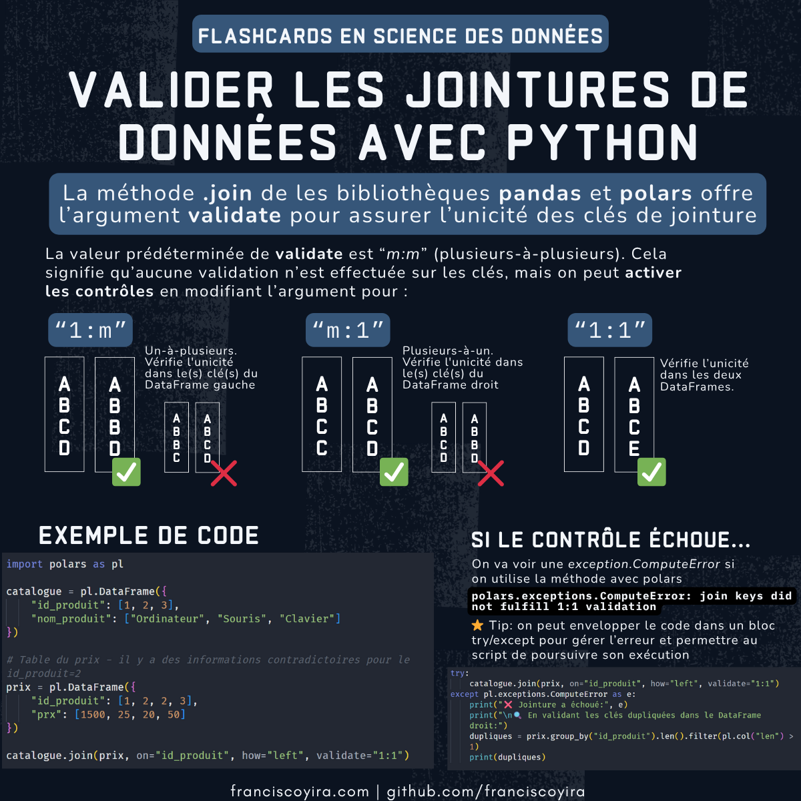

Est-ce que tu as déjà passé longtemps à dépanner un problème avec tes données, pour finalement te rendre compte que le problème venait simplement du fait que les clés d'une jointure entre DataFrames n'étaient pas uniques?

Il s'avère que les bibliothèques pandas et polars offrent un moyen très simple de résoudre cet ennui: l'argument `validate` dans la méthode `.join()`. Cet argument détecte les clés dupliquées dès le début dans ton pipeline et arrête l'exécution si la contrainte d'unicité n'est pas respectée. Ça peut devenir très pratique pour éviter le doublonnage silencieux de lignes qui dissiperait l'intégrité de nos données.

La meilleure partie c'est que pour implémenter ça tu dois ajouter moins d'une ligne de code!



La valeur prédéterminée de `validate` est `"m:m"` (plusieurs-à-plusieurs). Ça veut dire que la méthode ne fait aucune validation sur les clés, mais on peut activer les contrôles en changeant l'argument pour:

- `"1:m"` (un-à-plusieurs): vérifie l'unicité dans le(s) clé(s) du DataFrame gauche.
- `"m:1"` (plusieurs-à-un): vérifie l'unicité dans le(s) clé(s) du DataFrame droit.
- `"1:1"` (un-à-un): vérifie l'unicité dans les deux DataFrames.

Encore, s'il y a un problème avec la contrainte d'unicité, l'exécution de notre script sera arrêtée (on va voir une `exception.ComputeError` si on utilise la méthode avec polars).

Ci-dessous on peut voir une exemple de comment utiliser cet argument avec polars:

```python
import polars as pl

catalogue = pl.DataFrame({
    "id_produit": [1, 2, 3],
    "nom_produit": ["Ordinateur", "Souris", "Clavier"]
})

# Table du prix - il y a des informations contradictoires pour le id_produit=2
prix = pl.DataFrame({
    "id_produit": [1, 2, 2, 3],
    "prx": [1500, 25, 20, 50]
})

catalogue.join(prix, on="id_produit", how="left", validate="1:1")
```

Dans cet exemple, le code va générer la prochaine erreur:

```
polars.exceptions.ComputeError: join keys did not fulfill 1:1 validation
```

Si on veut permettre au script de poursuivre son exécution, on peut envelopper le code de jointure dans un bloc `try`/`except`. Encore mieux, ça nous va permettre d'inspecter les clés qui ont violé la contrainte d'unicité et d'enregistrer le problème dans une journalisation.


```python
try:
    catalogue.join(prix, on="id_produit", how="left", validate="1:1")
except pl.exceptions.ComputeError as e:
    print("❌ Jointure a échoué:", e)
    print("\n🔍 En validant les clés dupliquées dans le DataFrame droit:")
    dupliques = prix.group_by("id_produit").len().filter(pl.col("len") > 1)
    print(dupliques)
```

```
❌ Jointure a échoué: join keys did not fulfill 1:1 validation

🔍 En validant les clés dupliquées dans le DataFrame droit:
shape: (1, 2)
┌────────────┬─────┐
│ id_produit ┆ len │
│ ---        ┆ --- │
│ i64        ┆ u32 │
╞════════════╪═════╡
│ 2          ┆ 2   │
└────────────┴─────┘
```

Si tu utilises la bibliothèque pandas au lieu de polars (désolé!), le code est prèsque le même, à condition que tu utilises la version 1.5.0 ou plus (et tu peux encore ajouter le contrôle à la méthode .merge):

```python
import pandas as pd

catalogue = pd.DataFrame({
    "id_produit": [1, 2, 3],
    "nom_produit": ["Ordinateur", "Souris", "Clavier"]
})

prix = pd.DataFrame({
    "id_produit": [1, 2, 2, 3],
    "prx": [1500, 25, 20, 50]
})

try:
    catalogue.merge(prix, on="id_produit", how="left", validate="one_to_one")
except pd.errors.MergeError as e:
    # quelque chose que tu veux faire si une erreur est trouvée
    dupliques = prix.groupby("id_produit").size().loc[lambda x: x > 1]
    print(dupliques)

```

## Références

- https://docs.pola.rs/api/python/stable/reference/dataframe/api/polars.DataFrame.join.html
- https://pandas.pydata.org/docs/reference/api/pandas.DataFrame.join.html
- https://pandas.pydata.org/docs/reference/api/pandas.DataFrame.merge.html#pandas.DataFrame.merge